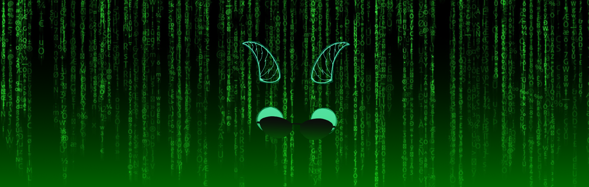
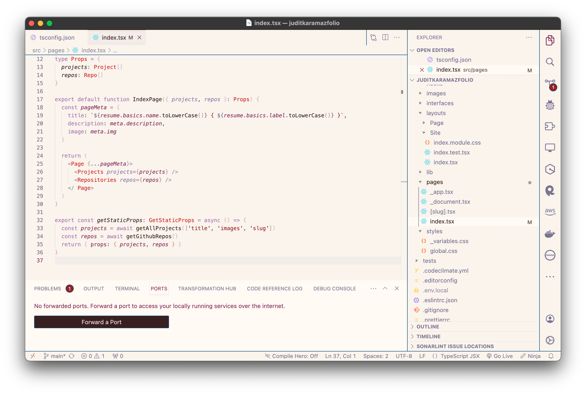

A precarious and probably-not-so-interesting list of devices, tools, and services that allow me to stay connected to the digital world and its many changes and layers.

## Hardware

My so-called-office is a fleeting one, and that's why I wouldn't survive without:

- **[MacBook Pro (M3 Pro, 14-inch, 2023)](https://www.apple.com/shop/buy-mac/macbook-pro/14-inch-space-black-apple-m3-pro-with-11-core-cpu-and-14-core-gpu-18gb-memory-512gb)**  
  _Space Black, Apple M3 Pro chip with 11‑core CPU, 14‑core GPU, 16‑core Neural Engine, 18GB unified memory, 512GB SSD storage. A beast._

- ~~**[MacBook Air (Retina, 13-inch, 2019)](https://support.apple.com/kb/SP798?locale=en_GB)**~~  
  _Space Gray, 1.6GHz dual-core Intel Core i5, Turbo Boost up to 3.6GHz, with 4MB L3 cache, 8GB RAM, 1TB SSD. Officially deprecated, but I wouldn't be here if it wasn't for this little thing. In case you are wondering: it is indeed possible to initiate your programming journey with an Air, no matter if the circumstances will eventually force you to find more appropriate tools._

- **[iPhone 11 (Black, 128GB)](https://www.apple.com/by/iphone-11/specs)**  
  _My worst mistake, all thanks to the incredible years that my old iPhone 4 gave me. It's still allowing me to embrace my "digital animal" nature, but I must admit that I've never been proud of the decision I made with this one._

- **[Razer Barracuda X](https://www.razer.com/gaming-headsets/razer-barracuda-x)**  
  _Black. Monochromatic. Optimal sound quality and noise cancellation, no matter the far-from-great microphone that it has._

- **[Kindle Paperwhite](https://www.amazon.com/Kindle-Paperwhite-adjustable-Ad-Supported/dp/B08KTZ8249)**  
  _Black, 8GB. Quite convenient for literature devourers due to its lightness and capacity, but I still believe that a sexy paper experience is unmatched._

- **[Oxford Signature Journals](https://www.my-oxford.com/int-en/oxford-signature-journals/oxford-signature-a5-classic-bright-journals/oxford-signature-journal-400154868)**  
  _Tons of different journals are the new black._

- **[Nintendo Switch (Neon Blue & Neon Red Joy-Cons, 2019)](https://www.amazon.com/Nintendo-Switch-Neon-Blue-Joy%E2%80%91/dp/B07VGRJDFY)**  
  _Essential when you spend way too much time traveling around._

Additionally, most of these little guys never leave my desk:

- **Custom Desktop computer**  
  _MSI GTX 1080, MSI Z270 Gaming M3, Intel Core i7-7700K 4.2GHz, Corsair RM750X 750W 80 Plus Gold, Corsair Vengeance LPX DDR4 (16GB), Cooler Master Hyper 212X, Seagate Desktop 7200.14 (2TB). All of it exists deep inside my Corsair Carbide 400C (black model), and surprisingly after all these years, it still allows me to play in Ultra._

- **[BenQ EW2440L, 24"](https://www.displayspecifications.com/en/model/131873b)**  
  _It clearly needs a revision - or retirement._

- **[Razer Huntsman Mini](https://www.razer.com/gaming-keyboards/razer-huntsman-mini)**  
  _Black Edition, Razer Optical Switcher (purple)._

- **[Corsair HARPOON RGB](https://www.corsair.com/es/en/p/gaming-mouse/ch-9301011-na/harpoon-rgb-gaming-mouse-ch-9301011-na)**  
  _My Claw grip brought me here, and even though I'm not so much into shooters anymore, it still offers a balanced weight._

## Software

There's no surprise: [macOS](https://www.apple.com/macos/) and [iOS](https://www.apple.com/ios/) are all around even though I still rely on [Microsoft](https://www.microsoft.com/en-us/windows?r=1)'s flexibility, which is something that I miss more than I should - ~~especially since my MacBook Air, as great as it is, can't handle the most basic video games and applications without the ventilation system warning me about future explosions~~ then, I think of my (new and) splendid MacBook Pro, and it washes all my pain away. The majority of my work, however, is done on macOS.

As for the rest, there is no need for complicated things: default Apple apps across devices here and there (including **Mail**, **Calendar**, **Notes** and **Photos**), some **Spotify**, a bit of **Steam**, and boom: magic. Quite a cloud-first life, huh? As practical things are more than required these days, I'm starting to store all my files in some cloud service and selectively sync them to any device.

"Something else, Judit?" Do you really want to know? Allow me to let you in on a secret, then: **automatic dark mode**. Always.

### File Storage & Sync

- **Finder & Files**  
  Simple and powerful, I use them to access all my files from multiple sources: iCloud, SSH servers through [Secure ShellFish](https://secureshellfish.app), or version controlled projects.

- **[iCloud Drive, 1TB](https://www.icloud.com)**  
  Most of my non-code related files (pictures, books, papers, random memories...) live there. Simplicity for the win.

### Browsing

- **[Safari](https://www.apple.com/safari)**  
  My main browser on every Apple device. I stay for the feature and UI minimalism, as well as the privacy and content blocking features.

- **[1Blocker](https://1blocker.com)**  
  My content blocker of choice for Safari. Fast and effective.

- **[Firefox Developer Edition](https://www.mozilla.org/en-US/firefox/developer)**  
  My secondary browser on macOS and Windows, mainly used for development and debugging. Running with [React Developer Tools](https://addons.mozilla.org/en-US/firefox/addon/react-devtools), as it's mandatory.

- Test browsers: **Chrome**, **Edge**, **Brave**, and **Opera**. Still trying to fall in love with **[DuckDuckGo](https://duckduckgo.com)**.

### Development

- **[VS Code](https://code.visualstudio.com)**  
  If you are into coding and you are poor enough to exist in the margins of [JetBrains](https://www.jetbrains.com/)' IDES and software, I do not think there's something I can tell you about VS Code that you don't know, but its feature set, coding experience, and ecosystem far outweigh the Electron drawbacks, and at least it is the most performant Electron app that I know. Here, I am using only a small set of extensions, mostly for automatic code formatting:

  - [EVASCode](https://marketplace.visualstudio.com/items?itemName=tecnomazov.evas-code)
  - [Nord](https://marketplace.visualstudio.com/items?itemName=arcticicestudio.nord-visual-studio-code)
  - [ESLint](https://marketplace.visualstudio.com/items?itemName=dbaeumer.vscode-eslint)
  - [GitHub Pull Requests and Issues](https://marketplace.visualstudio.com/items?itemName=GitHub.vscode-pull-request-github)
  - [Markdown All in One](https://marketplace.visualstudio.com/items?itemName=yzhang.markdown-all-in-one)
  - [npm Intellisense](https://marketplace.visualstudio.com/items?itemName=christian-kohler.npm-intellisense)
  - [Prettier](https://marketplace.visualstudio.com/items?itemName=esbenp.prettier-vscode)
  - [stylelint](https://marketplace.visualstudio.com/items?itemName=stylelint.vscode-stylelint)

- **[EVASCode](https://marketplace.visualstudio.com/items?itemName=tecnomazov.evas-code) & [Nord](https://www.nordtheme.com)**  
  My go-to syntax color themes for everything displaying code. As for EVAS (mostly EVA-00 for the dark theme when I'm not using Nord, and The End Of Development for the shiny moments of light and peace), I created that pile of VS Code themes myself, and no matter if it's far from being the best creation ever (spoiler: it is not), it still fits my likings and preferences pretty much better than most of the themes out there.

- **Terminal.app**  
  The Terminal.app plus the integrated terminal in VS Code wombo-combo perfectly fits my needs. When it comes to the Terminal itself:

  - my default shell is **[zsh](https://www.zsh.org)**
  - styled with **[Pure](https://github.com/sindresorhus/pure)**
  - configured with my own **[karamaDot(file)s](https://github.com/JuditKaramazov/ethC-dotfiles)**.

- **[Git](https://git-scm.com)**  
  So far, my projects are under version control and synced as Git repositories; almost everything I do for work is embedded in a Git-based workflow.

- **[GitHub (mobile)](https://github.com/mobile/)**  
  Quickly managing issues and code reviews couldn't be easier. Also, you can keep track of your progress thanks to its integrated widget, so... double win!

- **[Homebrew](https://brew.sh)**  
  The trusty package manager for the Unix side of macOS. A "must" for all the stuff which is not Dockerized.

- **[nvm](https://github.com/nvm-sh/nvm)**  
  Perfect for switching between multiple Node.js versions.

- **[Docker Desktop](https://www.docker.com/products/docker-desktop)**  
  Docker containers are always running on my machine, but I still prefer to directly use my local development environment for everything that's based on JavaScript and/or Node.js.

- **[Kaleidoscope](https://www.kaleidoscopeapp.com)**  
  Kaleidoscope is the only app helping me to properly resolve a merge conflict. Without it, I would be a pacifist - or a coward. Or both.

- **[Secure ShellFish](https://secureshellfish.app)**  
  Slowly getting used to it, but I must admit that Secure ShellFish is truly unique in its iOS integration. We'll keep you guys updated.

### Design

- **[Figma](https://www.figma.com)**  
  I mostly design using my several notebooks and post-its, but now that I'm slowly becoming a UX/UI beast, most of my UI wireframing, prototyping, and design needs are met with Figma.

- **[Typeface](https://typefaceapp.com)**  
  Gotta love my font manager of choice.

- **[Sketchbook](https://www.sketchbook.com)**  
  I am not using it myself but my sites wouldn't look like this if it wasn't thanks to this app and the skilled hands of Auregan Nedelec.

- **[Adobe Fresco](https://www.adobe.com/products/fresco.html)**  
  We are now trying to animate some artworks by using frame-by-frame or motion path techniques. Coming soon!

### Photos

- **[iCloud Photos](https://www.icloud.com/photos)**  
  Our relationship is based on pure convenience.

- **[Photos](https://www.apple.com/macos/photos/)**  
  As Paint seems to be a forbidden art these days, most edits happen thanks to Photos. What a time to be alive, guys.

### Music

- **[Spotify](https://open.spotify.com)**  
  Back in time, I used to feel comfortable with [iTunes](https://www.apple.com/itunes) (good iPod times), but Spotify's flexibility, user interface, and stronger relationship with its users truly caught my attention. Also, as someone who can't live without some music playing in the background, I believe that Spotify offers more control for users over their listening experience, which allowed them to beat out Apple Music.

- **[Apple Music](https://www.apple.com/apple-music/)**  
  Still using it due to its excellent playlist curation.

### Video games

- **[Steam](https://store.steampowered.com)**  
  Steam has been a dominant force in the digital distribution platform for PC gaming for several reasons, no matter if competitors like Epic Games Store and Ubisoft's platform have sought to challenge Steam's dominance by offering exclusives, competitive revenue-sharing models for developers, and other features. Although some well-known games live happily here (ah, [Dark Souls](https://store.steampowered.com/app/570940/DARK_SOULS_REMASTERED)...), allow me to share some of the indie gems that I will never uninstall due to their excellent quality and heartbreaking stories:

  - **[Kentucky Route Zero](https://store.steampowered.com/app/231200/Kentucky_Route_Zero_PC_Edition)**  
    A magical realist adventure game about a secret highway running through the caves beneath Kentucky, and the mysterious folks who travel it.
  - **[Disco Elysium](https://store.steampowered.com/app/632470/Disco_Elysium__The_Final_Cut)**  
    You’re a detective with a unique skill system at your disposal and a whole city to carve your path across. Interrogate unforgettable characters, crack murders or take bribes. Become a hero or an absolute disaster of a human being.
  - **[Hellblade: Senua's Sacrifice](https://store.steampowered.com/app/414340/Hellblade_Senuas_Sacrifice)**  
    Set in the Viking age, a broken Celtic warrior embarks on a haunting vision quest into Viking Hell to fight for the soul of her dead lover.
  - **[Firewatch](https://store.steampowered.com/app/383870/Firewatch)**  
    Firewatch is a single-player first-person mystery set in the Wyoming wilderness, where your only emotional lifeline is the person on the other end of a handheld radio.
  - **[Journey](https://store.steampowered.com/app/638230/Journey)**  
    Explore the ancient, mysterious world of Journey as you soar above ruins and glide across sands to discover its secrets.
  - **[Hotline Miami](https://store.steampowered.com/app/219150/Hotline_Miami)**  
    Hotline Miami is a high-octane action game overflowing with raw brutality, hard-boiled gunplay and skull crushing close combat.
  - **[The Beginner's Guide](https://store.steampowered.com/app/303210/The_Beginners_Guide)**  
    The Beginner's Guide is a narrative video game from Davey Wreden, the creator of The Stanley Parable. It lasts about an hour and a half and has no traditional mechanics, no goals or objectives. Instead, it tells the story of a person struggling to deal with something they do not understand.
  - **[The Red Strings Club](https://store.steampowered.com/app/589780/The_Red_Strings_Club)**  
    The Red Strings Club is a cyberpunk narrative experience about fate and happiness featuring the extensive use of pottery, bartending and impersonating people on the phone to take down a corporate conspiracy.
  - **[GRIS](https://store.steampowered.com/app/683320/GRIS)**  
    Gris is a hopeful young girl lost in her own world, dealing with a painful experience in her life. Her journey through sorrow is manifested in her dress, which grants new abilities to better navigate her faded reality.
  - **[Celeste](https://store.steampowered.com/app/504230/Celeste)**  
    Help Madeline survive her inner demons on her journey to the top of Celeste Mountain, in this super-tight, hand-crafted platformer from the creators of multiplayer classic TowerFall.
  - **[Milk inside a bag of milk inside a bag of milk](https://store.steampowered.com/app/1392820/Milk_inside_a_bag_of_milk_inside_a_bag_of_milk)**  
    A short story about what sort of challenges everyday little things can be. Help the girl buy milk, be the first not to disappoint her.
  - **[SOMA](https://store.steampowered.com/app/282140/SOMA)**  
    From the creators of Amnesia: The Dark Descent comes SOMA, a sci-fi horror game set below the waves of the Atlantic ocean. Struggle to survive a hostile world that will make you question your very existence.
  - **[Chants of Sennaar](https://store.steampowered.com/app/1931770/Chants_of_Sennaar)**  
    Legend says that one day, a traveler will reunite the Peoples of the Tower who are unable to communicate with each other. Observe, listen, and decipher ancient languages in a fascinating universe inspired by the myth of Babel.

### Messaging

- **Mail**  
  What can I say? Apple's default email app is simply convenient.

- **[Telegram](https://telegram.org) & [WhatsApp](https://whatsapp.com)**  
  The only messengers I use every day for personal and random stuff. Memes. Memes are everywhere.

- **[Slack](https://slack.com) & [Discord](https://discord.com/)**  
  The main work communication tools. Thanks to video games, I hate Discord slightly _less_ than I do hate Slack.

### Writing

Except within ~~Notes.app~~ iA Writer or my personal notebooks, everything I write these days is composed as [GitHub Flavored Markdown](https://github.github.com/gfm). Quite a plot twist, if you ask me.

- **[iA Writer](https://ia.net/writer)**  
  Listen carefully: this is the most beautiful thing that ever happened to me. If you are wondering why, I invite you to have a look at its website, give the free trial a try _(I didn't intend it, I swear)_, and then embrace your new life as a “stay-focused maniac". You won’t find a place in the world making the writing process as enjoyable as this app.

- **[VS Code](https://code.visualstudio.com)**  
  Most development-related writing ends up in VS Code. Is that good, is that bad...?

### Password Management

- **[1Password](https://1password.com)**  
  Most of my passwords sleep in here, and then it's all about locally syncing them via WiFi to the rest of my devices.

- **[iCloud Keychain](https://support.apple.com/en-us/HT204085)**  
  Really efficient integration into Safari.

### Reading

- **[Books](https://www.apple.com/apple-books)**  
  I prefer physical books that I can touch, destroy, and smell, but most of my technical books are imprisoned here.

### Social Media

- **[X-Twitter](https://twitter.com)**  
  The... bird app that now became an aseptic X... with them memes... and constant fights. Oof. I stay for the memes, though.

### Backup

- **The Magnificent Cloud™**  
  It's the same for all of us, right? It's a good line of defense, I assume.

- **Tons of pen drives I can't find anymore™**  
  Really, where are they?
