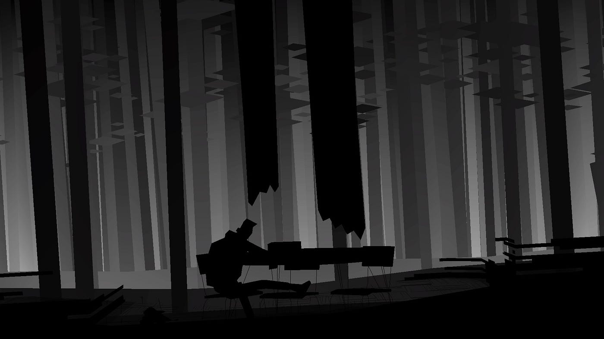
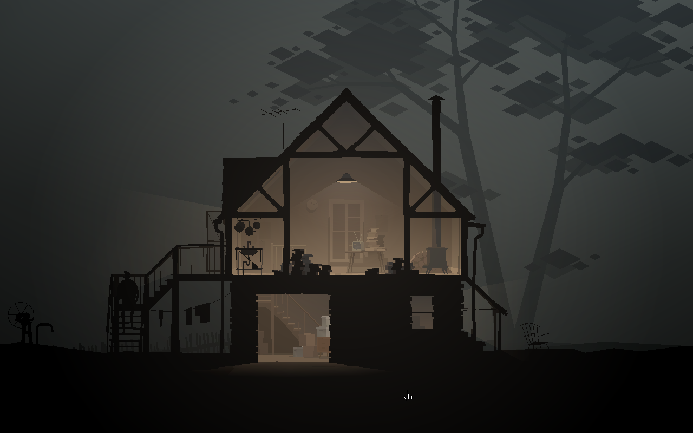
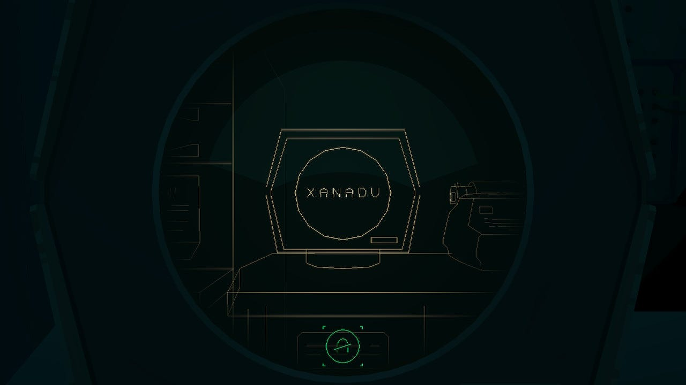
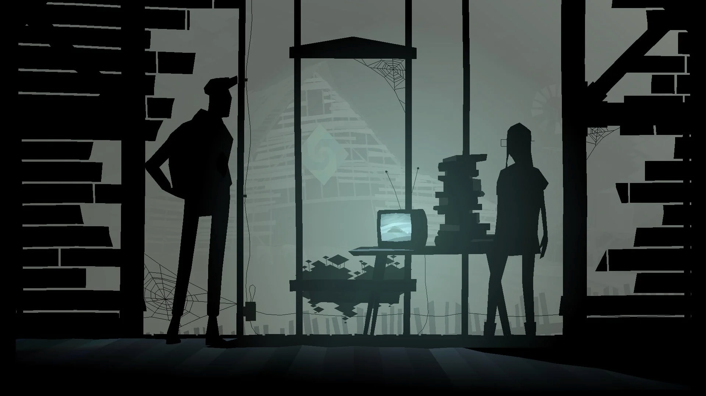

In recent times, it's almost impossible to witness artistic artifacts as successful at designing for mystery as Kentucky Route Zero is. From the theatricality of a scenography as somnambulant as impossible to replicate, to a musical structure crossed by the bluegrass genre and other forms of experimentation, Kentucky Route Zero's constant and improvised staging is pure rigor, both in its seemingly more superficial aspects and in its ability to make its way through an alienated character (Conway, an old truck driver running his last delivery for a local antique shop) along with the formulation of the very concept of community, with all that implies.

Much has been debated about the essence of the sum of acts and interludes proposed by [Cardboard Computer](http://cardboardcomputer.com). From a germinal but satisfying crowdfunding on Kickstarter (satisfying in its humility, without notable excess), through the start of its episodic publication back in 2013, to the final edition for computer and consoles published by Annapurna Interactive, Kentucky Route Zero has been labeled as:

1. an adventure game that draws its inspiration from magical realism and deals with a secret road flowing beneath the caves of Kentucky
2. a graphic novel crossed by a wide range of sub-genres typical of the American novel and the most atrocious face of capitalism (thus, by extension, capturing the impact of a crumbling economic system on a human level)
3. some kind of interactive book with an effective artistic design and an atmosphere that flirts with David Lynch's style, narrative, scenography and apparently nonsensical dialogs, making the game automatically absurd by extension.

What _is_ Kentucky Route Zero, though? A yearning to reach beyond its boundaries through the use of multiple channels of storytelling, just like its adventure game ancestors did? The interstitial releases between acts which often included weird experiments and real-life components, like "Limits & Demonstrations", staged in a partial form at a [real-life gallery in Philadelphia](http://kentuckyroutezero.com/pub/newsletter-archive/2013-feb-krz-feb-13-newsletter-limits-demonstrations.html)? Perhaps the answer lies in what it is _not._ Maybe the most prudent position, in any case, is to ignore all classification and embrace the idea that, despite what it does _not do_ or what it is believed _not to be,_ the denial of its parts only reaffirms its nature as a video game fully aware of the "here and now" and still respectful towards the media itself and its own beliefs. As stated by Anna Ishchenko in [“But Maybe They Should Feel Lost”: Magical Literariness in the Computer Game Kentucky Route Zero](https://lnu.diva-portal.org/smash/get/diva2:1726162/FULLTEXT01.pdf):

> The game represents the genre of text-based adventure games – it imitates and references them. What makes adventure games distinct (and probably all conventional games in general) is the sense of progression. The player of the adventure game is expected to advance further in the story by completing quests, solving puzzles, fighting monsters and collecting items – all for the purpose to finish the game with the best outcome possible. However, magical realism defamiliarizes this representation. In Kentucky Route Zero, the principle of progression is undermined through the special use and arrangement of magical realist poetics. The game manages to negate the concept of linear progression by evoking the feeling of being lost, disoriented. [...] In Kentucky Route Zero, stories include stories, dreams evoke dreams, memories contain memories, old technologies represent other technologies, referenced literary texts meet other literary texts. In short, the game conjures the seemingly endless maze of fictional worlds which overlap and somehow extend each other. Thus, rather than progressing further in the game, the player of Kentucky Route Zero immerses deeper into the bewildering, mesmerizing, ambiguous dreamlike world that comprises other worlds: linear time is negated.

"Nostalgia": one of the first words that comes to mind whenever we think of a game like Kentucky Route Zero, a theme that seems to run both through its stylistic features as well as through a content that confronts loss at every stage of its thoughtful journey. However, how is such a thematic and formal pillar affecting the roots of a concept built upon technology? Is it possible to develop magnificent and tragic horses on top of ruins?

Starting with some puzzley platform games but quickly moving toward a kind of slow-paced, text-driven direction, [Ruins (2011)](http://cardboardcomputer.com/2011/09/15/ruins) was one of Jake Elliott's first creations, "a short, desolate game in which you play a dog", but also a way of re-contextualizing branching dialogues quite fundamentally; what does a dialogue choice mean, even? That is one of the main questions evoked there. Some other pieces like [Balloon Diaspora](http://cardboardcomputer.com/games/balloon-diaspora), [Hummingbird Mind](http://cardboardcomputer.com/games/hummingbird-mind), or [A House in California](http://cardboardcomputer.com/games/a-house-in-california) also highlighted an intention to deliver surreal, conversational, and narrative games, highly inspired by some 80s and 90s classics, such as [Mystery House (1980)](https://en.wikipedia.org/wiki/Mystery_House) for **A House in California.** It wasn't until [Jake Elliott](http://dai5ychain.net) and [Tamas Kemenczy](http://tamaskemenczy.net) reunited after several years of friendship and shared projects that Kentucky Route Zero arose as a plausible option, though, taking all the previous experience and inspirations and then regurgitating it prior to further assimilation.

Besides the literary premise that emerged from two men who genuinely loved theater, Elliott cited multiple times a number of video games that he and his fellow programmer drew inspiration from, including the ever-growing presence of [Twine-based text adventures](https://twinery.org) and the open-source tool they were based on, which aims to offer an accessible development platform to those who don't know how to code. While it's a graphical game, Kentucky Route Zero also includes long sequences that play out entirely in text, sometimes fading the visuals away entirely, connecting it to the text-based games that dominated the first decade of the genre's existence, and have continued to be a rich source of designs and ideas ever since. Thanks to this so-called hypertext game engine, Twine, some immersive text adventure moments in the overworld map of Kentucky Route Zero gained shape, but even the map mode itself was loosely inspired by early computer graphics that had all sorts of limitations and where it was pretty frequent to have nothing else than simple line art - just like The Zero remaining as a rare constant throughout the game, or as an immense wound crossing the country. Remarkably, there's a theme across all these references about the edges between reality and magic, or between software and sentience; an homage to the most magical moments computers have brought us in the past half-century: moments of collaboration between people and code - and adventure games are certainly part of that tradition of wonder.

Similarly to what happened with the visual effects, an almost artisanal real-time modulation of the reverb effect proved to work pretty much well for cave areas to have the sense of being more muddy, resonant or close by the way reverb affected the music and engine sounds. Using Conway's truck while traveling The Zero as an example, some parts of the game even had different loops which switched whenever the player turned at certain symbols, alternating to different tracks in situ. As an interesting note related to such a computationally intensive process, there is a vast in-game chamber called the Hail of the Mountain King where players can find the abandoned Xanadu computer, visually styled after the groundbreaking [PDP-1](https://en.wikipedia.org/wiki/PDP-1) mainframe that debuted in 1959, and on which was created the first interactive word processor, the first computer chess, the first major timesharing system, and, of course: some of the first examples of computer music. Closely related to it, the sound design used for the Xanadu was made with an [E-mu modular synthesizer](https://en.wikipedia.org/wiki/E-mu_Modular_System), both a relic from that time and a source of vibrantly new and interesting sounds.

As fancy and well-documented as everything previously stated may sound, however, and according to their own [Kickstarter site](https://www.kickstarter.com/projects/149077132/kentucky-route-zero-a-magic-realist-adventure-game), the resources allowing them to go through such an intense process of documentation and deep understanding of all sorts of technology and cultural elements were, as it usually happens with indie and experimental projects, limited:

> Our development costs are pretty slim relative to a typical video game budget, but still substantial relative to our assets. We need to pay for the license for the game engine we'll be using (Unity Pro). We also need to pay the musicians and the audio engineer who will be recording the game's soundtrack. Finally we need to offset living expenses enough to be able to focus on the game full time and complete it in the next nine months.

Most of Kentucky's level design happened in Blender ("and occasionally on paper when it's a nice day to work on the porch", according to Tamas); the rest was based on a Blender-to-Unity workflow that wouldn't culminate until January, 28th of 2020. Although the initial premise of any funds raised on Kickstarter beyond the funding goal gravitated around the idea of hiring local artists to help generate more content (3D models and textures, in this case), and paying freelancers to make the environments richer and the characters more detailed and various, Cardboard Computer started their journey with two members and finished it with three after the incorporation of [Ben Babbitt](https://benbabbitt.bandcamp.com). Surprisingly (or not so), these nine months mentioned in their early Kickstarter site translated into an almost entire decade of development, releases dispersed in time, the confrontation against sound design and audio management, an archeological codebase, necessary extensions of the Unity Editor, struggles, unexpected discoveries, and a resulting product radically different from the initial trailer, which showcased a premature section where, in their own words: "Conway meets a robotic country singer named Junebug who is trapped in the abandoned restaurant that once employed her, and has to explore the cavernous depths below the restaurant in order to shut down a security system and free her".

Despite the fact that the main topics, influences, and general tone were clear and well-defined since the first public appearance of the game, and as it usually happens in the development sector, the more the project grew, the more Elliott and Tamas realized how naive they were with the initial rough estimate of a single year to complete the game they had in mind. Besides the original two-man development team reality, the project's possibilities became more ambitious, and hence, the challenges and obstacles for them to overcome projected a shadow as large as their shared dream. This didn't come as a surprise, though. Several newsletters seemed to indicate the time tribulation as a huge amount of reworking started to take place:

> We've been reworking a lot this month: redesigning our pathfinding and movement code, redesigning levels and the overall flow of the game, and rebuilding our own workflow from 3D modeling and lighting into the game engine. It's important work, and we're getting good results, but it also means we're starting to discard a fair amount of code and content that doesn't fit in anymore or has been superseded. [(KR0 Newsletter, May, 2011)](http://kentuckyroutezero.com/pub/newsletter-archive/2011-may-kentucky-route-zero-may-update.html)

Finally, and after restless months of working, redesigning, and privately sharing the latest news on the development process with their backers, a post dated from November 2011 announced their future silence regarding the release timeframe they had decided to set:

> It also didn't take into account the fact that developing this game has been for both of us more a process of discovery than implementation. We still have the same basic gameplay, art treatment and plot framework that we started with in November 2010, but as we've worked on the game we're discovering a lot of new opportunities for depth, and rather than hold onto a narrow preconception of these environments and characters we've found that we're drawing a lot more energy from being alive in the creative moment & open to exploring some of these thematic rabbit holes. [...] So for now we're going to stop talking publicly about a specific release timeframe for Kentucky Route Zero and just say "when it's done." [(KR0 Newsletter, November, 2011)](http://kentuckyroutezero.com/pub/newsletter-archive/2011-nov-krz-update-about-the-release-timeframe.html)

If we were to wonder why hiring outside help was never an option, the team's financial situation wasn't the only problem associated with this decision. Putting aside the financial commitment, since there was no full-time programmer on the team, Elliott and Tamas had to split coding duties between them, and given the challenging nature of the project and each member of the studio coming from an artistic background, their unique approach made the game's code difficult to understand. According to Kemenczy himself, the codebase became so idiosyncratic that some of it was absolutely inscrutable; here, as Elliott made clear throughout several interviews on the matter, some decisions ended up being more conceptual than practical, as if they had always understood their own game as a kind of software art project. No matter if the main storyline of Kentucky was outlined before development began, the main reason behind what the audience considered as "delays" was their experimental approach to development, which made it nearly impossible to predict when a new episode would be released. The team indeed had a strong outline for how events would unfold that remained largely intact, but as they also expressed:

> When we started on the game, we committed ourselves to releasing a new episode every three months or so. And that was a really bad decision, and we totally killed ourselves to get Act II done in four months. After that, we decided not to pursue that commitment any more, not to get these out at that industrial pace that we'd set for ourselves. [(Jake Elliott, 2020)](https://www.theverge.com/2020/1/28/21112356/kentucky-route-zero-act-v-interview-cardboard-computer-xbox-ps4-switch)

Kentucky Route Zero and the development of its tragic horses began with a 2011 Kickstarter for a simple adventure game, planned at first to be released later that year. What happened, however, was not simply about Elliott and Tamas realizing the story they wanted to tell was spilling out of boundaries; Kentucky is, above all, a video game deeply concerned with both the past and future of adventure games, and it managed to turn their predecessors' artistic limitation into a deliberate device. Shockingly to many, the game was always meant to have visible aliasing, or "jaggies" as part of the art style. According to Tamas, "Old DOS games that achieved real-time polygons were a visual reference (both VGA and SVGA)". Later, he referenced the following misunderstanding:

> Maybe because KRZ shares more DNA with the likes of Another World or Elite Dangerous which rendered polygons instead of tiles and sprites of old 2D pixel games, it just didn't read as a deliberate move for some of our players, and instead maybe understood the jaggies as an oversight or something, I'm not sure. Some people were definitely upset about it early on. When we established the art style ten years ago, retina/4k displays weren't common place and we didn't really need to consider it too closely, so players could just set whatever maximalist resolution they wanted. To us, 720p is just about ideal for visual density, and 1080p is the upper limit where we think the style remains cohesive. We have now a 'classic/modern' switch which has a quality similar to running a game in VGA or SVGA mode back in the day, basically 540p or 1080p. [(Tamas Kemenczy, 2020)](https://www.vice.com/en/article/dygdkx/kentucky-route-zero-creators-on-finding-hope-and-the-burden-of-4k-gaming)

In the era of 8K or 16K displays, a game that used bitmap/pixel fonts and had only five sizes showcases illegible text on higher resolutions due to its resolution-dependent nature, a feature that old games from the 80s and 90s relied on and designed around as well. Putting aside the possible debates around artistic decisions, maintainability, scalability, or even tempo, let's bear in mind that the resulting artwork moves at a slower and more contemplative pace than most modern games, with its designers also taking inspiration from filmmakers as bold in their use of slowness and stillness as Kurosawa or Tarkovsky. This, too, happens to echo the pace of classic adventure games; even since its very origins when the game first emerged in 2013, it always felt like a **timely** exploration of how economic forces impact people and their communities. Content and form are indeed intertwined, as much as most of these decisions the developers made were indeed more conceptual (and atemporal) than practical.

If there is something Elliott and Kemenczy got right from the technical tenets of magical realist fiction, it is the fact that people accept the magical and the bizarre along with the real. Beneath strange encounters, unique imagery, or the usage of bluegrass recordings as raw material reworked into lush and mysterious ambient loops, Kentucky Route Zero appears to breath pure mystery, constantly inhaling and exhaling its own question marks in its narrative and artistic design - but also in its development conception. Nowadays, we wouldn't possibly imagine a video game taking almost a decade of work without an inevitable cancellation explaining it. However, and as much as the game itself is about a secret highway in the caves beneath Kentucky, it feels as if the Cardboard Computer team managed to find their own temporal caves beneath the ferocious architecture holding the video game industry as we know it these days together.

Almost all the characters Conway runs into are in some way beholden to debt, particularly to the Consolidated Power Company, whose game is exactly what the name indicates: consolidated power. In a reckless effort to cut costs and maximize profits, the Company required miners to purchase their own safety equipment rather than supplying it themselves, implementing a truck system arrangement in which workers paid in plastic tokens could redeem canaries and respirators from the Company store. In a similar tone, the Consolidated Power Company also rationed the electric system to save money, leaving workers scrambling to micromanage the lights, water pumps, and PA system, all of which threatened to shut down given the lack of adequate power.

Although the game situates the recent financial crisis within a broader history of American exploitation in the South, it's tempting to draw a parallelism between a powerful criticism of modern capitalism and the current situation of a constant tolling bell of industry layoffs defining the last years, with job losses for thousands being in stark contrast to stellar release schedules and record-beating acquisition numbers. People like Weaver Márquez, Jake Elliott, Tamas Kemenczy and Ben Babbitt managed to slip between worlds, of course, and places might eventually be repurposed by the Bureau of Reclaimed Spaces - but debt will always remain, no matter if under the form of an AAA company or personified by the glowing, skeletal appearance of our leg due to unaffordable medical debts.

Let's now hope a brighter future is yet to come for the video games industry and its magnificent, tragic horses. Let's simply imagine that behind our TVs and those additional devices providing us with entertainment and touching stories, there's indeed something magical (and still mundane) waiting to happen.
