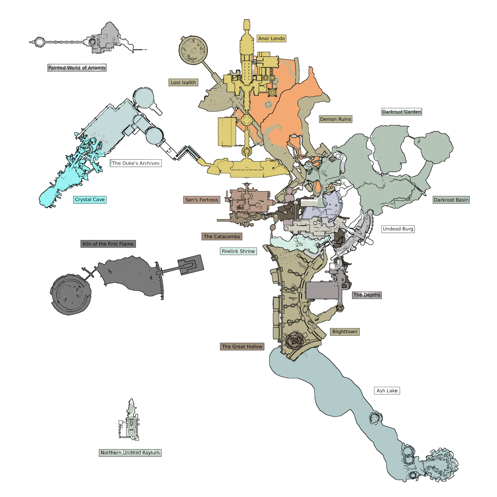

The formula for Metroidvania games is pretty much set in stone - or at least that's what some analysis will firmly defend. Theoretically speaking, the genre derives its core gameplay loop from the premise of having the players become lost, and almost all of them feature single large spaces with more focus on navigation and exploration as opposed to pure action, as well as a vast interconnected world with inaccessible areas that require players to backtrack in order to unlock new abilities. However, the Metroidvania genre has branched out to many different paths making the term feeble and the community in a state of confusion.

## "Metroidvania": Approximations

The concept of "Metroidvania" translates into a sub-genre of action-adventure platform games that utilizes certain characteristics of games in the [Metroid (1986)](<https://en.wikipedia.org/wiki/Metroid_(video_game)>) and [Castlevania](https://en.wikipedia.org/wiki/Castlevania) (more specifically, [Castlevania: Symphony of the Night](https://en.wikipedia.org/wiki/Castlevania:_Symphony_of_the_Night), from 1997) franchises. Many newer Metroidvania games like [Axiom Verge](https://en.wikipedia.org/wiki/Axiom_Verge), [Blasphemous](<https://en.wikipedia.org/wiki/Blasphemous_(video_game)>), or [Hollow Knight](https://en.wikipedia.org/wiki/Hollow_Knight) have a similar approach to the balance that Metroid and Castlevania tried to define between a punishing core and multi-directional and non-linear navigation, with little information being presented upfront, and more detailed navigational aids being unlockable through some means. The difference between modern and classic Metroidvanias, however, is as significant as it is worth mentioning: although non-linearity, the setting, and certain power-ups and abilities may remain, the recent approach to the genre offers a more even pace and greater linearity, which falls into adventures that often open up more slowly over the course of the game than their predecessors. In a similar tone, it's also possible to find more linear sections aiming to better guide the experience at certain points and allowing players to familiarize themselves with some of the crucial updates in order to prevent them from being unprepared, lost, and confused.

Although it's impossible to deny the existence of other differences like the obvious technical updates, how could the minor ones lead to any sort of misunderstanding regarding the nature or definition of the sub-genre? From a conceptual point of view, the idea of platform games where you get new abilities that recontextualize previous content and allow you to access new one or handle new challenges seems pretty fair. Given some formal definitions, couldn't we incorporate [The Legend of Zelda](https://en.wikipedia.org/wiki/The_Legend_of_Zelda) into the "Metroidvania" term as it too places emphasis on exploration, and promote growth through key power-ups which are used to overcome obstacles, for instance? As most of these games incorporate only a small percentage of the features added by _Castlevania: Symphony of the Night_, should we still keep the "vania" part?

---

### A permeable and blurry concept

There is an interesting entry in [Games and Other Bits](https://lucencies.com/2020/04/10/what-is-a-metroidvania) exploring the genre naming and the nature of Metroidvanias where the author dives into the same concern:

> Growing up, I didn't consider Metroidvanias to be their own subset of games, but rather a subset of Castlevania games. I sometimes see people get upset over the term Metroidvania because it gives too much credit to Symphony of the Night, which came after three solid Metroid games. As much as I love Castlevania, I do actually agree with that sentiment. Why not call the games "Metroid-like"? Castlevania is a series with a lot of games. According to Wikipedia, there's thirty games in the series, not including spin-offs. The problem is, a lot of these games are completely different from one another in terms of gameplay. I often see all the Castlevania games categorized into one of three categories: 1. The platformers. These are the classic Castlevania games. Games like the first ever Castlevania game from 1986. "Classicvanias". 2. The games that were somewhat similar to Metroid games. Metroid-like? Metroid-eqsue? "Metroidvanias". 3. The games that we pretend never existed. [...] So why did the term "Metroidvania" catch on to other unrelated games? It's hard to pinpoint exactly how and when it caught on.

As for the final part of the article, no matter if it's indeed difficult to clarify how the term became so permeable and vague, I find it clever to close the text by saying that "_shooter_ is a much more descriptive word than _Metroidvania_ is", as it summarizes pretty much well the confusion and general disappointment around the naming matter: although it may be clear for players, the terminology is not accurate nor descriptive enough by itself. Independently of this fact, let's not forget that similarly to what may happen when mentioning an "Elizabethan tragedy", the idea of naming a certain convention after a work that defined it isn't without precedence; otherwise, and if we were to redefine something taking into account only what that thing is (in this case, a "5 Act Structure English Early Modern Tragedy With Instructional Cautionary Ethos"), we would end up delivering a definitely accurate, agnostic, and yet obtuse description of the thing itself. Pedant that I am, I still would rather keep these genre details more colloquial than scientific, if you allow me to share my opinion.

### Platform games "do not open from this side"

If there's something that truly catches my attention here, though, that is the constant proposal of "platform" requirements. Do not get me wrong: I understand what makes up the anatomy of a modern Metroidvania and how the genre came to flourish almost 30 years after it spawned. Despite that, I find it significant to highlight the platform's persistence when truth being said, the level design is what truly stuck to me as the most relevant ingredient in making the Metroidvania formula work as well as it does. As expressed in [What makes a great metroidvania](https://www.vdgms.com/opinion/what-makes-a-great-metroidvania):

> For better or worse, one of the largest aspects of a Metroidvania is the constant backtracking. Having great level design is probably the biggest factor that separates the good from the great. This is not to be confused with world design, which is more about atmosphere and art as opposed level design which is how the world is constructed by an architect. By the end of most Metroidvanias, you will have to backtrack across many paths that lead you through all of the different areas that you have slowly unlocked one at a time. If the level design is laid out smartly and is aided by good art design then this will be a joy and not a nuisance. You will actually find enjoyment in retreading the same ares and not frustrated that you are lost yet again. A good way to explain this is that the games in the genre with the best level design don't require a map. They have maps, which can be good to see what door you haven't tried in a while, but once you figure out where that is located, you should be able to get there just by memory alone.

As surprising as it may sound given the multiple power-ups, abilities, weapons, epic boss fights, and overall monumental atmospheres, the fact that players can interiorize an entire universe compressed in a video game demonstrates an absolute sense of immersion which wouldn't be achieved without some superb crafting skills, as well as an absolute understanding of how the concept of interconnection works. Besides Metroidvanias and perhaps certain shooters (easily explained thanks to the contained scope, as well as the constant repetition due to the limited amount of maps), the best example that comes to mind while discussing exceptional level design is [Dark Souls](https://en.wikipedia.org/wiki/Dark_Souls). Although the game created by [FromSoftware](https://en.wikipedia.org/wiki/FromSoftware) doesn't subscribe to the sub-genre we recently discussed, it's still valuable to offer some insight into what makes the architecture of video games excellent as a way to understand them as an entire and interconnected ecosystem, and not simply as isolated artistic artifacts standing on their own.

Let's now take the example of having to draw a bicycle offered by [popMatters](https://www.popmatters.com/dark-souls-bicycles-and-level-design-2495423591.html):

> Something is terribly wrong with this bike. Namely it doesn't have any pedals. Or gears. Or chains. In fact, the whole thing would probably collapse if you tried to sit on it. There are also smaller irregularities. The cruiser handlebars sit uncomfortably low, so you may have trouble seeing the road while riding it. It also doesn't have breaks, so if you did get this thing rolling down a hill, you wouldn't be able to stop. And you might have a hard time parking this thing without a kickstand. It's a bit of a mess. There is a frequent impossibility found in Gimini's bicycles. Despite our familiarity with the bicycle, most people would have a hard time drawing one that actually works. We're just not professional designers. But I actually find all of these doodles kind of insightful. See, even if none of these diverse objects would actually work as designed objects, we recognize each and every one. They are all clearly bicycles. After seeing Gimini's work, I started thinking about how we remember video games as designed objects, especially level design. Think back on your favorite gaming worlds, the ones that you remember the best. If I gave you a pen and paper, could you draw me a map? How accurate do you think it would be?

We would all be terrified after witnessing some Lordran's recreations.

---

## (Almost) Impossible architectures: Introduction

An integral part of level design is the flow and continuity of its construction. Just like architectural design, it's all about finding the appropriate means of expressing our ideas about gameplay; in the end, "levels" are nothing more than spatial experiences of environments that are usually inhabited by _you_ as some sort of avatar, and a bunch of (sometimes vaguely humanoid) other creatures. However, it's crucial to select an appropriate path and organizational type to act as a framework for a level since it's the only way to allow designers to focus on the smaller events that bring a design to life - as well as their main tool to achieve the correct scale and proportion of elements for a convincing sense of space. Taking [_Architecture; Form, Space and Order_](https://www.amazon.com/-/es/Francis-D-K-Ching/dp/1118745086) by Francis Ching as an example, the author defines space as "the three-dimensional field in which objects and events occur and have relative position and direction". Similarly to what may happen in architecture, components like entrances, corridors, stairs, or simply an overall sense of organization make it possible for designers to reinforce the idea of feeling of space that game narrative might involve. As for these narrative layers, one major consideration that all levels should face is the ability for players to piece together the history of a space by observing its visible attributes. For that, multiple layers of history should be utilized to create pieces of environmental narrative and storytelling that would broaden the sense of place within the level and make it feel more tangible to the player. As an example illustrating this idea, if we had a story idea about some corrupt corporation trying to take over the world with cyborgs, then it might help to go look at what some of the great corporate headquarters buildings look like; how does a corporation express it's power in the world by building architecture?

### The Depths: Layers & verticality in Dark Souls

When it comes to these ways of expressing tangible realities, Dark Souls demonstrated a great level design by incorporating most of the previously mentioned ideas into their game. What's truly relevant is that instead of taking the easy way out and incorporating such elements in a linear section of zones, FromSoftware created a complex maze that continuously branched and then looped back on itself, making it feel more organic and interconnected despite the narrative components themselves. However, the labyrinth they created was a linear one: a secret and paradoxical linearity that curved, bent, and doubled back on itself thanks to the usage of shortcuts and secret paths, which optimized the player's path forward significantly. Previously, we could find games like [The Legend of Zelda: Ocarina of Time](https://en.wikipedia.org/wiki/The_Legend_of_Zelda:_Ocarina_of_Time) applying such techniques and yet saving them for the most controlled and challenging areas: the dungeons. Dark Souls, on the other hand, used these conceptions as the design philosophy behind the integrity of its world; instead of moving forward as the players believe they do, the game constantly opens up new paths for the next run, revealing itself as a spiral devoid of all safety or simplified fast travels. If anything, even the level design emerges as an essential ingredient making the adventure feel like a complex journey: we can never tell when we will go back home, and the feeling of isolation and fear increases as we venture deep into certain areas.

The layering effect greatly contributes to the architectural brilliance of Dark Souls. Architecture in games lends itself to being a character first, and a plausible space secondarily. In other words, the character of the architecture in video games tells us a story about the place in which the player inhabits, and in this specific case, similarly to The Divine Comedy's subdivision between the lowest level of Hell and the highest echelon of Heaven into "strata" or circles, Lordran makes the player experience what happens when instead of clawing their way towards the center of Earth, they must carve an ascending or descending path. For instance, dropping down to Blighttown, going deeper and deeper only wishing to climb back out to familiarity, demonstrates a stark and yet fascinating contrast compared to ascending, in an almost heroic or divine way, through Sen's Fortress and Anor Londo, where the game displays its more memorable moments of fantasy, radiance, and warmth. Whenever the concept of "ascension" is involved, the vertical progression mutates into a rewarding feeling highly reinforced by the dazzling environments and eye-shading aesthetics; in contrast, since Dark Souls obsesses over its dualities, descending from the peak of the world takes the player through dank basements, sewers, and hellish landscapes, down to the very foundations of the world.

What's clever, again, is the distribution of connecting points between many of the game's locations through doors that only open from one side, or ladders that might allow the player not only to rest at a bonfire but to quickly skip sections dividing different areas thanks to efficient pathways. This way, we are never overwhelmed with options and branching paths at the very beginning; instead, as the game goes on, the world becomes steadily more complex, as it unveils its distinct zones (visually, but also from a gameplay perspective), a variety of challenges, and the particular feelings elicited from them. Resuming the vertical progression previously discussed, the first area after the tutorial, Firelink Shrine, works as a perfect microcosm of the visual motif of ascension and the implications of descending: given three possible routes (the Undead Burg, New Londo Ruins, and the Catacombs), only the route upward proves to be comforting enough compared to the rest of them, where the level of challenge escapes from manageable for unprepared players. Silently, Dark Souls makes it clear that only after reaching a higher level (both in physical and mechanical ways), the players will be ready for the intentional subversion of a structure where narrative progression will become a downward journey. Until then, Firelink Shrine stays as a monument welcoming adventurers from all across the world and providing them with its intermediate, intermittent moment of peace.

---

### Bright-towns: Memory & its difficulties

This clear understanding of architecture applied to level design doesn't translate into absolute lack of imperfection, though. One of the main challenges that designers have to overcome when making non-linear games is finding the right balance when it comes to difficulty curves; by maintaining a state of flow, the game can fully engage the player and avoid either frustrating challenges leading them to give up, either boredom due to the lack of engagement with the game's world. For this purpose, it is important to consider the variety of ways designers can influence a game's difficulty. As an example, a straightforward method for developers to modify the difficulty (but also one of the less satisfactory ones for players) is through power scaling, adjusting the player's stats and the enemies' ones. On the other hand, memory is another style of game difficulty that comes with experience: if a player can remember the placement of enemies and traps, they will anticipate the games' challenges - which may translate into a risk that could be prevented due to randomized elements or a deep understanding of the player's knowledge, as well as their need to face challenges they are unfamiliar with gradually and supported by the right exposition of the main mechanics.

No matter the many threads discussing Dark Souls' mechanical difficulty and highlighting it as one of the only elements to take into account, the series is based on three main pillars that are not exclusively linked to the combat. Undoubtedly, Dark Souls is much about giving the players "a sense of accomplishment by overcoming tremendous odds", but the notions of memory, observation and adaptation exist, too, in a deeper sense. Although we could define the difficulty curve of FromSoftware's creation as a static one (this is, a mostly steady and fair one with certain "difficulty spikes"), the world itself never changes, but you indeed do as you run through it over and over, learning its every tic and mannerism. Games like The Legend of Zelda surely provide players with maps and notebooks so that they can keep track of information, thus reducing the burden on their memory, but Dark Souls deliberately lacks guidance; players are expected to remember the layout of the vast, interconnected world they are inhabiting, and although this decision contributes to its high difficulty level, it also affects the way players think about and interact with the space.

After beating the Asylum, for example, there are at least a few possible paths that the player can take. Given this multidimensionality and the variety of unknown options, they must then commit to memorizing each of these directions rather than checking the map for unexplored threads. Does it ask more of the player? It does. On the flip side, and just as if it was some sort of trade-off, it adds more intimacy with the environment without necessarily compromising the way our memory encodes, stores, and retrieves the information of the scene; intentionally, the overall design decisions participate in this delicate dance where perception sets the scene, attention focuses the spotlight, the re-spawning enemies and repetition of segments make the task of remembering the environment second-nature, and memory choreographs the performance adaptively and gradually over time.

---

## Kiln of the first Rogue

Considering what's been delimited until now, it's no secret that the cyclical nature of the Soulslike journey is what we could describe as a faithful adaptation of a [roguelike](https://en.wikipedia.org/wiki/Roguelike). Based on 1980's classic [Rogue: Exploring the Dungeons of Doom](<https://en.wikipedia.org/wiki/Rogue_(video_game)>) and almost saturating today's market with tons of re-imaginations and twists of the original formula, roguelikes feature gameplay that forces players to lose all progress on death, and then tackle the dungeon fresh each time. Although Dark Souls is far from being that harsh, it still retains the best gameplay elements of roguelikes: players indeed lose significant progress on death and must face the same challenge over again until they master it, which engages players with a real fear of loss upon failure; yet it also presents them with a consistent ruleset to overcome with skill and perseverance. In this sense, while roguelikes have exploded in popularity in recent years, the core conceits of the genre (permanent death and trial-error progression) have been redefined by Dark Souls' combination of roguelike progression and a consistent and learnable world.

The extension and dimensions of Dark Souls are not comparable to the ones of recent FromSoftware's creations like [Elden Ring](https://en.wikipedia.org/wiki/Elden_Ring); they are more contained, defined, and depending on the case, not always as effective and integral to the whole work as one would expect. At the same time, although video games like [Bloodborne](https://en.wikipedia.org/wiki/Bloodborne) benefited from the warping system between areas, it is clear that a mechanic as simple as traveling by foot reinforced the sense of adventure, mystery, and uncertainty of the first Dark Souls; contrarily, Bloodborne and its dreamy, nightmarish layers of reality represented a consistent definition of what level design can achieve when it's supported by the main aspects giving shape to the world the authors wanted to recreate, and in this way, it didn't necessarily require to connect all its areas in the same way Dark Souls did. The pacing and progression surely do not need to demand the same tools on each Soulslike, and despite the obvious connection to the importance of Metroidvania's level design or roguelikes, Souls games only focus on specific parts of their design that are beneficial to the mechanics, the world, and the atmosphere itself, as the pacing and progression of a Soulslike are not the same as those of these specific genres either.

### "To Rogue or not to Vania"

Unlike roguelikes that make use of procedural generation for designing content, Soulslike games take place in handmade and uniquely designed worlds, and while most roguelikes are designed around individual runs taking anywhere from 30 minutes to an hour to complete, Dark Souls is played over multiple hours - which undoubtedly takes some distance from designing a level as a continued path from beginning to end to feature a more compacted design. Again, there is a sense of architecture and environmental design here: the design itself is not about building mazes but attempting to combine a plausible environment with a challenging yet deep-level design. There is, too, an extreme focus on detail that transversed extensive lore and backstory about how the world came to be and culminated in understanding how attributes work, or how persistence is tied entirely to the player's character without resetting if they died.

This focus on detail not only makes the entire world enriching and mesmerizing but also makes it easier for the player to create a mental roadmap and find their way around without the need for any in-game map, as such a tool is slowly crafted in memory thanks to an empiric approach and constant exposition to Lordran, its divine altitudes, its dark abysses, and its uncountable, sometimes terrible paths. With that said, let's keep in mind that Soulslikes would not be considered examples of roguelikes, no matter how challenging they are. A Soulslike is not built around replayability or variance due to the world not being procedurally generated, and while someone can replay the game with a different build, that is not comparable to a game providing new or different challenges during a run. In a similar way, despite an interconnected world with some inaccessible areas that require players to backtrack, Dark Souls is not a Metroidvania either. Nevertheless, what's undeniable is that Dark Souls took advantage, if not pure inspiration, of some of the most memorable genres and sub-genres displaying unmatched design skills of the gaming industry. Just like the game's core mechanic, Dark Souls confronted its most formidable design challenges, iterating, failing, trying again, and ultimately surpassing the limitations and conventions that once defined the action RPG genre. In doing so, it has left an indelible mark on the gaming landscape as a whole.

And no, there is no map for such design topography other than the one crafted in our collective, undead memory.
