The classic Point & Click adventure is a problem child, especially as most of the puzzles contributing to the genre’s essence feel arbitrary and lack a mixed and yet well-balanced bag in terms of difficulty. While the latest idea may result in brain-numbingly easy scenarios, some puzzles derive their difficulty from game logic rather than real-life situations; ironically, this culminates in mechanics that fail to create a skilful challenge and end up deviating from the established rules of the game world itself. There’s no denying that the brain teasers featured in puzzle games are extremely stimulating, but after years of experimentation on this popular niche, there are still way too many in-game mechanics requiring to be polished to ensure that each puzzle as mind-bending as possible. Speaking of which, could we consider [Duolingo](https://www.duolingo.com) a more or less decently-designed puzzle game?

# The hurts and horrors of linguistic otherness

Not long ago, a video released by [Daryl Talks Games](https://www.patreon.com/daryltalksgames) called [“The game that uses ꌗꌩꂵꉣꍏ꓄ꃅꌩ to terrify you”](https://www.youtube.com/watch?v=5o7o2VwxLgQ&t=10s) discussed how linguistic barriers may be used in certain media to portray the tragic sorrow of not understanding “the other” and feeling as though fear or violence were the only answers, which ultimately translates into a response based on fear of the unknown. Undoubtedly, tension and stress have been widely reported as a tendency in cross-cultural experiences due to the number of uncertainties inherent in them. As a mere example, some other stumbling blocks (like the assumption of similarity, nonverbal misinterpretations, preconceptions and stereotypes, and the practice of immediate evaluation) usually permeate both parties during an intercultural dialogue: the host is uncomfortable due to the lack of a normal flow of verbal and nonverbal interaction, while the foreign members feel helpless to cope with messages that swamp them. In both cases, their self-esteem is often intolerably undermined unless they employ defense methods such as withdrawal into their own reference group (or into themselves), or constant quests for reassurance that could reduce the impact of the unknown.

Usually, due to language, perception, and cultural barriers, proxemic and other norms may be violated, which culminates in a state of shared violence or lack of adequacy that [Yoko Taro](https://en.wikipedia.org/wiki/Yoko_Taro) portrayed with significant precision in works like [NieR Replicant](https://en.wikipedia.org/wiki/Nier). Although the combination of English, Japanese, a constructed language, and the mix of the previous three featured in the majority of [Drakengard](https://en.wikipedia.org/wiki/Drakengard) and _NieR_, there is no doubt that Taro’s focus on emotion above the story itself (a technique described as “backwards scripting” and explained by Taro as “the process of creating cause or reason starting with the conclusion of the story”) culminated in _Replicant_ regardless the constructed languages heard in the main soundtrack of [NieR: Automata](https://es.wikipedia.org/wiki/NieR:_Automata), which mainly transmitted emotion without prioritizing coherent language or logic, nor diving any deeper into the layers of meaning of the game.

Closely related to this idea, Jack Gibb remarked what follows:

> Defence arousal prevents the listener from concentrating upon the message. Not only do defensive communicators send off multiple value, motive, and affect cues, but also defensive recipients distort what they receive. As a person becomes more and more defensive, he becomes less and less able to perceive accurately the motives, the values, and the emotions of the sender.

Although our linguistic tools usually offer ways to discuss the entangling distance between the person and their context, as well as the person and the individuals around them, _NieR_ investigates what happens when culture shock translates into a state of dis-ease. Like a disease, the effects are multiple and varied, containing different degrees of severity, as well as varied time spans for different people. In _NieR_’s case, although the main characters may feel “threatened” or “challenged” by the rest of the cultures, the player first faces unpredictability, helplessness, and threat as an empathetic response towards the avatar they are controlling, not truly questioning the dimensions of the dispute yet intrigued by the true nature of “the other”. It’s not until they finish their initial run that the language spoken by “the other” (in this case, humanoid shadows called “shades”) is then revealed to the player, and through linguistic understanding, the reasons, perception, goals, and motivations of the shades unveil themselves as something deeper than it seemed at first glance.

As I am not here to fully spoil one of the game’s most interesting twists, what’s crucial to highlight is the fact that communication cutoff caused by immediate evaluation is dramatically heightened when feelings and emotions are deeply involved. As stated by Sherif and Nebergall, “a person’s commitment to his religion, politics, values of his family, and his stand on the virtue of his way of life are ingredients in his self-picture intimately felt and cherished”, and that’s exactly what makes violence an essential ingredient in _NieR_’s intercultural (and failed) relationships. However, what happens when the admonition to resist the tendency to immediately evaluate “the other” becomes tangible? What’s the outcome of looking and listening empathetically rather than through a thick screen of value judgments that would cause one to fail to achieve a fair and integral (or honest, at least) understanding?

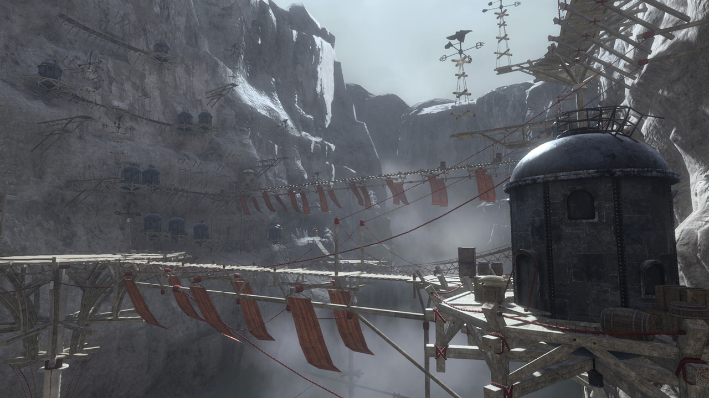

---

# Cross-cultural communication, a puzzle

There is no doubt some video games worked on integrating fictional languages and cultures to explore the possibilities of intercultural and socio-cultural literacy. Despite the massive popularity of the media, its increasing variety and the diversification of the player base lend to a better approach to knowledge acquisition, development of intercultural skills, self and cultural awareness, and perceptional impacts. Even though it was already possible to find fictional languages in video games like [Rise of the Tomb Raider](https://en.wikipedia.org/wiki/Rise_of_the_Tomb_Raider) or [No Man’s Sky](https://en.wikipedia.org/wiki/No_Man%27s_Sky), they still needed to convey their linguistic ideas accurately, as the languages encountered were never assimilated nor integrated by the player; instead, they would appear as achievements unlocking certain skills that failed at determining a real sense of approximation to the concept of “the other”. As a mere example, otherness in _Tomb Raider_ is mostly represented by _monoliths_, a puzzle item that Lara needs to decode in order to find certain secrets. To do so, she will still need a certain level of “Language Proficiency” in Greek, Mongolian, and Russian, which will only be achieved by studying murals, reading documents, or examining certain relics.

As surprising as this feature may sound given the nature of _Tomb Raider_ games, and even though the atmosphere built around one of the most recognizable archaeologists in video games seems to be appropriate, such puzzles revealed a double-sided nature the creators appeared to ignore: on the one hand, and independently of the vast investigation suggested by the writers themselves, [Crystal Dynamics’ development team admitted](https://www.gamedeveloper.com/design/creating-compelling-puzzles-in-i-rise-of-the-tomb-raider-i-) that most of the puzzles in _Rise_ were engineered with simplicity in mind, which automatically made the game fail at a cultural level due to the lack of proper exposition, understanding, or assimilation of languages, social behaviors, and cultural settings. This fact is easily excused by the already mentioned nature of _Tomb Raider_, a formulaic action-adventure game that’s indeed interested in displaying an exquisite art design but definitely not focused on cultural integration. If anything, [Shadow of the Tomb Raider](https://en.wikipedia.org/wiki/Shadow_of_the_Tomb_Raider) tried to incorporate culturalization in its core by taking real historical and cultural facts into account, yet presented us with a problematic Lara who happened to represent the colonial values of old-school archaeology and the privileging of white culture over other cultures. “Casual colonialism”, some would say.

Let’s now head back to the puzzle’s part, though. According to [Ron Gilbert](https://en.wikipedia.org/wiki/Ron_Gilbert), the emblematic video game designer, programmer, and producer behind graphic adventures like [Maniac Mansion](https://en.wikipedia.org/wiki/Maniac_Mansion) and [Monkey Island](https://en.wikipedia.org/wiki/Monkey_Island), “adventure games are officially dead”. In his article [“Why adventure games suck and what we can do about it”](https://grumpygamer.com/why_adventure_games_suck), he expresses that “what makes most games tough to play is that the puzzles are arbitrary and unconnected”, and then, he adds:

> There is nothing more frustrating than solving pointless puzzle after pointless puzzle. Each puzzle solved should bring the player closer to understanding the story and game. It should be somewhat clear how solving this puzzle brings the player closer to the immediate goal. (...) Puzzles and their solutions need to make sense. They don't have to be obvious, just make sense. The best reaction after solving a tough puzzle should be, "Of course, why didn't I think of that sooner!" The worst, and most often heard after being told the solution is, "I never would have gotten that!" If the solution can only be reached by trial and error or plain luck, it's a bad puzzle.

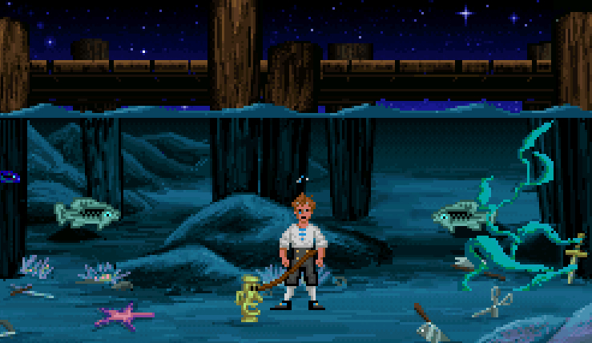

---

# Gamification & Museums of Failure

Adventure games, just like everything else around us, have changed significantly throughout time - “but unfortunately not in the right direction”. As for the part of the puzzles, it seems difficult to argue their oversimplification, the tendency to incorporate them as time-fillers whenever the game doesn’t feel long enough according to today’s standards, or the silly time-wasting nature they took in recent years, frequently choosing to be challenging at the expense of the player’s patience. Let’s take again linguistic barriers and _Duolingo_ as examples: although the last is clearly not a video game, a strategy that kept _Duolingo_ users coming back for more is their implementation of gamification, a concept that is described by its creator, You-kai Chou, as “the craft of deriving all the fun and addicting elements found in games and applying them to real-world or productive activities. This is what I call ‘Human-Focused Design’ as opposed to the “Function-Focused Design”. Considering his description, it is evident that in a learning environment, gamified apps such as _Duolingo_ can support students by contributing to their motivation, visualizing their progress, and making the learning curve feel like an interesting and appealing puzzle to solve.

In the realm of education, innovative approaches have emerged to enhance student engagement and improve learning outcomes. What happens when we keep the puzzle base, the linguistic and cultural implications, and then remove the educational filter, though? Could video games built around such bases succeed, or would they simply become museums of failure, destined to miscarry at bridging between culture and players?

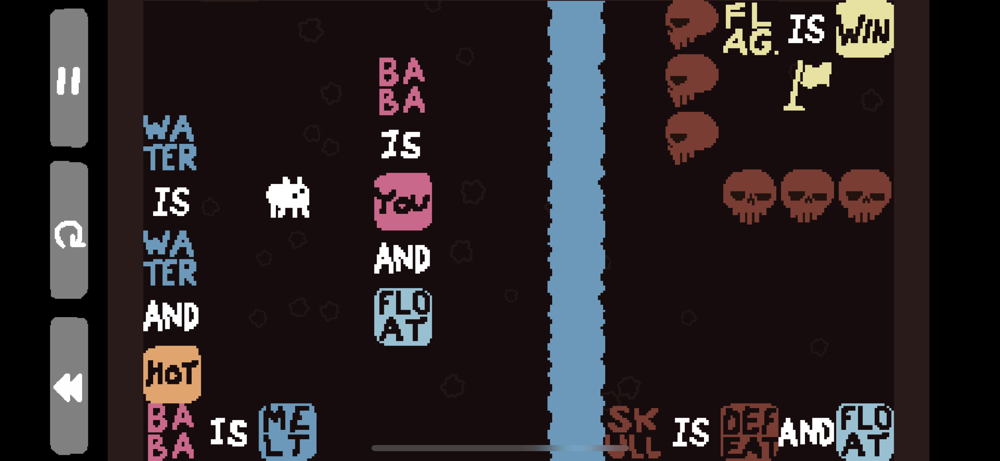

---

# Save (safe) point: linguistic and ludic bridges

Language is constantly evolving and changing, and video games are a great opportunity (and tool) to showcase how culture and art influence linguistic shifts. In relation to this matter, Julien Moya, art director at Rundisc, the studio developing _Chants of Sennaar_, shared [some insightful thoughts](https://www.gamedeveloper.com/design/deep-dive-the-visual-tapestry-of-i-chants-of-sennaar-i-) on the creative process of the different languages and cultures inhabiting their own game:

> A language is the result of a culture, and a culture is the emanation of a people. So, as with the script, we began by sketching out the various peoples of the Tower: their way of life, their values, their history, their technology, and their relationship with others. We quickly found similarities between these fantasy peoples and existing or past cultures: Latins, Persians, Arab-Andalusians, Indians, Norsemen, etc. We, therefore, decided to take inspiration from the scripts of these cultures to create the graphic aspect of our own, often mixing several to obtain an original result.

## Examples of linguistic and cultural integration

There are not many video games exploring languages and cultures from this particular prism, though. Despite the profound investigation previously captured in Moya’s description of their artistic process, influences, and goals, the common linguistic case we can find in the media usually branches into a division that could be drawn as follows:

1. Linguistic integration solely for aesthetic and phonetically artistic purposes (also called [artlang](https://en.wikipedia.org/wiki/Artistic_language)), as it happens with the popular [The Sims](<https://en.wikipedia.org/wiki/The_Sims_(video_game)>).
2. A (fictional) foreign language integrated into the game, without real repercussion or effect, in order to contribute to the world-building, setting, and credibility affecting other cultures that coexist or existed before the present one. _Hylian_ in [The Legend of Zelda](https://es.wikipedia.org/wiki/The_Legend_of_Zelda) or certain runes and carvings pointing at the existence of ancient civilizations in [Shadow of the Colossus](https://en.wikipedia.org/wiki/Shadow_of_the_Colossus) are great examples of this phenomenon.
3. Linguistic integration symbolizing a barrier that affects the avatar-world relationship and the way we approach and decode “the other”. While _NieR_ encapsulates the effects, hurts, and horrors of misunderstanding, [Ico](https://en.wikipedia.org/wiki/Ico) and the relationship between the main character and Yorda, on the other hand, represent the positiveness related to the comprehension of nonverbal signs and symbols such as gestures, postures, and other body movements that could translate into a potential communication barrier in different circumstances. Despite the lack of a common language, Yorda and Ico still manage to avoid stumbling blocks in their intercultural communication thanks to their lack of preconceptions and stereotypes, similar forms of adaptation, shared values, actions, and overall attitude towards their mutual loneliness and wounds.
4. Language as the main puzzle mechanic, mostly based on logical patterns disconnected from specific contexts or fictional cultures that aren’t closely related to the “space of the game” itself, often perceived as a playground. As we’ll discuss later, [Baba Is You](https://en.wikipedia.org/wiki/Baba_Is_You) and even [Sethian](https://store.steampowered.com/app/432370/Sethian) could exemplify this case to a certain extent.
5. Language as the main puzzle mechanic, with the difference that this time, the game’s been built around a multicultural matter and relies on it as an essential skeleton (and even muscle) keeping the work in motion. From this perspective, both [Heaven’s Vault](https://en.wikipedia.org/wiki/Heaven%27s_Vault) and the recent [Chants of Sennaar](https://en.wikipedia.org/wiki/Chants_of_Sennaar) provide an interesting approach to this peculiar way of integrating languages, multicultural perspectives, and core puzzle mechanics altogether.

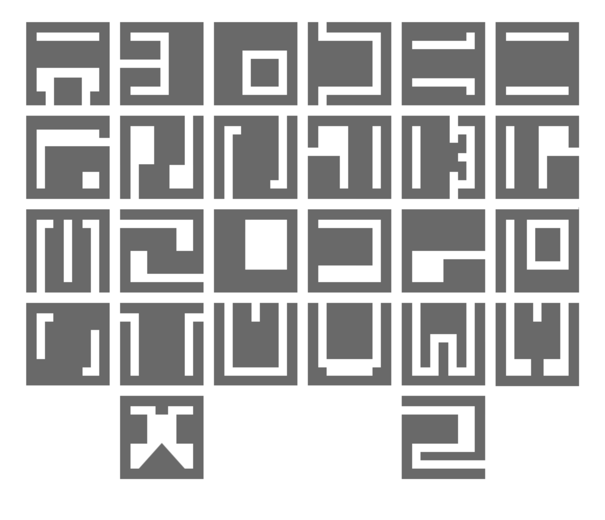

Undoubtedly, there are plenty of other possible divisions and subdivisions that could be applied to this scenario; however, and for purposes of clarity, it seems appropriate to keep this categorization as plain and accessible as possible in order to understand better how this linguistic and cultural mediation, mixed with the interaction and design bases of video games, can effectively bridge communication gaps, provide the player with a meaningful yet entertaining experience, and ultimately foster cross-cultural understanding and sensitivity.

### Baba is you, isn't it?

As the name itself implies, _Baba Is You_ is a game about “being”, “identity”, and their relation to language - and its way of expressing and delivering this message culminated into one of the most brilliant playable experiences of recent years. Under the appearance of a 2D video game in which the player pushes world-blocks around to build sentences, and through self-reference paradoxes, metalanguage, and the map-territory distinction, _Baba_ became an intuitive and extremely clever philosophic playground by enticing players to question not only language and its uses, but some general conceptions video games and the way we understand, interact with, and even create them.

According to the article named [“Baba Is You is a Postmodern Masterpiece”](https://intothespine.com/2019/08/07/baba-is-you-is-a-postmodern-masterpiece):

> The basics of postmodernism rely on not the objective truth, but the objective truths that are shaped by our own backgrounds, perspectives, and inherent biases. As such, the truth is relative to a number of other factors, and can vary from person to person or, in this case, puzzle to puzzle. Sometimes the truth is that Baba can float across water. Other times it will sink. The truth is relative to the puzzle, and relative to the three words placed adjacent to one another somewhere on your screen. This relativism is what makes Baba Is You so unique and addictive. The solution to every puzzle depends on how you and Baba manipulate the rules. And, so long as Something Is You, there are countless truths that can solve each puzzle.

As we pointed out during our previous categorization, words in Baba Is You depend entirely on their context, though, what makes Baba its own language-game where simply switching adjectives makes the puzzles change form entirely, just like the win conditions do, too. In this sense, the article is absolutely right: in _Baba Is You_, a concept as clear as “water” can suddenly mean “something new in the language game of the game and the language-game of a certain puzzle”. Above all, _Baba_ is a lateral-thinking video game that’s all about breaking and recreating rules, and as the author himself, Arvi Teikari, shared: “the narrative of the game is very much more concerned with the rule system and the structure of the game world than with Baba or the other beings seen in the game.”

Given this particular dimension of _Baba_, always expecting the player to challenge the “obvious” and to see that even this assumed “obvious” is a construction that can be tackled, reasoned about, (re)defined, and manipulated, we can indeed discuss a linguistic approach to puzzle mechanics - even a permeability of the fourth wall due to the rearrangement of the spelled-out rules and conventions of a game that imports its essential tools from our empirical world. However, since it is not possible to recognize other context than the one that belongs intrinsically to _Baba Is You_ and the constant references to itself (a referential function that makes the game its own context), it wouldn’t be possible to interpret Baba as a game built around a multicultural approach; its true nature, if anything, relies only on the preexisting associations and assumptions built from every other video game we experienced in order to then reject and subvert traditional game rules.

### Sethian: "they ascended"

If _Baba Is You_ was all about skepticism, manipulation, metalingual and referential language functions, and metacommunicative signals able to take ambivalent meanings while still borrowing the linguistic rules of English, _Sethian_ chose proper language patterns, structures, and a design premise as inherently as hostile to interpretation as possible from the outset. While some games like [FEZ](<https://en.wikipedia.org/wiki/Fez_(video_game)>) replaced every letter in the English language by, in this case, a square symbol (this is, a fictional alphabet, which can be done very easily by simply replacing the font used to render the text), and although others, like [TUNIC](<https://en.wikipedia.org/wiki/Tunic_(video_game)>), decided to integrate a fictional syllabary as a form of writing system in which symbols represent syllables but not letters, all of these examples lacked their own grammar, a fact that effectively translates into interesting transcriptions, but not languages as such. In _Sethian_’s case, and independently of its fairly primitive aspect, the main puzzle mechanic relies on a fictional language that’s not based on any traditional linguistic system.

“Sethian” is the name of a long-lost colony that we, playing the role of a xeno-archeologist out to save our career, have just discovered. As we are tasked with exploring the ruins of an abandoned colony and communicating with an ancient computer in the native language of the people who once inhabited the planet, only the usage of puzzle mechanics will allow us to study and decipher the language of this lost civilization in order to uncover its mysteries. Through this premise, the player is capable of sitting in front of an alien computer that functions only in the local extraterrestrial tongue, and asking certain questions to help them with their studies, always counting on the support of a journal with the basics of the language as picked up by previous archaeologists; even though the journal itself comprises over a hundred pages in total, unlocking them is completely up to us, though. From this perspective, it’s undeniable that the task of trying to find the right glyphs and punctuation to communicate an idea based on what little we can glean from our dictionary creates a growing sense of panicked curiosity that is downright intriguing, to say the least. A little niche, too, as it is a single-screen mystery about typing commands to find out more about the extinct race behind the device, but what’s great about it? How does this everything work, even?

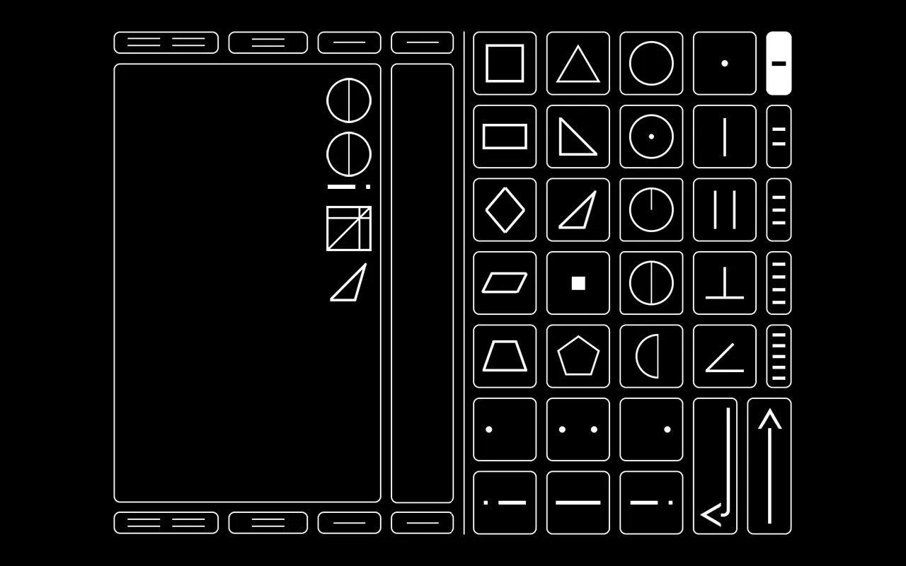

[Grant Kuning](https://twitter.com/sethiangame), the creator of _Sethian_, decided to start working on the game after studying Chinese for three years, and even though American Sign Language and other inspirations are included in his work, the features of Sethianese have no real counterpart. Despite of that, the similarities between the fictitious language he created and Chinese itself, for instance, are that they both use a complex system of symbols to represent the meanings of words; this differs, of course, from the English language, which uses an alphabet to write down pronunciation rather than meaning in its written form. As for the symbols themselves, Kuning took directly from ancient geometry and followed an approach comprised of basic shapes, concentric circles, inscribed squares, dots, and lines, giving the symbols and the system they follow to create sentences a truly appealing yet uneasy, eerily-geometric aspect. The incredibly intelligent and creative work of word-building related to Sethianese is beyond any doubt: everything feels inhuman and artificial because it _is_ inhuman _and_ artificial.

The downside comes in the form of handwritten notes (most of the time, the game simply writes down all the clues for you), as well as _Sethian_’s real aim, which might be perceived both as the game’s novelty and unavoidable problem: although Kuning created a work fully aware of puzzle games being all about mystery, and no matter how certain aspects contribute to the atmosphere of the unknown, the real aim isn’t related to the story’s climax but to create a dictionary. If you’re wondering why this could become a problematic matter, let’s keep in mind that interactive fiction that relies on a parser (a computer program that breaks down text into recognized strings of characters for further analysis) can be unaccessible enough when it is written in plain English. If we also take into account the fact that inputting just a single mislaid symbol is more than enough to make a query unanswerable, there’s the possibility that many players could fall into unpleasant thoughts with its roots in frustration.

The profound symbology and mystery of _Sethian_ are as impressive as its fictitious language is, and unlike in other games previously mentioned, Sethianese indeed uses its own unique grammar and vocabulary rather than simply substituting words and letters one-for-one with English - an immensely vast task, without question. Finding the right balance between reducing the number of translations and suggestions the player receives (which could make the game far too tough to figure out) and incrementing these helpful hints (which might ruin most of the challenge) is a delicate matter, though - especially considering that _Sethian_’s gameplay follows a simple rinse-and-repeat form. The contradiction between the game’s premise, the meticulous care with which Kuning crafted his Sethianese language, and the monotone flavor of its execution makes it still necessary to highlight the importance of a small atmospheric game containing a language that, like all language, has weight and power, even if it’s been removed from all context and encapsulated in a computer.

### Language contextualization in Heaven's Vault

_Baba Is You_ offered ways to play around (with) signs and meanings, bringing their customarily accepted sense, praxis, and pragmatics into view, which made the experience something similar to a meta-puzzle playground. On the other hand, _Sethian_ proposed a game where the context went beyond the game-context itself, turning it into an atmospheric (and extremely difficult to deliver, as [the author himself explained](https://www.kickstarter.com/projects/1158657297/sethian-a-sci-fi-language-puzzle-game/posts/1731256)) work of craft, contradiction, and construction, as its core vision gravitated around making sense _contextually_ - whatever happens, it _has_ to fit in with the conversation with the computer. Finally, _Heaven’s Vault_, a sci-fi adventure starring a historian named Aliya Elasra, tried to investigate what happens when choosing the shape of a linguistic puzzle where the exploration of a whole ancient language developed from scratch relies on history, unique moral and cultural dilemmas, and the craft of a compelling narrative.

Creating puzzles that are open to interpretation is no small task. Similarly, turning on the bright lights and focusing on archaeology without guns and whips involved might sound challenging enough, no matter if _Heaven’s Vault_ is not an accurate representation of how archaeology truly works either. Not without its flaws, Aliya’s universe solves very elegantly some of the main problems of the _Tom Raider_ series, though, and does not fullfil any imperialistic, racist, or sexual tropes, while still referencing them. Moreover, and just like [Zora Gilbert pointed out in his review](https://sidequest.zone/2019/05/02/heavens-vault-is-too-a-game-for-linguists), the game is capable of delivering an experience that “gamifies and makes interesting the puzzle-solving aspects of learning _about_ a language just as much as learning the real language itself”, which is enough of an achievement independently of the issues encountered during the process.

Speaking of the process itself, it’s crucial to clarify that in _Heaven’s Vault_, Ancient is a conveniently unusual language. As read in [“Heaven’s Vault: A Linguist’s Buried Treasure”](https://www.wired.com/story/heavens-vault-linguist-review-switch-release/):

> The Ancient language dictionary contains an impressive 3,000 words, but it is still fundamentally the English language in terms of its grammar, albeit written through a variety of glyphs. It allows players to lean on their grammatical knowledge of English and the context of the game, such as their surroundings, to derive the meaning of the glyphs as they progress. Ancient is what linguists call a logographic writing system, the oldest type of writing system, which uses a symbol or picture to convey a word or a part of a word that has meaning. The most obvious real-world comparisons to Ancient in terms of script and the way a language is written and portrayed are Mayan and Egyptian. That is as far as the similarities between our world and Ancient go, however. It is an unknown alien language within the Heaven’s Vault universe, after all. The language is static, there is no slang or spelling discrepancies, and it is a “scripta continua” — a style of writing that doesn’t use spaces or punctuation, reminiscent of classical Greek and late classical Latin.

In order to make players feel like true archaeologists, [Inkle](https://www.inklestudios.com), the studio behind _Heaven’s Vault_, created an entirely new hieroglyphic language from scratch. At first, the players won’t understand a word of it, but as they keep playing, they’ll not only start to understand the words but also the society that created them. As an example, the first time we get to see a hieroglyph, we’ll essentially have to guess what it is. The game will display a pictorial, and then give us a few options for what it might mean, which can immensely vary depending on the context and how we approach, understand, and decode it; although we might think we’re visiting a garden, the mere realization of it being an ancient burial site might make us rethink the meanings of the glyphs entirely. Understanding the language is a sort of puzzle for us to solve, but it’s also a powerful storytelling tool closely related to a context that goes beyond a mere playground: the more we learn about the glyphs, the more we discover about the alien civilization that created them and, as a consequence of it, the more we are capable of building a clear picture of the culture, rich history, art, and religion.

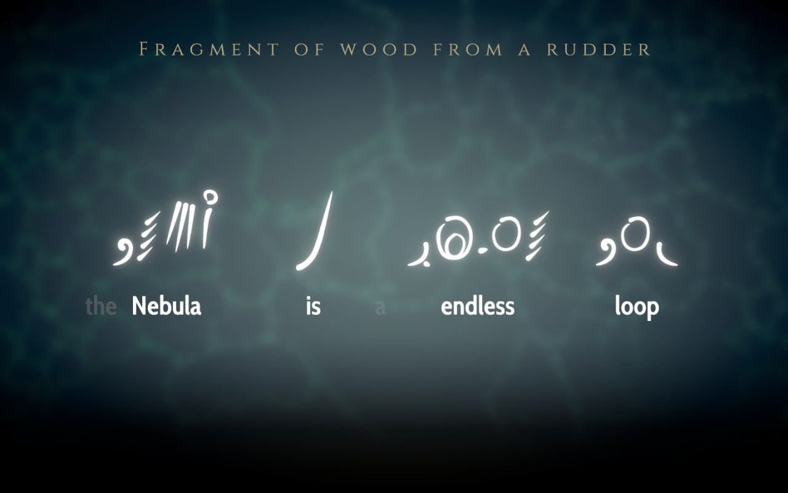

That’s probably why the addition of robust contextual variables and factors demonstrates to be essential in terms of impact, engagement, and understanding of the game experience itself; in all forms of linguistic communication, successful interpretation is dependent on our ability to make use of knowledge beyond the words themselves. Generally speaking, when we study human language processing we cannot ignore the fact that language is fully embedded within its context, this is, the conditions of its generation with reference to participants and environment; certainly, _Baba Is You_ is a remarkably clever reformulation of [Sokoban](https://en.wikipedia.org/wiki/Sokoban), while _Sethian_ treated writing and decipherment in the most sophisticated way. What (successfully) failed in these cases, and what made _Heaven’s Vault_ a game with more weight and compactness, was the fact of keeping into account that, in trying to understand real-world examples of unknown or ancient writing, linguists are increasingly focusing on the importance of cultural context and thinking about writing and language not as abstract puzzles to be solved, but embedded in, and connected to, every other aspect of a culture, from its art and ideas to its archaeology and architecture.

---

# Chants of Sennaar, “into the light”

## Me, not, love/like, plant, plant, dead/death

Languages can’t reference themselves only - and appreciating the right context for using language properly can be considered more important than sticking to the grammar and rules of said languages. From a linguistic perspective, and just like the British Council defined, the term known as “contextualization” refers to the notion of “putting language items into a meaningful and real context rather than being treated as isolated items of language for language manipulation practice only”. Not everything subscribes to language on its own, though; the contextual dynamics in linguistic communication are essential as well, as communication depends on understanding and adapting to context.

The games previously analyzed, besides showcasing puzzles way too pure and self-contained (in _Sethian_, for instance, everything about the writing system has to be understood _just_ from the writing itself), represent a partial (if not absent, in some cases) approximation to “the other” and what it truly constitutes or means. Significantly, both _Sethian_ and _Heaven’s Vault_ investigated different approaches and prisms in their way of representing ancient cultures, languages, and civilizations, but they did take a safe distance by making them _ancient_ instead of coetaneous. Although intriguing and ingenious, a writing shorn of cultural context and presented _purely_ as a puzzle feels like a kind of decipherment as imagined by mathematicians, but does not resonate with a natural bridge for cross-cultural communication. As for _Heaven’s Vault_, while it works better as an intercultural and historical bridge-builder (thanks, to a great degree, to the role of the main character as an archaeologist), it still fails at cultivating and developing an appropriate player-avatar relationship; the vast majority of articles and analysis related to the game and its many treasures, for instance, come directly from historians and archaeologists, which demonstrates that _Heaven’s Vault_ and its way of shaping social, linguistic, and cultural realities might generate more walls than bridges.

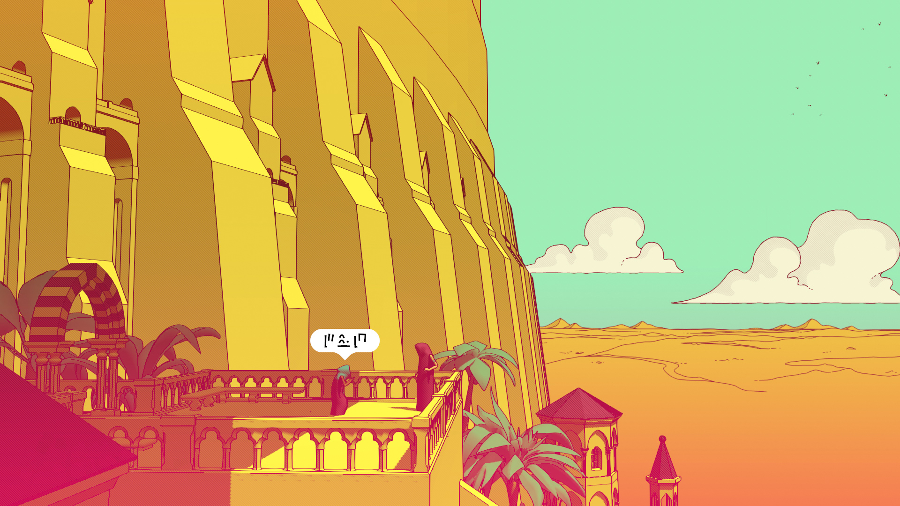

Not all walls are here to divide, though. At first, and after spending some time admiring beautiful yet unknown streets and buildings, I realized that I couldn’t understand what the kid shown in the image above wanted to communicate - at least not fully. During one of our first encounters, however, thanks to the playful music, non-verbal communication, and body language, the complete message started to get clear: he wanted to play hide and seek. After the moment of revelation that determined the success in this intriguing form of cross-cultural communication, some of the words he was using (which first worked as linguistic barriers between us) gained new layers of meaning, too. Certainly, language learning is not merely about grasping vocabulary and grammar; it’s also about immersing oneself in a new culture and understanding the nuances (body language included) that come with it - and _Chants of Sennaar_ is fully aware of it.

Developed by Stephen Krashen and Tracy Terrell in the late 1970s and early 1980s, the [“natural approach language learning theory”](https://en.wikipedia.org/wiki/Natural_approach) advocates for a continuous exposition to the language in order to develop our communicative skills, putting the focus on _acquiring_ the language and not simply _learning_ it, as the last idea doesn’t resonate with the organic nature of the learning process. In _Chants of Sennaar_ case, and even though body language is informed by culture, it is also a universal form of communication that may accept variations and cultural differences yet stays consistent in its non-verbal cues - and it’s introduced to the player as such. Another moment later on the same level exemplifies pretty much well this phenomenon: once the player, described as a “Traveler” by the game’s creators, reaches a perishing, walled garden, they have the option to address a man who appears to express some sort of sadness in its tone and physical attitude. There’s still no way to fully understand what he says, yet the plants dying, the fact that he’s standing next to them, his voice, posture, and gestures in front of such reality make it clear that whatever may affect him, it is indeed related to sorrow and anguish.

Cultural norms, values, and social context play a significant role in shaping the interpretation of non-verbal cues, but by recognizing cultural differences in body language, it is possible to enhance our intercultural communication skills, and therefore build positive relationships in diverse cultural settings. Besides murals, written instructions for certain mechanisms, or a vast variety of conversations (not necessarily related to any specific quest or goal; just interactions between individuals), _Chants of Sennaar_ demonstrated a deep understanding of our real world’s crisis of otherness and the crucial role of language, cultural awareness, or non-verbal communication on it. Divided into five different levels representing the distinct “floors” of the biblical myth of the Tower of Babel, the communities inhabiting _Sennaar_’s world coexist in a conflictive way due to the lack of mutual understanding. On a positive note, the fact that our character is a traveler or, in other words, a blank page with no specific position nor preconceived stereotypes (just like we somehow are, too, in front of the game itself: a stranger with nothing else than their curiosity), facilitates our way of approaching each different civilization to great extent; by applying no characterization to our featureless protagonist, we are disconnected from assumptions and certain traits in our personality, and therefore, our permeability, tolerance, and cross-cultural immersion possibilities increase, as no barriers are separating us from such a varied amount of cultural stimuli. Since there is no way our character can be described as someone participating in an experience “outside their cultural environment” (we can’t even know if there’s a culture of origin in the Traveler’s case, even), the effects and consequences of cultural shock are then minimal.

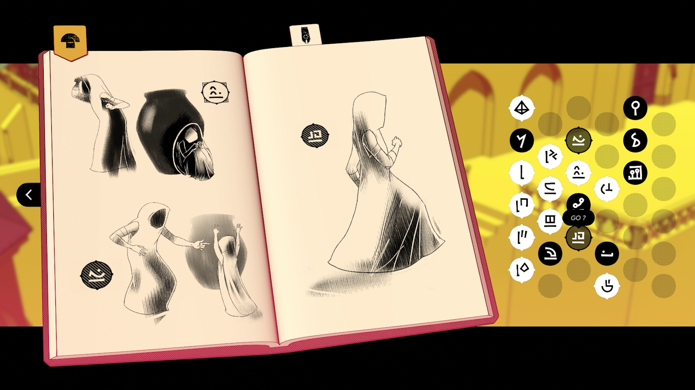

---

## Human, human, go/pass, door

There is no doubt that cultures are embedded in constant disagreements because conflicts arise almost naturally in human relationships, and _Chants of Sennaar_ is no exception despite its ludic dimension. People from different cultural and social units perceive the world through the lens provided by their distinctive languages, which eventually leads to disruptions, disputes that might be resolved (or escalated) through language itself, and multiple misunderstandings preventing social groups from perceiving their many similarities. The first area, which encapsulates the reality of a social group we could describe as “The Devotees”, is a great example of this reality: due to their intimate relationship with religion, their natural tendency to ascend in order to get closer to God is dismissed by the second group, “The Warriors”. Initially, it’s not possible for the player to decipher what’s exactly that The Warriors, in a very imperative and direct way, try to communicate, as the first language and the second one (independently of some similar treats, a fact easily explained due to their geographic proximity) differ. However, what’s clear is that tensions do exist, and they seem to branch out and multiply throughout the entirety of the tower.

The microcosmos of “The Devotees” area is fascinating, and it only keeps expanding its possibilities as the game moves on. Since initial zones are widely used as “tutorials”, _Sennaar_’s first integration of elements, as well as its gentle way of easing the player into the experience of the entire work, is determinant to validate the brilliance of its design. While it’s not mandatory to integrate tutorials in video games (one could incorporate tutorial elements without being obvious, or simply provide instructions during ordinary gameplay in an organic way), the truth is that the first level of the tower efficiently introduces the player to the main mechanics, conflicts, and overall tone and atmosphere of the game: there are murals describing cultural facts, mini-games providing more context on the social hierarchy, conversations that might be relevant (or not) to the plot, a vast usage of the pictorial journal (in this case, the game allows the player to input their own interpretations, and then puts them to test), and, of course, direct interactions pointing at the existence of various civilizations with their own, unique languages, mindsets, and peculiarities.

As for the languages themselves, this is probably one of the biggest achievements of _Chants of Sennaar_: they are rich yet not intimidating, intuitive, beautifully crafted, meticulously thought out, and logical enough to become the core mechanics of what essentially is a puzzle game. As expressed by Julien Moya:

> A language reflects the culture it comes from in many ways. Its graphic aspect reflects its history, the technologies that have shaped it, and the influences that have enriched it. The corpus of words, the vocabulary used, says much about the way its speakers see the world, their values, prejudices and taboos. Finally, the very syntactic structure of a language can serve to express its more or less primitive character or, on the contrary, its subtle or poetic nature.

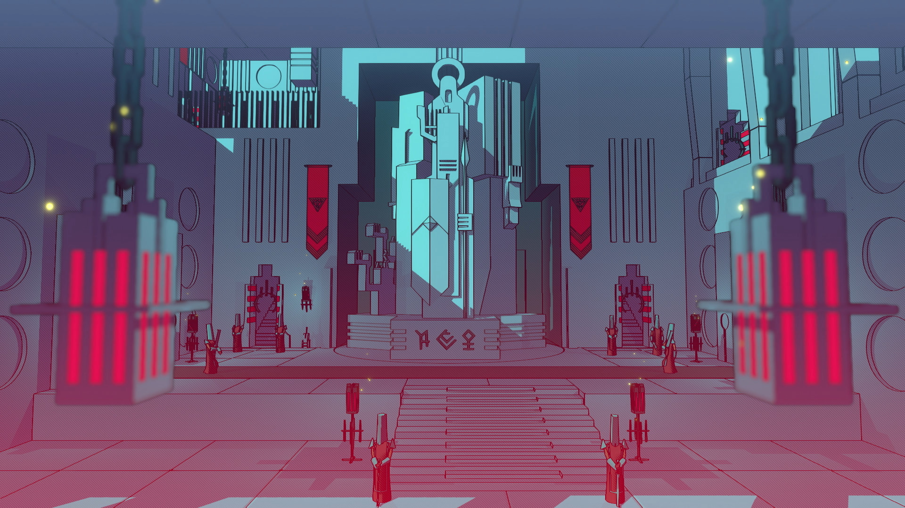

---

### A linguistic “Garden of plenty”

The more we ascend (socially, of course, but also knowledge-wise), the more distance might seem to grow between us and humbleness - both linguistically and culturally speaking. In that sense, and taking again The Devotees and their reality as the main references, it’s almost impossible to deny that simplicity crosses their civilization entirely: although most of the languages in _Chants of Sennaar_ are logographic (each written character or glyph represents a word directly), the first language we encounter resembles cuneiform and their pictographs: this is, early systems of writing where pictures represent an entire idea or word. For instance, the glyph for “man” reminds of some sort of sapling sprouting from a seed, while the glyph used to represent “death” seems to represent an upright person now lying horizontally on the ground; quite a genuine, if not innocent or rudimentarily developed lens to use as a filter to decode, understand, and describe reality. Another characteristic of the language that demonstrates its candid nature, besides other commonalities in the way characters are written (as an example, the underline meaning an action), is the duplication of the singular noun’s glyph in order to handle the plural; since there is no specific plural marker before nor after a given noun for The Devotees, a multiple concept like “people” would inscribe “human-human”, while “us” would be expressed as the conjunction of “you” and “me”.

As the player (or the Traveler) ascends in the tower, however, emerging languages spoken by different civilizations will organically readjust, refine, and develop their linguistic system, just as much as they will advance in every other cultural, technological, or political aspect. A brilliant move regarding this matter is how well each language portrays and resembles the ideological essence of each group: The Devotees, for example, understand the world through a simplified terminology mostly related to nature, crafting, basic utils, or religion, while The Warriors, with a language as sharp as their weapons, introduce an entire set of words describing an immediate reality that happens to be intimately linked to labor, duty, working tools, and physical activities.

Considering this, even though the core mechanic (the progressive discovery of a language) remains the same stage after stage, the progression feels organic, first of all, due to the lucid variety of these fragmented cultures, their hierarchical distribution, and their various beliefs, working, and social mechanisms; despite their differences, the “ascension” metaphor applied to all plans of their (fictional) existence feels coherent and rich. Secondly, we can’t ignore the immersion fact as key to the experience itself: each group we encounter _exists_ in our same temporality, and our actions have immediate repercussions since we are _coexisting with_ instead of _uncovering the ancient mysteries of_ different social groups. Moreover, each set of people is portrayed with a disarming subtlety, which impeaches the player from making heavy-handed moral or Manichaean judgments about concepts like “richness”, “poverty”, “peaceful”, or “militaristic”; each clan, independently of their mannerisms, can be likeable in their own, unique ways.

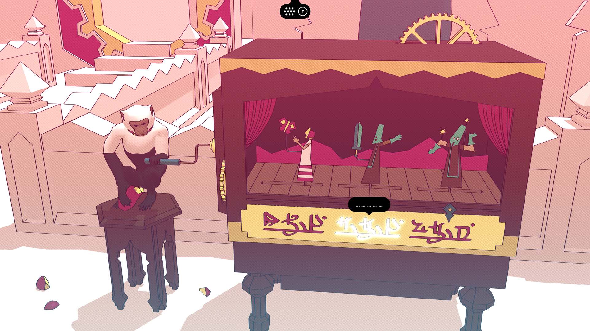

### “What’s the situation, Snake?” Coherence & cohesion

If two concepts have emerged as powerful tools to challenge traditional conventions and redefine the boundaries of video game narratives, these are “genre-bending” and the “subversion of expectations”. Although many video games (unsuccessfully) tried to subvert what the player _expects_ to experience through intertextual knowledge, deconstructions of the gameplay, and both mechanic and narrative shifts, the truth is that most of the time, merging genres doesn’t bring the best results. Taking _NieR_ again as one of the few exceptions coming to mind, we might agree on the fact that there is a clear inclination to parody crossing the entire franchise, but there is also a clever understanding of the media allowing Yoko Taro to blend in other genres seamlessly into one game while still getting rid of the disadvantages this choice could bring. Combining game types, narrative, and ludological elements in video games, as interesting as it might sound at first, can eventually _break_ instead of _subvert_ the player’s expectations, though, and as many analyses succeeded in highlighting, this reality affects _Chants of Sennar_ as well.

The bulk of _Sennaar_’s puzzles and rooting mechanics are all related to the linguistic and cultural dimension of the universe itself, as they provide the player with a better understanding of several key concepts (a learning process reinforced by images, signs, and a more visual and narratively-rich context surrounding them all), the hierarchy that irremediably caused a divide in civilization (the area of The Devotees, for instance, includes a card mini-game showcasing an ascending order of power: “Human” < “Devotee” < “Warrior” < “God”), and even rewards that work both as key items and references to the media itself (back the day, [Flappy Bird](https://en.wikipedia.org/wiki/Flappy_Bird) was indeed a thing, right?). Ultimately, successful game development requires a cohesive relationship between narrative design, mechanics, and system design, and although the different puzzles keeping in motion the meticulously crafted engine of _Chants of Sennaar_ normally offer a balanced approach to coherency and cohesion, the stealth sections populating the game didn’t participate in the overall atmosphere of the game.

From a strictly linguistic point of view, the usual definition of “coherence” is logical and hermeneutical, meaning that it involves argumentation and interpretation, while “cohesion” is more related to grammar. If we were to apply such concepts to _Chants of Sennaar_ and its mechanics, we could summarize by saying that even though the stealth mechanics are theoretically _coherent_ (they refer to deeper narrative structures, and aim at offering a more immersive approximation to the context and narrative themselves), the sudden genre-shift taking place in an experience that is mostly relaxed, reflexive, and atmospheric, doesn’t contribute to form a _cohesive whole_, as it generates unnecessary tensions and trial-error scenarios that scape from the ones making _Chants of Sennaar_ feel as a compact work.

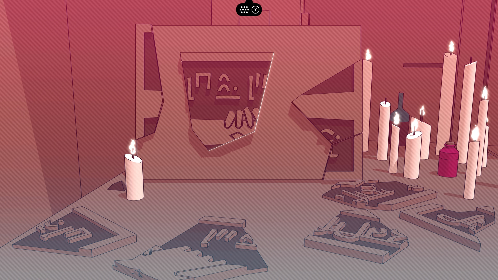

This disconnection falls in the difference between surface and deeper structures in video games. Since coherence is only recognizable beyond the surface, if the player tries to look for contextual and argumentative reasons for this specific game design choice, they will realize that there are indeed narrative implications making this aspect of the game design coherent enough. However, even though the creators had a clear idea of what they wanted to communicate and made choices that were mostly coherent with that original idea, there are times when some mechanics are perfectly solid from a narrative standpoint - but not that enjoyable as part of the gameplay itself. Needless to say, and as a positive note this time, the moments when the fluid loop of the game’s mechanics is perforated by stealth sections _still_ manage to liven up the pacing, no matter the initial frustration nor the slightly imprecise controls and camera angles.

---

## God, love/like, you, me

The enigmatic tale of _Sennaar_ doesn’t come without constraints, but they are insignificant compared to the vast immensity of a game that pushes players to understand why languages are constructed the way they are, which realities they try to communicate, and how much they do participate in making reality a better (or worse) place. The lack of a map having the player confusedly backtracking from time to time, as well as the weaker sections in terms of gameplay, pale in front of the ingenious usage of everyday scenarios to help players decipher _Sennaar_’s linguistic mystery, making it relatable, immersive, engaging, and genuinely clever in its approach to mimicking real-life language learning. Not everything is about “learning” and “languages”, though. Quoting Emily Price’s words in [“When puzzle game Chants of Sennaar is on a roll, there’s nothing else like it”](https://www.polygon.com/reviews/23864920/chants-of-sennaar-review-puzzles-stealth):

> A lesser game would make every single character into a mere puzzle piece, but developer Rundisc refuses to do so, and you engage someone in simple conversation as frequently as you talk to them to solve a puzzle. These conversations create the same magic feeling that comes when you’re learning a new language and you first realize you can utter a full sentence: Knitting together words into actual expression is intoxicating, even if you’re just listening to someone lament their dead plant. Even when you’re not speaking, you can come across people playing music or making pottery. The world of the tower feels alive.

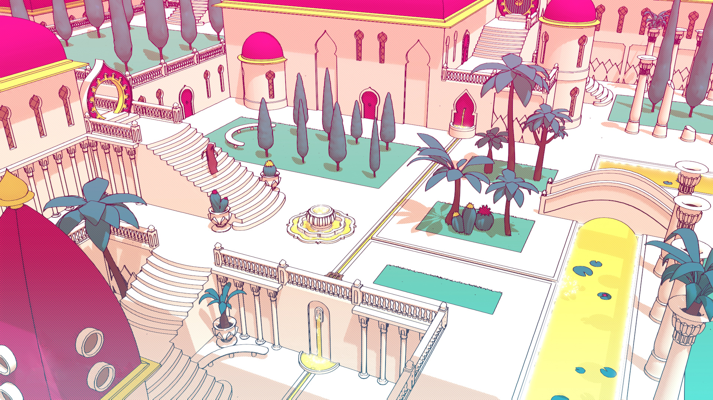

Rundisc’s way of crafting _people_ instead of heroes, avatars, or mere chess pieces is utterly laudable. Whether the player engages in useful dialogs or simply admires others enjoying the notes coming from the strings of a lute, there is not a single moment when the game leaves the balance between cultural background, research, and artistic design behind. From the impeccable influence of Franco-Belgian comics masters like Mœbius, François Schuiten, and Philippe Druillet, to the exquisitely chosen inspiration taken from past cultures like Indians, Persians, or Arab-Andalusians, _Chants of Sennaar_ is as vibrant as it is radiating tolerance, respect, and life.

Regardless of the unavoidable misunderstandings and disputes whenever different groups of people coexist, _Sennaar_’s delicate way of portraying such conflicts and “cultural knots”, as well as the universal and culture-fair perspective they apply to represent proximity and diversity, is a matter of joy. On the other hand, language learning, as a gateway to cultural appreciation, plays an undoubtedly pivotal role in building bridges between individuals from diverse backgrounds. No matter if the so-mentioned languages are fictional or not, and independently of puzzle games being more or less alive these days, it's little wonder that immersion in video games is a powerful tool that, when well applied, is bringing us, too, closer to finishing the puzzle of cultural appreciation than ever.
