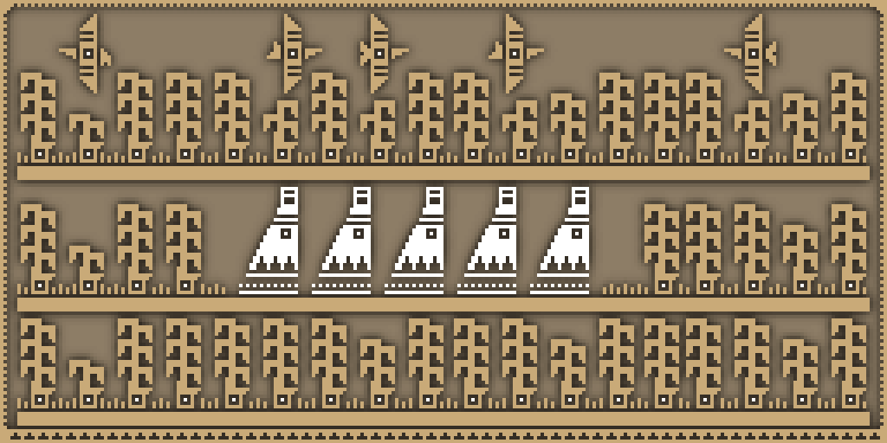
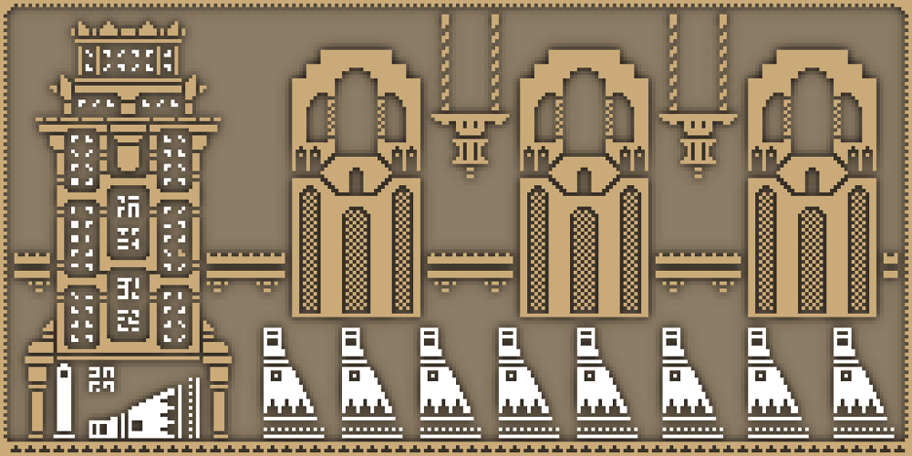

Anxiety, burnout, depression, and that modern career malaise, the very well-known “impostor syndrome”, are frequently (and alarmingly) reported by those who work in the development sector. While these symptoms are exacerbated among independents and freelancers, it’s no secret that the video game industry has been traditionally adopting practices such as “crunching”, a frequent reality that involves overworking to an inhuman point in the months preceding the release of a title; in other words, the result of poor management, often interpreted as the one and only proof of being committed to (or passionate about) one’s job. On the other hand, those who switched to an independent career (normally, after experiencing unfair treatment in their previous companies), reported a constant sense of job insecurity accentuated by their achievements and skills being constantly scrutinized. Their completed projects, metaphorical badges inseparable from their identity as creators and workers, eventually led to the dissolution of clear feelings of adequacy, thus to the realization that the constant process of self-branding is as devastating as the impossibility of proposing structural changes in their field.

## Narratives of profoundness

The definition of a "deep video game" is partial and limited. Although we could simply assume that these artistic artifacts try to address the complexity of social and personal lives to a deeper degree than the majority of video games, the truth is that they also aim to represent abstract concepts and habits of thought in order to make such emotions not only accessible or visible but _playable._ Furthermore, what we understand as "deep" or "meaningful" works, games that have the unique ability to provoke deep, socially based emotions triggered by choice and consequence, have proved to efficiently frame mental health, promote empathetic understanding, and above all, facilitate a dialogue that involves both the creators and the objective public of their digital creations, as the existence of certain proposals has a grip on a well-known lack of cooperation between mental health specialists, game designers, and gamers themselves.

Not without reason, the inclusion of mental health disorders within digital productions has often been perceived as troublesome. Undoubtedly, difficult portrayals of characters struggling with mental illness are gaining traction even in the mainstream, but it is also undeniable that big blockbusters still find themselves either avoiding realistic representations of trauma and grief, either suffering the many comments and criticisms of a general public that, even up to these days, understands video games as a magnifying mirror where we can (and must) find invincible versions of humanity, but not round characters highlighting _the unbearable lightness of being._

Perhaps it's all about the terminological literariness of "video games" since the ludic layer seems to separate these works from other art forms by emphasizing the medium's fundamental playability, thus denigrating them as trivial and demanding no further investigation. As it's not rare, commercial games that call upon various forms of psychological disorders are, for instance, frequently met with a great deal of skepticism due to the notion of "playing" itself, which often brings accusations of trivializing or exploiting topics that are perceived to require a more reverent approach than the one video games could ever offer.

What happens when creators try to overcome what seems to prevent video games from attaining artistic legitimacy, though? Is it possible to develop games that not only address issues related to mental health but also have the potential to remove the same stigmas and stereotypes commonly seen in films or television? Given the current state of the industry, is it possible to build the proper spaces allowing this possibility to exist, even?

Is the convoluted state of the industry _itself_ a reason facilitating the existence of such works?

### That dragon, incomprehension: Ellie Miller

Before diving into the present state of the sector, let's explore a specific case demonstrating how intentions are not always effective enough in delivering their initial message. As it shouldn’t surprise anyone, [The Last of Us Part 2](https://en.wikipedia.org/wiki/The_Last_of_Us_Part_II) became one of the most recent victims of the distorted and inadequate perception that exists _inside_ and _around_ the media - recent, because new disputes spark even some years after its original release. Naughty Dog’s most controversial child focused heavily on Ellie’s grief and PTSD, including the display of symptoms like flashbacks, hyperarousal, disconnection, weight loss, and apathy. Neither this symptomatology nor the anticipation of it were entirely new, though; as seen in the first part of [The Last Of Us](https://en.wikipedia.org/wiki/The_Last_of_Us), Ellie was raised in a world that normalizes death and violence, with the experience of loss, horror, and trauma forged and presented as a normality their inhabitants must learn to deal with. In Ellie's case, witnessing, living through, and surviving different forms of violence eventually led to an urge to reclaim humanity and autonomy that could only be achieved through self-sacrifice - an externally denied form of offering for the last remnants of society, though.

Much has been said about compromised moral agencies regarding The Last Of Us, the unprecedented realism of its characters, the inability to make in-game moral decisions, and the ubiquity of its violent dreads. Independently of the unclear moral evaluations of the ways this work uses cruelty (mechanically yet also narratively speaking) without shying away from the most brutal and horrible aspects of human nature, what's undeniable is that the setting itself reinforces a crucial idea: Ellie's evolution is perfectly plausible given the dimensions of the traumatic events haunting and dominating her actions. Repairing the broken trust not in herself only, but also in her community and the systems of faith and morality sustaining all this interconnection of individuals and experiences is _difficult_, to say the least - and it doesn't fade away from one day to the other, no matter the positive connotations of the circumstances surrounding the ones showing evidence of traumatic memory. According to Bessel van der Kolk in [The Body Keeps the Score: Brain, Mind, and Body in the Healing of Trauma](https://en.wikipedia.org/wiki/The_Body_Keeps_the_Score):

> Being traumatized means continuing to organize your life as if the trauma were still going on — unchanged and immutable — as every new encounter or event is contaminated by the past.

Even though the symptoms and events listed above are an oversimplification of the highly complex and personal process of traumatization, they should suffice for spectators to understand some of the behaviors, thoughts, and reactions so closely related to the severely brutal and distressing experiences Ellie had to go through, and how they still have a deep psychological impact after time has passed. Contrarily, just as the dynamics of the marketization of cultural products gave rise to the shaming of both specific individuals and certain forms of art, Ellie became one of the most hated characters in the industry, and the ones involved in the game were eventually forced to abandon if not their projects, at least their social media presence. Ironically enough, a Triple-A that emphasized authentic representation of mental health challenges experienced the worst face of their stigma instead of fostering compassion and empathy.

Presumably, that’s one of the sector’s biggest problems. The content of our media conveys a sense of cultural value by reflecting our beliefs, attitudes, and priorities. Given this idea, these cultural values may indeed shift based on the messages in the media we consume. Such effects range from cultivating new thoughts and perspectives to reinforcing stereotypes, being the last the most frequent scenarios in video games. The lack of diversity in the sector, still predominantly white and male, and still fantasizing with the idea of a plain, generic, archetypal (and almost delusional) hero that shows little depth, causes those who do not belong to the dominant gender, race, and class to remain silent; otherwise, [review-bombing campaigns](https://www.forbes.com/sites/paultassi/2020/06/21/the-last-of-us-part-2-is-getting-predictably-user-score-bombed-on-metacritic/), [abusive, transphobic, homophobic, and anti-semitic messages](https://x.com/Neil_Druckmann/status/1279841603843051520?s=20), [death threats directed to developers, writers and actors alike](https://www.forbes.com/sites/mattgardner1/2020/07/04/the-last-of-us-part-2-actor-laura-bailey-shares-disgusting-death-threats-from-gamers/#507a0d0241f9), or other forms of harassment and discrimination contribute to perpetuating a cycle of exclusion and inequality.

Are these problems linked to the public perception of artistic products only, though? Are we participating in building over and over again the same archetype of consumers undermining the industry we claim to love?

---

## Capitalizing invisible wounds

### Fractured spaces

Although the days of stigmatizing mental health issues or prolonging harmful cultural beliefs and practices should be over, our cultural spaces are still influenced by an individualized and gendered narrative of competitiveness, hatred, precariousness, and meritocracy. Within this context, however, the development of video games making sense of these social, emotional, and professional factors is interpreted by its participants as one of the few ways to facilitate exchanges of autobiographical experiences that, otherwise, would be regulated (and therefore, dismissed) by the norms of professional networking. We will analyze this phenomenon later on, but before doing so, there is something we should bear in mind independently of our specific relationship with the industry: the saddest part regarding this matter is the instrumentalization of individual and collective failures, which happens to be a matter that goes _beyond_ (yet it's still affected by) the public's perception and reach.

Learning to be a successful indie developer is often presented as a process of self-discovery, covered by a worrying idealization of human potential. Reinforced with the “passion” pretext, the video game culture has been adapting the concept of the indie game developer as an obsessive worker and martyr that, thanks to their perseverance, succeeded in landing a masterpiece. In this case, success can be just as heartbreaking as failure, though. While discussing the management of mental illnesses in the sphere of indie publishing with the creators of [Hotline Miami](https://store.steampowered.com/app/219150/Hotline_Miami/), the article under the title [“It’s time to talk about mental illness in indie development”](https://www.engadget.com/2018-04-04-mental-illness-indie-take-this-kate-edwards-mike-wilson.html), by Jessica Conditt, explored the following notions:

> "Anxiety for AAA developers is significantly different from anxiety for indies," Edwards says. "For the AAA developers, often it's the deadline, it's the manager, it's the performance review. (...) But in the indie space, it's the same anxiety as the entrepreneur or small business owner has." Online tools have made it easier than ever for folks to work from home, but this evolution can be a double-edged sword, keeping developers from engaging with nature, friends, strangers, and the non-digital world in general.

### A "b(l)ooming" sector

As if some inherent working conditions weren’t harmful enough, the site [Game Industry Layoffs](https://publish.obsidian.md/vg-layoffs/Archive/2024) reported that in the first six weeks of 2024, the industry had announced more than 6.000 job cuts, including 1.900 jobs from Microsoft’s gaming division some months after its [¢69 billion acquisition of the famous publisher Activision Blizzard](https://www.digitaltrends.com/gaming/microsoft-activision-blizzard-acquisition-impact/), or the 900 staffers that PlayStation let go by the end of February, among others.

No one would dare doubt that incredibly high investments were made due to the COVID-10 pandemic, which led to an unexpected video game industry boom that, consequently, increased the number of acquisitions, mergers, and investments taking place. What’s more difficult to believe, however, is that investors didn’t anticipate that this exponential growth would eventually end. Independently of the reasons behind, the decisions made, or the urgent need for developers to unionize, what’s clear is that making games is a tough, long road, and the combination of poor working conditions and layoffs becoming the norm in the industry does not translate into the best environment to nurture creativity.

Irremediably, the entirety of a concerning atmosphere like the one the sector has been facing these recent years pays off. Affecting studios of all sizes, the production pipeline of video games is, as we explored some paragraphs above, generally powered by rigid marketing plans and extenuating periods of crunch. Although this process seemed to work enough to culminate in incredible games over the years (2023 gave great proof of it, being [the strongest year dating back to at least 2001](https://www.theringer.com/video-games/2023/12/21/24011192/2023-greatest-video-gaming-year-of-all-time), according to Metacritic), the truth is that such a situation has also been detrimental to developers’ mental health, as there is now no proof of long-term job stability either.

### State of decay

Uncertainty provides an unsettling panorama in this titanic, expensive, yet volatile industry - even a backdrop for the hype coming out of the sector itself, as examples like the successful 2023 seem to tell a tale of two industries: a tale of greatness, and a different one where no one _in_ the industry is happy, independently of the millions of people _externally_ enjoying their creations. The situation is not as recent as we might perceive it is, though. As Jason Schreier highlighted back in 2014 with an article called [“Why Game Developers Keep Getting Laid Off”](https://kotaku.com/why-game-developers-keep-getting-laid-off-1583192249), layoffs happen _all the time_, “yet, paradoxically, the video game industry is booming”. Layoffs are, and were back in 2014, a routine:

> "The ideal situation for a big studio is to have multiple projects running at once so that team members can cycle on and off as needed," said Holden Link, a game developer who runs the layoff-tracking website GameJobsWatch. "Every time one project ships, the next one should be 'ramping up.' The 'seasonal layoffs' happen when things in that cycle don't go as planned. Maybe one of the projects got cancelled. Maybe it simply got delayed. Any change of plans like that can lead to layoffs." For an independent studio with no big financial backers, poor planning or just bad luck can leave the people in charge unable to pay their staff.

As helpless workers are the common profile and success can be hit-or-miss at any level, the economic stress triggered by the realization of the difficulty of finding the means to stop a studio from going bankrupt became a dangerous normality in the indie sector, which happens to be, at the same time, the most active one addressing and thoughtfully dissecting psychological issues, their impact, and their invisibilized presence in our daily lives. Ideally, it would be great to see big companies doing more about mental health, both _in_ games and _around_ them, but at the moment, and unlike big-budget productions, indie games are the ones uniquely equipped to create targeted experiences that tackle multifaceted topics like the ones discussed above.

---

## Loop (anti)heroes: invalidating experiences

For clarification purposes, this is not only about the impact of depression, anxiety, or grief having a crucial role in the indie creators’ lives. As we previously explored, the pains of mental distress keep spreading and crossing the entirety of the sector - and it is not something unique to the independent side of it. However, these small productions are not handcuffed to audience or shareholder expectations as much as AAA games are, a difference that allows them to craft narratives that are more direct, poignant, and less biased than the ones presented in bigger games. There are no clichés required. There is no need to mark any harmful “supernatural phenomena” checkbox as a necessary element whenever portraying mental illness. It is not required to present little or no hope for recovery, as if certain illnesses were nothing but a dramatization of a distorted, endless battle with the mind and oneself. If anything, these common misconceptions only perpetuate two problematic behaviors: marginalization (the separation between the concept of “us” and “them”) and discrimination (behaviors that deny social participation or access to resources).

Closely related to the previous paragraph, it feels adequate to affirm that fidelity is uncommon across most media depictions, no matter the subject itself. As a mere example, “madness” or specific spaces, like asylums, used to be a go-to trope for Horror and Gothic traditions that _still_ persist as a crucial element in our conception of certain genres, as it happens with survival horror in the gaming sphere. Now, let’s think of the many times mental health patients acted as shorthand for a threat to an audience to elicit fear. Let’s keep in mind video games like [Manhunt 2](https://en.wikipedia.org/wiki/Manhunt_2), [Outlast](https://en.wikipedia.org/wiki/Outlast), or [The Evil Within](https://en.wikipedia.org/wiki/The_Evil_Within), where institutions and individuals were stigmatized alike, clearly demonstrating how ingrained the portrayal of the mentally ill as violent has become within our culture at large.

### The harms of villainy

The way society is growing desensitization towards certain disorders is utterly perplexing. Given how intensely player-character interactivity and player proximity to the game world may impact people's sensitivity, it's simply unacceptable to perpetuate a turn to a base notion of "insanity" in order to explain seemingly inexplicable acts of violence perpetrated, more precisely, by game's villains. Indeed, one of the most common and arguably most damaging misrepresentations is, by extension, the incorporation of the "crazy villain" as a trope constantly oscillating between lazy writing, personal bias, or just plain misinformation. From [Far Cry 3](https://en.wikipedia.org/wiki/Far_Cry_3) to [Final Fantasy](https://en.wikipedia.org/wiki/Final_Fantasy), [Call of Duty](https://en.wikipedia.org/wiki/Call_of_Duty), or [BioShock](https://en.wikipedia.org/wiki/BioShock), among many others, video games are full of antagonists whose sole reason for villainy is mental instability. Although many creative industries use "insanity" as a crutch to avoid thinking of any actual motivation for wrongdoing, few do so with such raw abandon as video games, where it appears thrown in as an "interesting" game mechanic or mischaracterized as the sum and whole of a character's personality.

Surprisingly or not, if Ellie Miller went from one of the most loved characters to a villain in the gamers’ imaginary, for instance, it wasn’t only because she didn’t fit the “white, male, heterosexual” standard we so deeply embraced, nor due to the larger focus of the game on violence cycles rather than empathetic moments as such; in The Last of Us Part II, Ellie didn’t pass the “common theme of the principal villain” requirement implicitly expected in our media, and since she wasn’t the villain but the main character instead, we _had_ to push her back to our insensitive and inaccurate preconception of what individuals who have mental illnesses are. If she wasn’t the villain, we had to make her be one.

That's what we do with the ones struggling with psychological difficulties: villainize them.

---

## Reclaiming misplaced spaces

Video games are still relatively young as a medium, but that doesn’t mean they’re exempt from any form of criticism. Similarly, our position as part of the general public shouldn’t prevent questions, concerns, and healthy guidelines from existing either. We do lack empathy - and we do lack spaces to foster it. Whatever escapes from the margins delimitating (and often imprisoning) our reality, is considered as a threat, then automatically discarded due to the difference in a shape we don't even bother to stare at. Although the active involvement of the media is essential for success, if we truly want the media to be used effectively, its motivations and limitations must first be recognized and understood.

It's clear that video games can and _must_ do better. _We,_ as consumers of the media, must follow the same steps, too.

Now, let's take a moment to consider the words of [Tom Bissell](https://en.wikipedia.org/wiki/Tom_Bissell) in his work [Extra Lives: Why Video Games Matter](https://en.wikipedia.org/wiki/Extra_Lives):

> Films favor a compressed type of storytelling and are able to do this because they have someone deciding where to point the camera. Games, on the other hand, contain more than most gamers can ever hope to see, and the person deciding where to point the camera is, in many cases, you — and you might never even see the “best part.” The best part of looking up at a night sky, after all, is not any one star but the infinite possibility of what is between stars. Games often provide an approximation of this feeling, with the difference that you can find out what is out there.

Certainly, even the greatest messages may fade unless the audience decides to process, discuss, and even use to their advantage the many qualities that artistic works have to deliver. If we started delving into "deep video games" and their effectiveness in facilitating dialogue, it is precisely because when a game explores a creator's personal experience, what may seem to be a problematic portrayal could help to give a voice to someone who has experienced mental illness or trauma. Moreover, these perspectives may serve to openly communicate and normalize the experience itself, and in addition, provide players with the chance to assess a stigmatized view and, ultimately, challenge their own thoughts.

### Save/safe rooms

There is hope in the sector - and it's not due to its youthfulness. Although video games are still tackling mental health with mixed results, multiple works out there try to avoid games in which the player perceives and approaches "madness" as inexplicable, chaotic, and uncontrollable. [Ninja Theory](https://en.wikipedia.org/wiki/Ninja_Theory), for example (and no matter the [many aspects they got wrong about mental health](https://www.polygon.com/2017/9/15/16316014/hellblade-senuas-sacrifice-mental-illness)), showed a great deal of willingness to adapt its ideas in order to achieve not only realism but also sensitivity in representing the character of [Senua](https://en.wikipedia.org/wiki/Hellblade:_Senua%27s_Sacrifice), who suffers a schizoaffective disorder after her tribe is murdered by a Viking raiding party. Other games, like [Celeste](<https://en.wikipedia.org/wiki/Celeste_(video_game)>), offered a story of anxiety, challenge depression, friendship, despair, and hope - a story that, above all, told the player that trying is already a lot. While we will explore how to efficiently represent some examples in the following article of these series, the list is as varied as it is invigorating: [Gris](https://en.wikipedia.org/wiki/Gris), [That Dragon, Cancer](https://en.wikipedia.org/wiki/That_Dragon,_Cancer), [Omori](<https://en.wikipedia.org/wiki/Omori_(video_game)>), [Night in the Woods](https://en.wikipedia.org/wiki/Night_in_the_Woods), [Spiritfarer](https://en.wikipedia.org/wiki/Spiritfarer), or [The Beginner's Guide](https://en.wikipedia.org/wiki/The_Beginner%27s_Guide) are just a few indie options approaching trauma, loss, and mental illness through respectful and delicate perspectives.

Undoubtedly, the industry is willing to openly discuss mental health, and that is because it _genuinely_ needs to express itself more maturely and solidly. Taking back the interview with Hotline Miami's creators, one of the most significant excerpts of it comes right after highlighting that indie developers indeed face a very specific brand of pressure, much of it internal. What brings hope to the table, however, is captured in a simple statement, which reads: "They're willing to talk about it, that's the most important thing", according to one of the interviewed members. That's key.

### Kapitel 4: Gestaltzerfall

Identifying and structuring meaningful change is hard. Just like we analyzed before, developing video games often translates into an extreme focus on productivity, leading to workplace stress, a lack of work-life balance, burnout, turnovers, and so on. In this sector, in contrast to the software or start-up industry's discourse, indie success is very rarely defined in terms of growing a studio in scale or profit. Rather, success is linked with the capacity to "keep on keeping on", which is simultaneously challenging and psychologically demolishing. Devastating. Considering this, it is natural that if there are no organizational structures nor institutions efficiently supporting the pillars of their companies (this is, their workers), then such support must be sought in the artistic artifacts themselves, as they indeed may work as platforms giving voice to what seemed to be a silent reality. For those works to succeed in complete terms, however, the paper of the public plays an essential part, too.

Although audiences can ignore the subtlety and figurative nature of video game narratives if they so desire, doing so minimizes not only the value of the art itself but also the reality of the human beings in charge of crafting such works, which appears to be compromised given the current state of the sector - psychologically, economically, and emotionally speaking. For the ones wondering if such a human theme as mental illness is an over-explored concept in indie games, the answer is clearly and rotundly: "No". Sadly, 97% of Steam's games focused on _or_ discussing mental health involved negative portrayals of mentally ill people, still reproducing the same harmful stereotypes we discussed above.

So much progress and positive representations still have to be made, and way too many working conditions still _need_ to be improved. We may be on the rise, but the essential is (almost) invisible to the eye up to this time.

