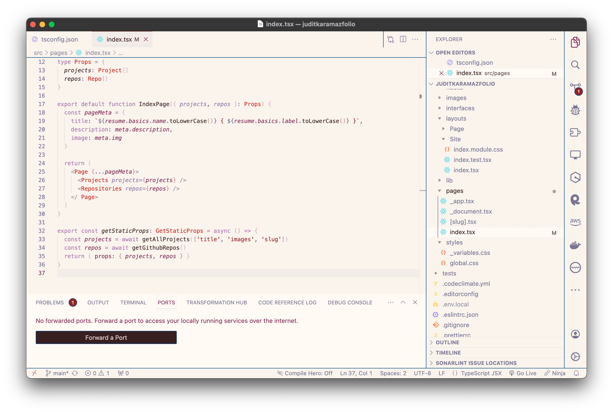

Anyone who spends substantial time in front of a computer understands the relevance of the little things (like responsiveness, ergonomics, or design), as they can highly affect the quality of our digital experience. Regarding this matter, it's undeniable that creating themes for development environments is both fascinating and intricate, especially if we take into account the need to optimize them for various languages and ensure clarity through distinct color representations for varying depths. Syntactically speaking, there's something else to consider: the delicate balance between consistency and flexibility _without_ compromising readability.

We'll agree on the fact that building themes can be satisfyingly unnerving. Although VSC uses a JSON file-based configuration system where one can open the settings, fiddle with some of the variables, and try our best to call it a day, it gets slightly more complex when you need to work on a different scale of a problem which doesn’t involve just fixing a couple of values. In cases like in-depth customization where a theme is built from scratch, the ideal scenario involves simultaneously paying attention to the smallest, inherited details, and the bigger picture - all at once. It takes some passion, some would say.

[EVASCode](https://github.com/JuditKaramazov/TCA-EVASCode) was meant to represent not only a more or less accurate approximation to the original color scheme of different [Neon Genesis Evangelion](https://en.wikipedia.org/wiki/Neon_Genesis_Evangelion) Units, but also a personal interpretation of certain scenes, themes, the overall atmosphere and tone, and the characters' role in the story. Behind these layers of purpose, there was also the main goal to maintain as much coherence as possible throughout diverse programming languages. However, while it's true that I contemplated other development environments, the original repository served as a package of themes designed specifically for [Visual Studio Code](https://code.visualstudio.com), primarily built using JSON files.

Once downloaded, you'll find that the package contains the following themes:

- **EVA-00**
  

- **EVA-01**
  

- **EVA-02**
  

- **The End of Development**
  

## Features

- easy installation
  - (both available in GitHub and the Marketplace)
- clarity and coherence
  - (these themes take into account different syntax and various color depths, just as it happens with JSON files)
- carefully crafted
  - (although EVA-01 and EVA-02 try to respect the original color palette of their respective Units, EVA-00 and The End of Development provide a subjective and unique approach to Rei Ayanami's persona or certain scenes from [The End of Evangelion](https://en.wikipedia.org/wiki/The_End_of_Evangelion). Tons of love here!)
- light and dark options available
  - (for more information regarding the aesthetic decisions that I took, do not hesitate to read the [style section of my original README.md file](https://github.com/JuditKaramazov/TCA-EVASCode/blob/main/README.md#style))

## Usage

Run the following command:

```bash
git clone https://github.com/JuditKaramazov/TCA-EVASCode.git
```

Then, in your terminal:

```bash
cd EVASCode
npx vsce package
```

This will allow you to package the themes into a .vsix file. Finally:

```bash
code --install-extension evas-code-1.0.0.vsix
```

Now, you'll be ready to run and test the themes locally. However, bear in mind that you can also download the latest release version of the themes in the [Marketplace](https://marketplace.visualstudio.com/items?itemName=tecnomazov.evas-code). It costs nothing but a single click!

## Check out & contribute

Head over to GitHub for more information, and feel free to take a peek into the code. If you find any bugs or further improvements, remember to report it just so that I can keep these themes as functional and balanced as possible.

<p class="content-download">
    <a class="icon-github btn btn-primary" href="https://github.com/JuditKaramazov/TCA-EVASCode">GitHub</a>
</p>
