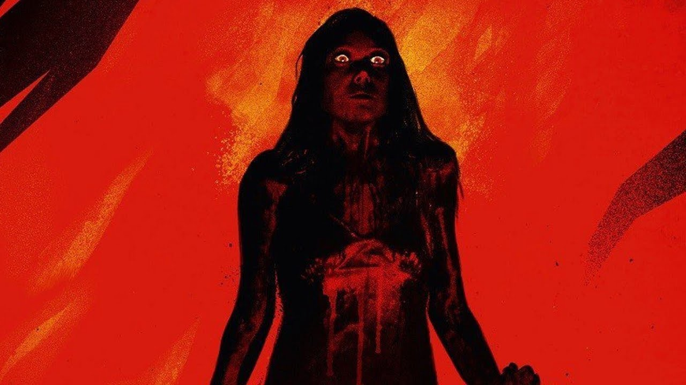
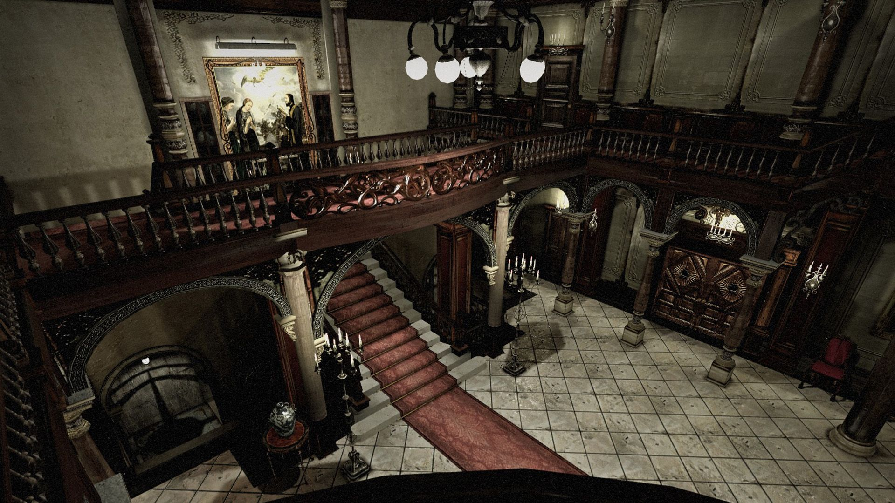
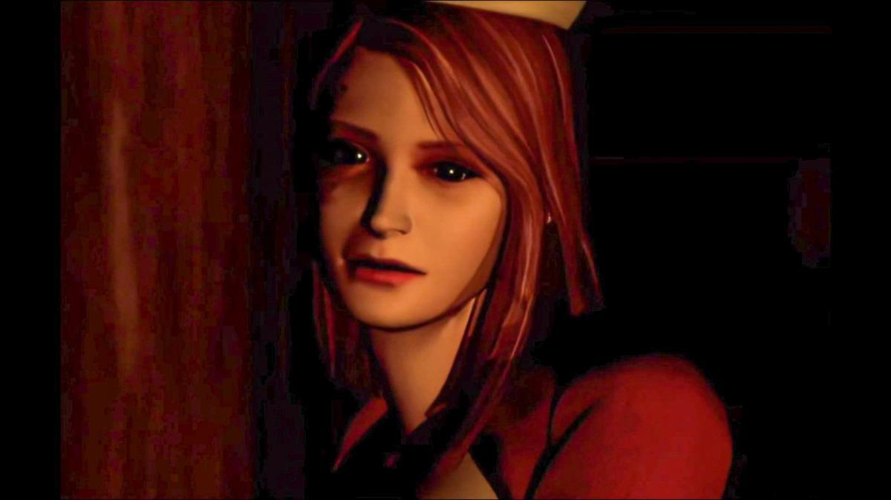
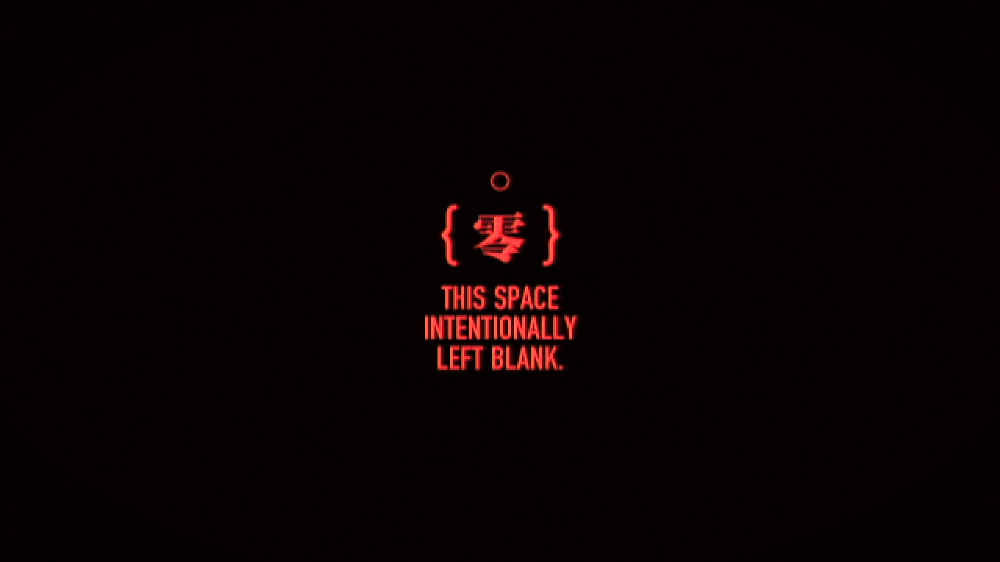
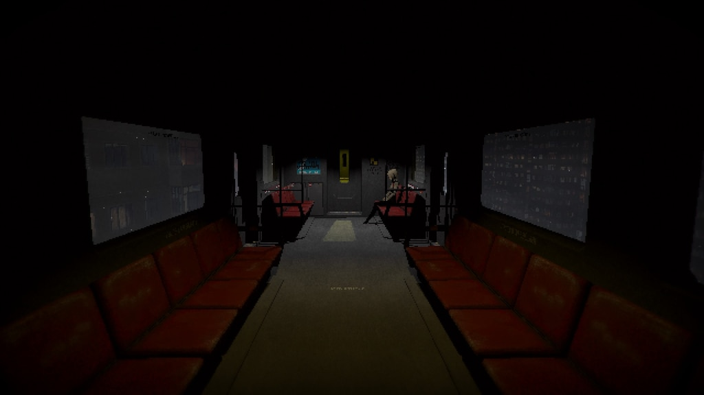
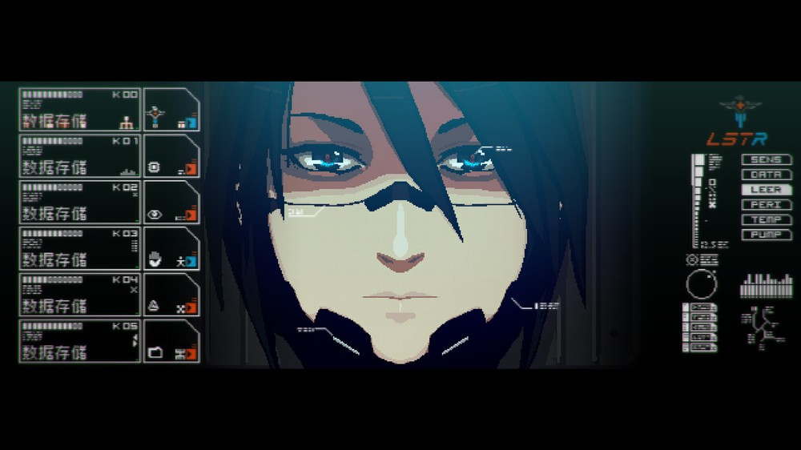
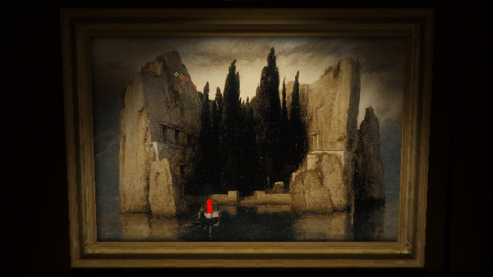
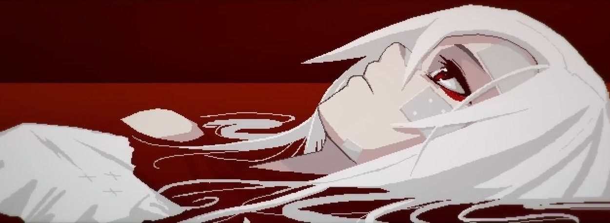
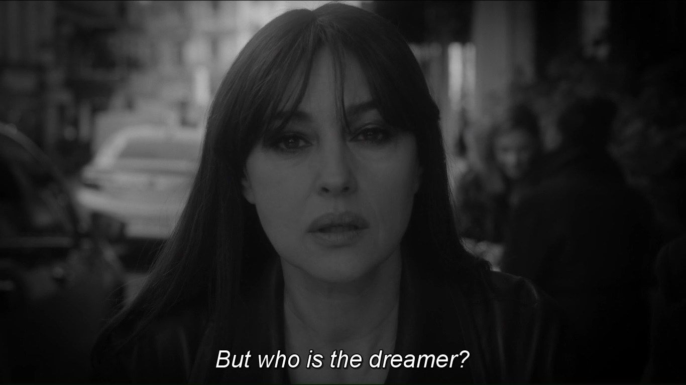

Not all games make the player feel a dreamy sense of _uncanny oppression_, as if everything except for our crashed ship was suspended in the very center of an illusion that might break at any moment (~~wake up~~). The ones that succeed in representing such mental states define the concept of “horror” way better than certain physical responses might ever do, though (~~Ich bin wieder ich~~). For instance, while most classic horror tropes have been overused to the point of self-parody, and although jump-scares showed relative efficiency until the beginning of a decreased usage in 2014 (~~wake up~~), the classic horror movies of the 1960s and 1970s used them sparingly (~~remember your promise~~). Compared to such predictable maneuvers, the combination of sound effects (or the absence of them), distant footsteps, dim lights, water dripping _somewhere_ (~~aber du bist nicht mehr du~~), the blurry and unreachable idea of the unknown, or the portrayal of elaborated yet fractured characters’ psyches, tend to create a feeling of tension and unease that’s significantly accentuated in video games, where their interactive spaces elicit way more complex emotional responses than other media (~~Ich warte~~). These days, however, games are failing at horror, as if studios didn’t consider enough the ample dreads certain themes provide (~~wake up~~).

## Song of horror: history

Research using brain scanning techniques tried to determine in the most accurate way which brain areas were involved in processing and reacting to horror. While the hippocampus is active when engaging with such stimuli, the brain area most associated with recognizing fear proved to be the amygdala, which made several artists name their monsters directly after it, just as it happened with [one of the most memorable Bloodborne’s Great Ones](https://bloodborne.wiki.fextralife.com/Amygdala). At the same time, evidence suggests that people can incorporate their experiences into horror, as the hippocampus plays an essential role in long-term episodic memory by supporting the recollection of contextual details. In other words, what we call “recollection” is associated with recalling the stimulus from a previous encounter, and if horror offers blank pages through the particular usage of sound or light, we are the ones in charge of adding new colors to that terrifying image based on things that are personally scary to us. If we indeed have contextual cues for what we should be afraid of, why does our brain fill in the blanks in different ways depending on the culture, era, and background, though?

### 1960s, 1970s & a sea of smoke

Our fears, aspirations, and concerns are usually revealed in art. Back in the '60s, our societies at large and the film industry itself were changing, and the division caused by the rising tensions about domestic issues, race, gender, or war, made horror movies incorporate notions that went from the psychological to the supernatural to address most of America’s national anxieties. If the previous premises were focused around strictly scientific or paranormal topics, the darkest corners of the human mind established themselves as one of Hollywood’s obsessions, proving that social paranoia, as well as the most scandalous dilemmas around what was considered “morally acceptable”, were both a necessary distraction and a reflection of trauma and generalized distrust.

Not without reason, the ones who love to be scared recognized the late ‘60s through the early ‘80s as a Golden Age capable of catapulting themes and imagery that would undeniably impact future filmmaking. After the back half of the ‘50s, its sci-fi motifs, and the visions of atomic apocalypse combined with genetic anxieties (which summarized into several radioactive monsters and alien invasions highly influenced by Cold War anxieties about the possibility of nuclear destruction), the media turned away from such narratives in favor of psychological thrillers. Quite logically, the audience needed more than the apathy concerning the processes of radiation, contamination, and destruction inculcated on them, and even though horror movies had previously leaned toward the fantastical, a society that watched real-life horrors like the Vietnam War unfolded on their television sets did not fear strange creatures nor giant bugs from outer spaces anymore. On the contrary, in the ‘60s, ’70s, and even ‘80s, people feared each other.

The horror was hidden yet visible in the ordinary.

### 1980’s causal loops

While 1960’s [Psycho](<https://en.wikipedia.org/wiki/Psycho_(1960_film)>), 1968’s [Rosemary’s Baby](<https://en.wikipedia.org/wiki/Rosemary%27s_Baby_(film)>) 1973’s [The Exorcist](https://en.wikipedia.org/wiki/The_Exorcist), and 1976’s [Carrie](<https://en.wikipedia.org/wiki/Carrie_(1976_film)>) offered a more grounded, explicit, and realistic understanding of what psychological horror was, 1974’s [The Texas Chain Saw Massacre](https://en.wikipedia.org/wiki/The_Texas_Chain_Saw_Massacre) and 1978’s [Halloween](<https://en.wikipedia.org/wiki/Halloween_(1978_film)>) allowed slasher creations to blow up and take over the horror genre for years. These films, featuring visceral killers and household items being used as weapons, horrified audiences across the nation as much as they magnified the love of the citizens towards such a form of terror.

According to the respected film critic Roger Ebert, “We aren’t seeing the movie, we’re having it happen to us. It’s frightening”. Indeed, the slasher genre represented what American people were afraid of as individuals and not only as a compact nation confronting history directly: “realistic” murders taking place on their soil, normally followed with false marketing of such films being based on true stories. The combination of suburban settings, inventive violence, commonplaces becoming menacing, and some other variations of the dangerous influences not only represented by the city anymore was clever enough to culminate in an effective type of thriller. The hopelessness for the future, distrust, and the inability of parents to shield their children from living nightmares seemed to hit way too close to home - close enough to make these creations feel as contemporary as their teen protagonists were.

The roots and popularity of the slasher films spread quickly, then mutated into the blatant exploitation of uncountable [Friday the 13th](<https://en.wikipedia.org/wiki/Friday_the_13th_(franchise)>) movies (a total of eight only during the ‘80s), and the “necessary” release of [A Nightmare of Elm Street](https://en.wikipedia.org/wiki/A_Nightmare_on_Elm_Street), which provided the audience with varied special effects, a charismatic villain, and a larger budget that allowed it to feel fresher than some of its predecessors did. It was merely a feeling, though. An illusion announcing a new sense of apocalypse.

### 1990’s & eternity in a box

Horror in the early days of the ‘90s was going through an identity crisis. Although some gems could still be found in the movie sector, they were slim-picking for a long stretch. The aggressive energy of the time was undoubtedly rudderless, struggling to find purpose as it lazily churned out these worn and tattered slasher franchises throughout the years. The ‘90s angst began to burn out.

The latter half of the decade slowly started to move on from the physical indulgences of the slasher films, fell away from the mere hack and slash, and closely embraced horror from a completely different perspective: the past’s hold on the present, the exploration of the decrepit, decayed, and abandoned towns, haunted woods, forgotten people, and an all-consuming melancholy that trailed in the wake of regression, primarily expressed through a recurrent idea of marching towards an inevitable doom. These changes captured in new artistic explorations were not fortuitous at all, though: they were the product of a general atmosphere of paranoia and dread that preceded the turn of the millennium.

Elevators stopping. Planes and trains coming to a halt. Credit cards and ATMs ceasing to function. The final days of the 1990s were a time of uncertainty, and nearing the end of the century, society was staring into the unknown, with the internet mutating into a ferocious and dominating presence in people’s daily lives, social interactions taking their first steps into the digital spaces, the truth becoming harder to discern, or bad news traveling in what felt like an almost instantaneous way. The world was changing faster than anyone could keep up with. In the middle of such confusion, the rumblings of the apocalypse started to gain presence, as 2000 was on the horizon and technological oversight was about to shatter our civilization. All at once, we found ourselves standing on the precipice of annihilation.

In those last few years, horror finally settled into its purpose as a somber but necessary reflection of the age: through its confrontations between repressed histories and odds, through its omens of the analog with radio static indicating danger, or by simply incorporating a spectral silence from the telephone. Modernity and tradition, folk myths mixed with urban legends, past colliding into the present - the arrival of this new wave of horror built around what we could consider “familiar” seemed to intensify the spectrum of this general uncanniness in both directions: morbidity and curiosity.

And suddenly, horror managed to introduce little seeds of anxiety and sorrow into the mundanities of day-to-day life.

---

## wake up

As the '90s decade and the millennium drew to a close, a vast number of artistic works were apocalyptic in nature, representing the world at odds with some force that would possibly destroy the planet. A more resigned, even mystical sensibility arose, and neither contemporary nuclear dread nor creative bloodshed compared to the beauty and indeterminacy of resignation. Nihilism declares that "existence is senseless and useless”, and so did much of contemporary pop culture. Video games, of course, were no exception.

In the history of video games, starting with the fusion of horror elements with adventure ones in the early 1990s, an ample variety of styles and genres of horror games bloomed. Realistically uncanny environments immersing players in a sense of adventure and curiosity gained traction, contradicting the few positive notes people like [William Worthington](<https://en.wikipedia.org/wiki/William_Worthington_(actor)>) wanted to extract from the year 2000, which would hopefully lead to “the subduing of all kinds of evil, both natural and moral, upon one large and comprehensive plan for the recovery of the whole creation, from the complicated malady, under which it all groans together”.

In words of the filmmaker [Wheeler W. Dixon](https://en.wikipedia.org/wiki/Wheeler_Winston_Dixon) in [Visions of the Apocalypse: Spectacles of Destruction in American Cinema](https://www.amazon.com/Visions-Apocalypse-Spectacles-Destruction-American-ebook/dp/B00LEUML2A):

> We’d like to care, but it’s too much effort. Bombarded by a plethora of competing media sources, contemporary humankind seeks some sort of refuge from the incessant images of destruction that flood our telescreen, without success. (...) Indeed, as a culture, we seem tired with life. As we enter the 21st century, there are signs of exhaustion everywhere. (...) In all our contemporary cultural manifestations as a worldwide community, we seem “eager for the end.” And there is, after all, something comforting in the thought of imminent destruction. All bets are off, all duties executed, all responsibilities abandoned. Contemplating not just one’s own mortality, but that of an entire civilization, somehow makes the unthinkable not only palatable, but also vaguely reassuring. If no one will survive, who is to say that any of us ever existed at all? What values will histories of the earth have when the entire planet is destroyed?

This loose, brooding rumination on globalist discontents permeated all sides of art, anxiously turning its creations around larger themes yet keeping a destabilizing sense of failure, fright, and ephemerality. While fear is a physical experience and a psychological state, anxiety is an ontological experience characterized by ambiguity and indeterminacy that expresses our finitude - and we wrought our own, stubborn, and irremediable destruction.

No wonder video games like [Resident Evil](https://en.wikipedia.org/wiki/Resident_Evil) or [Silent Hill](https://en.wikipedia.org/wiki/Silent_Hill) found their right place in such an emotional climate of despair caused by the awareness of living in a time of crisis. Independently of their unique understanding of prevalent feelings of dread and sorrow, and no matter which of their in-game functions implemented (or not) elements of the Gothic tradition, there is a clear tone trespassing them both: none of their worlds have been given any shelter that protects them from the all-pervasive anxiety of existence.

### On evil residents

The first [Resident Evil](<https://en.wikipedia.org/wiki/Resident_Evil_(1996_video_game)>) appeared in 1996, followed by an appraisal of its design cleverness and elaborated atmosphere. Combining survival, exploration, and puzzle-solving with slow-building tension, the beginning of the franchise became not only a touchstone of the horror genre but also an artistic work capable of bringing the zombie era back to life. Although there was indeed a time when the living dead represented a resonant avatar for various cultural anxieties, zombie films had descended into nothing more than parody in the ‘80s. Similarly, it wasn’t until [Alone in the Dark](https://en.wikipedia.org/wiki/Alone_in_the_Dark) was released in 1992 that “survival horror” began to take real shape in video games, but its approach to concepts such as the trope of the haunted house (or town) and undead creatures would still need to wait for some later refinement.

The way body horror installed itself in the collective imagination thanks to Resident Evil was unparalleled. According to [Paul Wells](https://cup.columbia.edu/book/the-horror-genre/9781903364000), there’s an irremediable form of horror associated with “the explicit display of the decay, dissolution, and destruction of the body, foregrounding bodily processes and function under threat, allied to new physiological configurations and redefinitions of anatomical forms”. Even though accurate, the previous description doesn’t even dive into what the monstrosities signify, though. About the meanings of these abominations, psychoanalytical and sociohistorical readings of horror “usually view the monster as either a symptom of or a metaphor for something bigger and more significant than the ostensible reality of the monster itself.”

Despite an innovative inventory system or the most superficial connotations of body horror previously enumerated here, two crucial elements reinforce the idea of terror in Resident Evil, both of them following the trail of signification described above. First, and in the light of [Robin Wood](<https://en.wikipedia.org/wiki/Robin_Wood_(critic)>)’s words:

> One might say that the true subject of the horror genre is the struggle for recognition of all that our civilization represses or oppresses: its re-emergence dramatized, as in our nightmares, as an object of horror, a matter for terror, and the 'happy ending' (when it exists) typically signifying the restoration of repression.

The monster is the reification (even the embodiment in a symbol) of an unconscious content in the mind, as well as the representation of a certain cultural moment, normally repressed. What makes these conceptions truly effective, however, is how these monsters are presented to the audience - and here’s where Resident Evil showed its own brilliance. Ripping away any remaining sense of comfort in the mansion wasn’t the key. The delicate balance between tension and sporadic moments of safety didn’t translate into the entire cleverness of the franchise either. Not even the combination of the living dead with Umbrella Corporation and its experiments to create bioweapons, which soon became more than a zombie story, would hold alone the heavy weight of the franchise.

What made scares truly discomforting in Resident Evil was the stationary position of the camera.

### Where hills remain silent

One might argue that the greater the violence in the apocalyptic rooster’s initial scenario, the more painful our tribulation in disappointment. Indeed, the mere act of acknowledging that the vision has failed is so staggering that it commonly triggers a response to negative developments with denial, followed by redoubled efforts. That wasn’t quite the case of the first [Silent Hill](<https://en.wikipedia.org/wiki/Silent_Hill_(video_game)>).

Maybe due to the imminent turn of the millennium, [Team Silent](https://en.wikipedia.org/wiki/Team_Silent) chose a more pessimistic, psychological, and apathetic approach to the notion of horror for their 1999 release. If previously we stated that, sometimes, everything’s as simple as hiding the horror in the ordinary, revealing the fault in ourselves while doing so may strike harder than the occasional cinematic rendering of total human annihilation. Then, silence emerges - does silence here mean indifference, or avoidance? Silent Hill does not offer any specific answer. As the article [“We need more pessimistic games”](https://www.vice.com/en/article/gynd8y/pessimistic-games-melancholy-silent-hill) explored while discussing other works, it feels appropriate to quote the following excerpt and compare it with the feelings that Silent Hill managed to elicit from the players:

> It is a game about discovery where you discover nothing at all; it is a game about finding things, but you find nothing; in the end, it is a game about accepting the limits of yourself and of humans. Face with obliteration, the people who once lived in that world just kept living their lives up to the last moment. The player, like them, keeps looking for clues and essentially finds nothing.

The combination of such a constant state plus the _need_ to incorporate an element like the fog (both as an in-game mechanic due to technological limitations, as well as a narrative pillar) translated into the offering of a horizonless space, too unclear, melancholic, and unsettlingly eerie in its way of making “the basis of human orientation disturbingly uncertain”. That’s the very basis of Silent Hill: “the total dematerialization of the surrounding world. We have the feeling of having to tumble into nothingness because we see nothing fixed around us that we could hold onto”, said Bollnow in his work [Human Space](https://www.amazon.es/Human-Space-Otto-Bollnow/dp/0907259359). In this case, while Resident Evil focused on concepts like body horror, scientific, and political conspiracies, Silent Hill found a way to represent that the outside horrors are nothing but an extension of the horrors within.

As the emotional experience of players is an integral part of video games, however, combining disjunct and dreamy spaces with fractured and troubled psyches didn’t seem to be enough. Thus, if the real victory of Resident Evil relied almost entirely on the perspective offered by its camera, Silent Hill opted to support itself on the power of sound design; suspense is undeniably aided by the accompanying music, as pulsing or eerie music can signal to us that we should be fearful of what’s about to happen. Although nightmarish silhouettes also made an appearance in such a silent town, there was no real need for something scary to be on the screen for the player to feel fearful. Instead, the music, as well as the absence of it, did the work.

---

## Achtung, Achtung

During the Qing period (yet starting already from the 13th century onward), a vast number of scriptures developing spirit-writing eschatological scenarios expressed anxiety about terminal decline in diverse metaphors, one of the most common being black vapors. The name they received was heiqi (黑氣), and they seemed to be produced by human sins, filling up both Heaven and Earth. Reached by such vapors, the higher Gods would unleash billions of demons to kill humanity, cleanse the universe, and start anew.

### Perhaps this is hell

“Wake up”. After a clear reference to one of Silent Hill 2’s most emblematic moments (this is, James Sunderland staring at his own reflection in the mirror), players find themselves in S-23 Sierpinski, an AEON facility located on an outermost inhabited planet called Leng. The Elster unit Replika they control there, however, is not the same one they first played during the prologue. Truth said, not even the picture they carry in their inventory, which initially showed a white-haired woman called Ariane Yeong (and which works, at the same time, as a narrative purpose for players to start their journey), seems to coincide with the one they hold now: the same position, similar attitude and facial features, yet this time, displaying a brown-haired girl called Alina Seo.

“It’s like everything was taken apart and put back together by someone who didn’t know how it worked”, said the analytical Replika Adler. Beyond some of the fragmented events and twisted enemies we get to encounter, only the many deceased Elster units found along the way, the constant shift through memory and trauma, and the incongruence of people and locations being warped through time and space reinforce the dreamy and uncanny nature of a surreal reality that feels constantly disassembled and reassembled by an unfamiliar hand.

Pictures of people who once were there, or maybe never did (~~ACHTUNG. ACHTUNG~~). Memories that do not belong to the person we surely believe we are. Distant doors and forgotten islands (~~Ich warte~~), their shores filled with indecipherable notes referencing, as many other elements do, the same book we opened before transitioning from the first Elster we met to the one we control now: [The King in Yellow](https://en.wikipedia.org/wiki/The_King_in_Yellow), by [Robert W. Chambers](https://en.wikipedia.org/wiki/Robert_W._Chambers). Disconnected and impossible locations that, at times (~~aber du bist nicht mehr du~~), look too familiar and plausible. Ordinary. The way of traversing them, however, is as otherworldly as transiting someone else’s dream would be.

Sometimes, black vapors draw shapes of humanoid shadows on the floors and walls, indicating that someone perished there (~~remember your promise~~). Then, as if some unforgiving God took control of the scene, everything starts anew in a never-ending, nightmarish, and melancholic loop of events. Is it a punishment or a sequential dream? Moreover, who is the dreamer?

(~~wake up.~~)

### Liminality

Signalis’ architecture is psychologically and deliberately manipulative. Driving inhabitants and players alike to explore what’s supposed to be familiar, the indie game development duo [rose-engine](https://rose-engine.org) managed to take well-established spatial expectations and proportions only to defamiliarize them through abstractions. Although each player has a unique psychological disposition, what allowed the German studio to succeed in their contribution to modern survival horror was their way of presenting new information through reframing an existing picture - a craftwork that takes place in a circle of subjectivity that, inevitably, can only be completed by the audience.

As a great student of the classics, Signalis understood that existence is both a temporal and spatial matter. While temporality appears to be a fractured piece complementing and recontextualizing the game’s narrative and architectural mechanism, the space itself embodies what the roboticist [Masahiro Mori](<https://en.wikipedia.org/wiki/Masahiro_Mori_(roboticist)>) first introduced as the [uncanny valley](https://en.wikipedia.org/wiki/Uncanny_valley): a benchmark for measuring if a character, design, or robot is believably realistic and authentically human-like, without specific details revealing wrongness or oddities and, therefore, making empathy drop sharply into repulsion.

This effect is not limited to photorealistic graphics or robotics, though - it could be even wider than we’ve ever assumed. While the theory traditionally focuses on human appearance, movement, or sound, we also have recognition and expectations of reality as a broader concept, which means that this form of transgression may appear under the chaotic disjointedness of incompatible spheres, exaggerated depth field, black and white signaling interferences, or the omission of spatial boundaries, all of it referencing dream logic. The unpredictable nature of this method cultivates textural qualities from imagery and performance that motivate unexpected insight from familiar components, after all, and this feeling of oddity or inadequacy seems to respond to the coordinates where the uncanny valley of physical spaces unveils its deviations and nonlinear appraisal.

What’s fascinating about Signalis’ transgression is that it’s never anything as blatant as breaking the fourth wall, yet it is _precisely_ more unsettling because of its lack of blatantness. While [liminality](https://en.wikipedia.org/wiki/Liminality) formally refers to “the transitional period or phase of a rite of passage” (or the quality of ambiguity or disorientation that occurs in the middle of them), Signalis conjugates spaces in a way that makes them dually liminal: first, because they are transitional from a psychological or emotional perspective, as liminal experiences are equally present in political, social, or individual transformations; second, because they subscribe to a [modern understanding of liminality applied to built architectures](<https://en.wikipedia.org/wiki/Liminal_space_(aesthetic)>), referring exclusively to ambiguous, distressing, or “off” physical spaces.

Considering the previous statement, the endless labyrinth of empty and decaying rooms has a double dimension here, as it appears in the shape of both a spatial and psychological puzzle.

### A dream about dreaming

Besides being a meticulous “third-person” sci-fi game with the camera fixed to the ceiling, Signalis is also a work about doppelgängers, doublings, and dualities that might eventually remind of [David Lynch](https://en.wikipedia.org/wiki/David_Lynch)’s approach to such matters. Moreover, it could even be a recording of a third-person sci-fi game - or just a dream about it.

Something worth mentioning is that oppression doesn’t manifest only through spaces, signs of human-made environmental degradation, respawning enemies, or a (perhaps way too) limited inventory forcing the player to make constant decisions. As introduced before, the way Signalis works is unusually connected to worlds, and to peculiar mechanics, of dreams. In all honesty, the distinction between what is real and what is not persistently emerges as a relevant question for an audience experiencing the game: pushed by a constant “wake up” reminder, and similarly to the interpretation of liminality in both an architectural and narrative way, there is ambiguity surrounding the question of which events exist within a dream or otherwise altered state, and which during waking hours. Once the player’s told to “wake up”, do they truly open their eyes? Have we ever been awake? And, above all: who is supposed to be awake, in the first place?

The unknown surrounding all these matters serves as an essential atmospheric element that finds itself reinforced by an ethereal soundtrack capable of elevating emptiness to loneliness, loneliness to horror, and ultimately, horror to tragedy. The tension, however, is always tangible. This retro-future sound design (which extends to visual noise and arrhythmic environment sounds, in many cases) persists in establishing a dialogue with the only window the player has to interact with the artistic artifact that Signalis is: the screen itself. Through flickers and manipulations of camera angles, it becomes impossible to discern what kind of entity or apparatus observes what Elster is doing other than ourselves. Are we the observers? Perhaps the dreamers?

This constant yet intermittent gaze upon the player adds a new layer of discomfort, especially since it’s not clear what originates it. As a universe carefully thought of, Signalis offers plenty of information about its solar system and the planet we are possibly inhabiting - not to mention the many clues and propaganda regarding its socio-political, technological, and cultural context. Independently of such evidence, we still do not know where nor _when_ we are. From all possible planets, we seem to transition from one to the other without further explanation, as if time and space were overlapping each other - or as if our character, for whatever reason, wasn’t that much of a reliable narrator. The existence of a [Red Eye](https://signalis.fandom.com/wiki/The_Red_Eye), for instance, is often referred to in several documents, but the true nature of the symbol remains unveiled. Are we, as players, an embodiment of the Red Eye?

Although this information is never clearly given to the player nor the avatar itself, the Red Eye symbolizes the omniscient stare of one of the dual dreamers in charge of recreating a world where _they_ could finally be awakened: Ariane. What’s relevant to highlight here, however, is the concept of “gaze”. Our flickering, glitchy screen (which often displays messages referencing the “recording nature” of the events and the several alterations suffered by the camera footage), participates in building up the sense of paranoia that so deeply crossed the ‘90s: cameras everywhere, glasses allowing individuals to keep their everlasting observation upon others, monitored classrooms, or even certain words being banned from usage (like “Umerziehung”, “reeducation” in English) are defined as the necessary tools to prevent any form of obscenity to the state. The totalitarian regime _observes_ - and then takes action as a response.

In a game about dualities, the idea of “total” (in essence, the conjunction of two or more elements) appears as a fragmented yet unavoidable facade of modernity. No one can escape totalitarianism, as much as no one can seem to wake up from it or their unique nightmares. The spatial context, or what we witness through our camera-screen, however, seems to be an exception, and if it is, it’s only because the unconscious mind reinvents relationships and surroundings to serve a certain purpose in their particular dream - in this case, one about rescuing.

It is unclear if Replikas dream of yellow, perhaps electric sheep, but what’s undeniable is the State’s dreams of glory, in this context, paled in front of visions of nightmares, as the last proved to be more _total_ than totalitarian regimes themselves.

---

## (Re)Visions of Alina

To give someone control in a video game translates into enabling them to make mistakes. Horror, on the other hand, comes from simply having to live with the consequences.

Originated in the writings of the German-American psychologist [Kurt Lewin](https://en.wikipedia.org/wiki/Kurt_Lewin), it seems appropriate to bring back the concept of [“hodological spaces”](https://en.wikipedia.org/wiki/Hodological_space): the space of movement that we, as humans, inhabit. This idea does not refer to places made up of strict coordinates as such, though; instead, they represent a thicket of preferred paths, usually affected by factors such as interest, distraction, curiosity, fatigue, or urgency. Across various authors, it’s common to find insistence that human’s preferred paths are difficult, if not impossible, to capture in maps that are rigidly quantified and metrical in their logic. Similarly, although mechanically speaking Signalis resembles the crooked, puzzle-marked path of Resident Evil or Silent Hill, the real path we are innerly following is way more complex than the locked-door-apparatus we seem to confront as players.

That idea explains, at least partially, the intricate spatial correlation of disconnected areas where Elster finds herself trapped: guided by short and normally decontextualized indications, our Replika is diving into the spatially metaphorical layers of emotion, urged by the haunting idea of a promise. Here, the problem is that there are no preferred paths for us because they all belong to an external force or individual in charge of crafting them. If anything, we get to experience the consequences of an urgency that’s ultimately related to the main themes of the game: love and loss.

### 3000 cycles (without us)

Normally, we discuss horror through the lens of unsettling images of abnormal creatures inhabiting and damaging our world, usually mirroring our own actions under the justification of a safe distance between _them_ (the _other_) and _us_ (as humanity). However, if there is something more horrifying than running away from the boogieman chasing us, it is chasing something without clearly knowing (or _remembering_) why, nor the true nature of such “something” itself. Essentially, that’s the key element fuelling Signalis’ story: we desperately look for something, but the cryptic imagery of the game does not insist on telling the player they will be rewarded with information that will help to reveal the truth if they keep going on. In all honesty, Signalis doesn’t care about being understood, and every single excerpt found or interaction met reinforces this statement.

When it comes to the pivotal ideas of love and loss and how they are interconnected, the “promise” exists only between Elster and Ariane, yet does not include the player as a substantial part of it. While interacting _with_ the game, we wake up in dreams we shouldn’t be dreaming, and thus they expulsate us from them until a fitting version of Elster, capable of dreaming and remembering, appears. On a deeper level, and despite the necessary interaction to keep the game in motion, the player can only _witness_ a theatre play where most characters feel uncomfortably forced to adjust to roles and masks they never asked for. Putting us aside, the game itself is nothing else than _The King in Yellow_’s theatre play. Or might be, at least.

All the allusions and homages to David Lynch's oneiric work, [Neon Genesis Evangelion](https://en.wikipedia.org/wiki/Neon_Genesis_Evangelion), [Ghost in the Shell](<https://en.wikipedia.org/wiki/Ghost_in_the_Shell_(1995_film)>), [Blade Runner](https://en.wikipedia.org/wiki/Blade_Runner), [H. P. Lovecraft](https://en.wikipedia.org/wiki/H._P._Lovecraft)’s horror, philosophy, classical music, religion, or paintings, are indeed a curated network of complementary symbols that, once comprehended and accessed, greatly redefine what the game means; all its references expand Signalis' meaning without restricting its significance. Yet this meaning, at least the literal one, is never required nor demanded.

What _is_ required is the acceptance of emotion.

### (You don’t have to) Become whole again

Going back to Latin etymology, it’s worth mentioning that “signalis”, the genitive case of “signal”, indicates the nature of the word as a possessive noun: a signal that belongs _to someone_. This someone, of course, is not the player. As an audience, we recognize that themes of memory, belonging, and identity arise in other stories about androids, Gestalts, and Replicas, but Signalis still manages to become a meta-text whose mechanics embody its themes by the simple fact that they _are_ homage, without pretending otherwise. They _belong to_, as much as the characters belong to each other.

More than a mash-up, this is a rare example of an emotionally rich, multi-layered, and highly symbolic video game. As an illustration of this idea, one of the most striking aspects of this artistic work is its genuine interest in how interpersonal relationships survive even when immersed in tyrannical, totalitarian, and potentially corrosive societies. At the same time, Signalis strives to represent how individuals express, preserve, and explore their individual identity, both to themselves and in relation to the perception of others. If we had to summarize what the game talks about, it is as simple as intimacy experienced _in the margins_: a love story doomed to fail, crashing in the middle of nowhere. Elster and Ariane’s journey aboard the Penrose 512 ship, an initiative by AEON to send out scout vessels in order to search for new habitable planets and resources, comes to an end when they receive a transmission from the Penrose Program officials informing them that, if they haven’t found anything by now, they should then prepare for system’s failure - and an inevitable death.

As collected in the notes we find in the ship:

> If you have not found a suitable world for landing by this point, accept that you will not. Find solace in the thought that others might be successful where you failed. As you are probably aware, your ship's spare parts and rations will soon be depleted. Life support systems and reactor shielding will soon begin to fail, and radiation may begin to leak from the cooling system. We recommend you do not attempt to prolong your suffering by reusing old filters or rationing supplies. Instead, make peace with your fate. We suggest that you ask your Replika, while it is still functional, to spare you a slow and agonizing death, or that you take permanent rest in the cryogenic pod. Remember, you will die having served your Nation by partaking in a glorious demonstration of our power.

Despite the warnings of a Union that plainly didn’t care about equipping the ships to survive a journey back home (an option that never crossed their minds), fascism and eldritch horror enter then a cycle of tension where a third element is required to balance them out narrative-wise: love.

Belonging, as previously stated, is of central importance to Signalis; more specifically, the search for someone that we belong to is. Multiple characters and doppelgängers imprisoned in Sierpinski-23, for instance, exhibit a will to search for their loved ones - but either they’ve been already corrupted by a devotion to their hierarchy, either they’re aching to become part of their community again. Elster, on the other hand, seeks the purity of a love that brought her through dissolution in cancerous nightmares of [LCL Seas](https://wiki.evageeks.org/LCL_Sea) (quite a reference to Evangelion: a world without [A.T. Fields](https://evangelion.fandom.com/wiki/Absolute_Terror_Field), shapes, or specific identities. “A fragile world where you exist everywhere, and thus exist nowhere”, in words of [Rei Ayanami](https://evangelion.fandom.com/wiki/Rei_Ayanami)) over and over again until she was ready to remember the nature of a promise that would eventually wake her up from the slumber of memory.

### But I can never go back / to being me

In words of [Vlada Petrić](https://en.wikipedia.org/wiki/Vlada_Petri%C4%87) regarding oneiric cinema:

> On a purely cinematic level, oneiric implies film imagery that stimulates a paradoxical experience: while the event on the screen is perceived on a rational level as absurd and impossible, it is at the same time accepted as "reality," with full psycho-emotional involvement on the part of the viewer in the diegetic world presented on screen.

Perhaps the essence of horror involves, above all, all the things we can’t understand, how we feel about them, and the paradoxical experience of logic colliding with our emotional perception - and that’s why horror has been systematically failing in recent times. In a digital environment, for horror to efficiently trespass the barrier of the screen, there has to be tension - whether it’s from the lack of resources, a sense of danger, or the confrontation with the unknown. However, a counterpart of “tension” needs to be carefully thought out and incorporated as a main dynamic as well; otherwise, the experience of dread would be overwhelming enough for the audience, or the players, to disconnect from it.

The ingredients required to make the audience jump are fairly easily reproducible: just a sudden unexpected movement and a loud noise will achieve a physical response, but only certain expressionistic camera angles warping and obscuring the player’s view of their surroundings (a lack of control that contradicts gamer’s usual safety) can truly make an impression lasting more than the moment itself. As part of the public, we experienced enough straightforward shocks and monsters to expect and even relativize them, yet paradoxically, we are less aware of the power of surreal imagery and its impact on our expectations, memories, and hidden discomforts.

Quoting Donna Hayward from Lynch’s [Twin Peaks](https://en.wikipedia.org/wiki/Twin_Peaks), the desirable response in front of horror, mysteries, or simply uncanny settings and situations should make the audience feel “like I’m having the most beautiful dream, and the most terrible nightmare, all at once”; that’s why this song authored by several birds of war called "Signalis" works, and that is precisely the reason justifying greater incorporation of references to Signalis’ ingredients than explanations about the plot itself in this article. The influences make themselves so obvious that their role in this sort of theatre play, anguishing dream, or distorted reality cannot be misunderstood: all of them are sign, signified, and signifier that there is something _wrong_ with the world around us - and with the emotions it elicits from us, too.

But maybe we can still go back to being us. Eventually, we might (_wake up_) in the right dream, with clear memories of (_our promise_).

