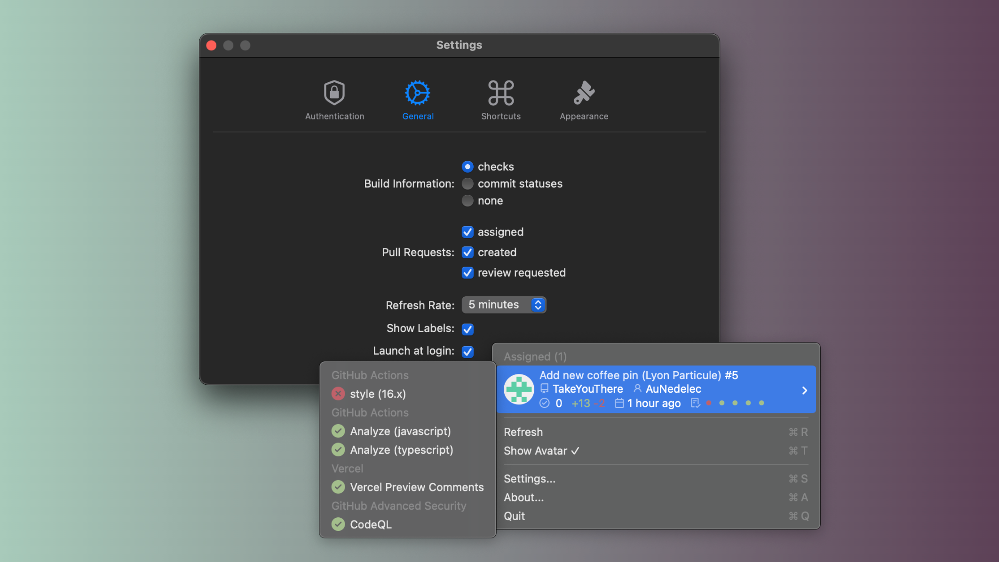
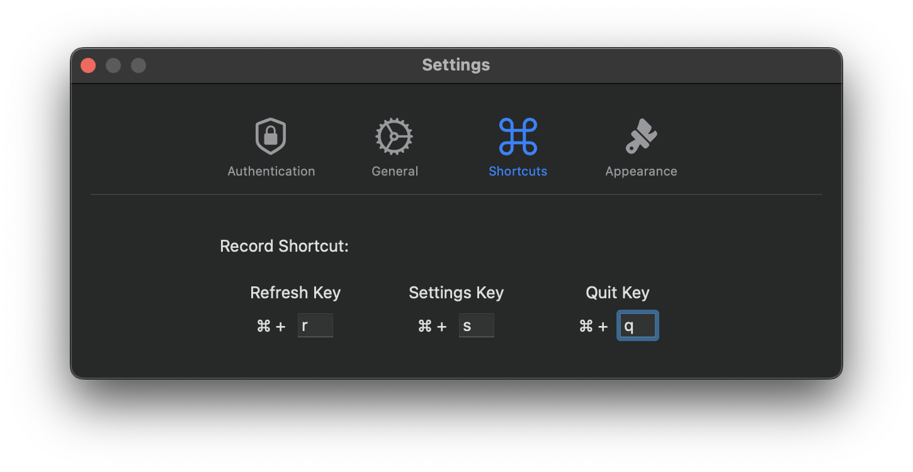
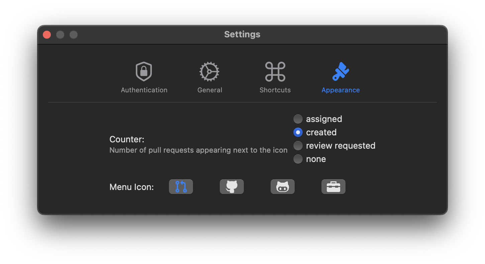

These days, becoming better turned out to be a blurry concept - now, it's all about being inhumanly, incoherently, and impossibly efficient. The idea of "performance management" or the questions surrounding _why keeping score is so important_ mean nothing, as our industry, similarly to the video games one, is obviously hit-driven: all that matters is an application, tool, or game blowing up, but no one tells you all the things you'll lose while walking through that valley.

In this context, such thoughts made me work on a **tool I could privately use to improve my productivity** - because nothing is enough. That's how [mergeOS](https://github.com/JuditKaramazov/mergeOS), a **MacBook shortcut allowing users to easily preview, manage, and access their development responsibilities (or pull requests)**, was born.

Needless to say, **accessibility** has always been one of my main goals, no matter if I was developing something for others or my own pleasure and entertainment. Considering this, I tried to simplify all the functionalities and authentication steps as much as possible for mergeOS, which resulted in the following requirements:

1. Download, unzip, and install the [latest release](https://github.com/JuditKaramazov/mergeOS/releases/download/v1.0.0/mergeOS.zip).
2. With the app open, go to **Authentication**.
3. Enter your **GitHub username**.
4. [Generate a GitHub access token](https://github.com/settings/tokens/new?scopes=repo) with **repo scope**.
5. Enter your token.
6. **Welcome to mergeOS**!
   

## Features

- easy installation
  - (as stated in the **Usage section**, it is possible to find both the [GitHub repo](https://github.com/JuditKaramazov/mergeOS/releases/download/v1.0.0/mergeOS.zip) and a [direct link](https://github.com/JuditKaramazov/mergeOS) to download **mergeOS**)
- accessible
  - (divided in four settings sections: **Authentication**, **General**, **Shortcuts**, and **Appearance**)
- automatized
  - (besides the _Refresh..._ option, it is also possible to set a **customized timer** for the app to refresh automatically)
- GitHub oriented
  - (choose the **build information** and **labels displayed**, the **pull requests** you'd want to visualize, or select a **custom endpoint URL**, compatible with GitHub Enterprise)
- customizable display
  - (select a **counter** appearing near the icon indicating the **assigned, created, review-requested pull requests**, choose your **preferred menu icon**...)
- key bindings
- persistent preferences





## Usage

Run the following command:

```bash
git clone https://github.com/JuditKaramazov/mergeOS.git
```

Then, in your terminal:

```bash
cd mergeOS
open mergeOS.xcworkspace
```

After it, you'll be ready to play with this little application locally; feel free to customize it and make it yours! However, if you'd simply want to **use the tool as it is**, bear in mind that you can download the [latest release version](https://github.com/JuditKaramazov/mergeOS/releases/download/v1.0.0/mergeOS.zip) directly. One simple click, and we are good to go!

## Check out & contribute

Head over to GitHub for more information, and feel free to take a peek into the code. If you [find any bugs](https://github.com/JuditKaramazov/mergeOS/issues/new?assignees=&labels=%F0%9F%91%80+needs+triage%2C%F0%9F%90%9B+bug&projects=&template=bug_report.yml&title=Bug%3A+) or [further improvements](https://github.com/JuditKaramazov/mergeOS/issues/new?assignees=&labels=%F0%9F%91%80+needs+triage%2C%F0%9F%92%A1+feature&projects=&template=feature_request.yml&title=Feature%3A+), remember to report it just so that I can keep this app as functional and balanced as possible.

<p class="content-download">
    <a class="icon-github btn btn-primary" href="https://github.com/JuditKaramazov/mergeOS">GitHub</a>
</p>
