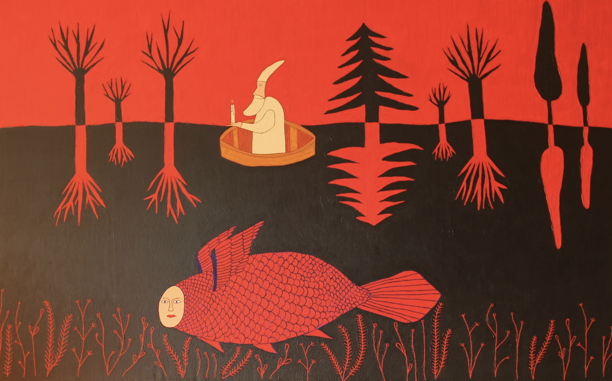
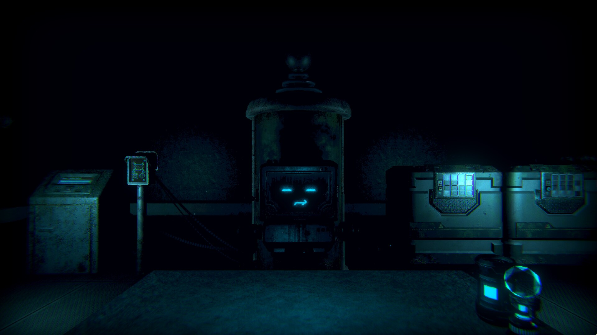
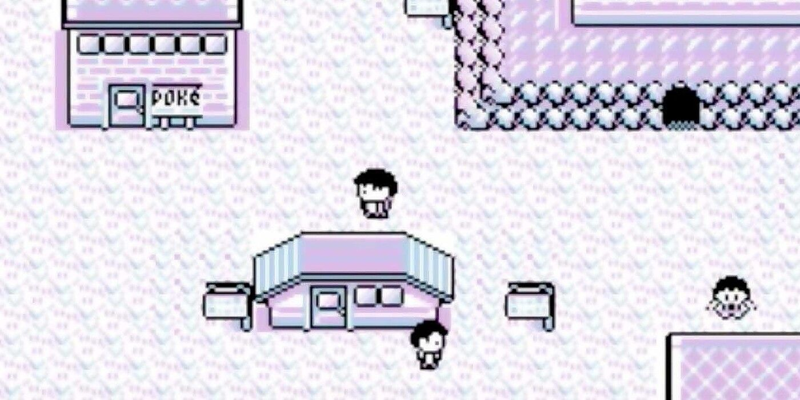
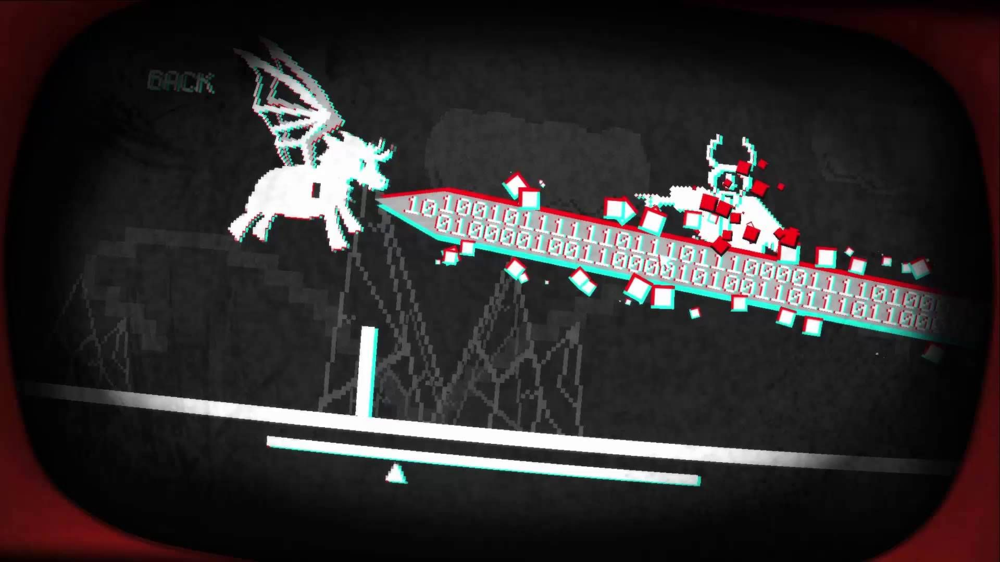

[Emily Gaudette](https://www.newsweek.com/slenderman-eric-knudsen-creepypasta-693052) stated that “Creepypasta authors are the contemporary version of kids telling ghost stories around a fire”. Besides certain aesthetic ideals that tend to revolve around a musical, vivid, and dramatic effect, to think about orality in postmodern times is to think about the ephemeral, which excludes the theoretical and literary writing voice and its trope of presence and authenticity. However, recent creators acknowledged their debt to _other_ stories of mythic or folkloric roots by becoming storytellers rather than “authors”, thus making their works participatory, empathetic, performative, and voiced enough to be heard. Moreover, today's artists (when not mere users) still manage to project, somehow, the digital shapes of bonfires into interconnected screens. The creatures of folklore were formed and molded in the space between the words of the storyteller and the minds of the listeners, after all - and that liminal space never ceased existing.

## Folklore, legends, and horror around a fire

The close relations connecting sound and content in the space of orality used to place individuals in between the states of interpretation. While written tales primarily prey upon the solitude of the act of reading, oral tales, on the other hand, used to take place in ambiguous delimitations, like cabins, the dark of the slumber dormitory, or around the fire, supplementing the ambiguity of spaces by the one of their content. As an example illustrating this idea, horror stories, with a proper assignment to the concept of "legend" in oral form, articulated worlds that didn't accept a simple _true_ and _false_ distinction, as they existed in a peculiar in-between amidst the real and the fictive. Ultimately, the boundaries dividing interpretation, its reception by the audience, and the experience of the characters themselves, were continuously drawn and dissolved into the uniformity of _effect._

### Orality and its ghosts

If we were to thoroughly discuss the nature of _folk horror_, we would necessarily have to analyze the roots of fairy tales. Established in an oral tradition as well, they passed down through generations by retellings to a multigenerational audience, exciting their imagination as much as the setting of these communal interactions did. Most of the time, the stories themselves were less important than the interchanges they stimulated; the constant interruptions in the telling and the listeners clapping and cheering, for instance, thickened the tale by its audience to a point that it became a collective product still imbued with authenticity. "Folklore", understood as this hereditary culture stream of knowledge and aesthetic forms, served as a way of shaping the identity, history, and cultural landscape of different countries. In comparison, and as strange as it might sound these days, the concept of "truth" paled in front of social cohesion or the constructions of dialogue.

Although the definition offered by the academic discipline of folkloric studies establishes a distinction between narratives like _folklore_, _legends_, _fables_, _tales_, _myths_, or _oral tradition_ (normally understood as the material based on spoken rather than written resources, which is how traditional narratives were originally shared), these terms ended up being used interchangeably besides their specific meaning. Independently of that, what's undeniable is that most of these works existed in thousands of versions, all of them connected by an essential notion: the necessity of creating a sense of place, no matter if literally or figuratively speaking.

Real or invented, folklore served as a gateway to another world not necessarily disconnected from ours. Going back to German folklore, later written-printed productions, the Grimm Brothers, and their relationship with fairy tales, violence, brutality, and monstrosity demonstrated that, just like it happens in life, fairy tales were there to offer a fascinating intersection of beauty and horror. However, in _folk horror_'s case, the concept of folklore was construed as an adjective meaning "traditional", thus bound up in the processes of intergenerational transmission and localized culture and, by extension, not representing authentic traditions.

And _that_ sounds strangely familiar.

### The ashes of the bonfire: modern liminalities

One of the most interesting ways of analyzing _folk horror_ is through the lens of modernism and postmodernism. Since terms like "tradition" and "folklore" have the meaning of _knowledge passed down through tradition_ only because such meanings were given to them in very specific contexts, it is always possible (much to academia's disappointment) to recontextualize them for authors to create their own folklore, even though they still choose to build it on existing tradition.

As one of the best examples, [H. P. Lovecraft](https://en.wikipedia.org/wiki/H._P._Lovecraft) advocated using folk myths in order to create what we would call "new artificial myths": styles, structures, and devices of folklore capable of giving fiction the "authenticity" that traditional motifs and ways of communication originally established. Tradition, in this sense, expanded plot possibilities and gave them a certain weight (or local color, if we prefer) thanks to the incorporation of oral narratives intertwined with beliefs and material culture, as it happened with the verisimilitude granted by architecture, which definitely gave Lovecraft's stories a grounding in the real world.

There were -and still are- many problems to address, but most of these factors could still be used on the side of traditional mechanisms. In the case of physical structures, for instance, no one would dare doubt that modern architecture abandoned meaning in favor of pure functionalism, which intensified the sense of loss of tradition in the present. Precisely because of that, much horror literature is based on feelings of insecurity brought by cultural change; no matter the threat itself (multiculturalism, modernism, secularism), tradition is often central to horror narratives - and so is architecture, as well as the ever-changing concept of "space".

There is a double-edged sword whenever we discuss the limitations and liminalities of modernism and its approach to tradition, though. Discourses on literacy reflected that "writing encompasses, precedes, and grounds orality", but at the same time, they insisted on exploring the clash between the tropes of "past surpassed", "past recuperated", "resistance", "liberation", and "loss", as speech seemed to have been exceeded by a writing that, on the one hand, destroyed the intimacy and participation of the oral world, but on the other, created a powerful new form of consciousness, abstraction, and precision.

Did we lose for good the oral quality of our cultures, then?

### Postmodern, unsounded voices

It would disturb no one if the writer in charge of these words stated that, recently, we found ourselves looking for the ghost in the machine. Now that we are capable of offering a new critical examination of the notion of _voice_ in the cultural context of technological revolution, the situation of what could be described as a _postmodern storyteller_ seems to be, if not uncertain, at least interesting in terms of vocality; readers, viewers, and listeners immersed in the fusion of the real and the virtual have been left with little to no clue of where reality ends and virtuality begins.

In front of the ironic mirror of the postmodern vision of literary writing, retelling, borrowing, and manipulating folklore have defined a new reality where real _and_ invented traditions seem to be as compatible as they ever were. Also, since postmodernism sustains a critical questioning of the very limits of literary representation, it feels like we're experiencing the most adequate moment to question if certain voices and oral textures have been indeed left unsounded - or not. Under the aesthetics of paradox, is it possible to present what's supposed to be _unpresentable_? Was it all about _voice_ or _echoes_ instead? Which are our conventional communication models now that the act of communicating has acquired an entirely new dimension?

Admittedly, trying to find meaning for these questions in the context of postmodernism is useless, as most of its authors and thinkers playfully avoid the very possibility of "meaning" itself. However, it's still interesting to analyze its ideas of pluralism, subversion of the truth, anti and meta-narratives, and above all, its sense of unity marked by a commitment to local experiences, where folklore and folklore became crucial figures of creativity.

Again: are we truly losing the oral quality of our cultures? Does the ghost indeed exist in the machine?

---

## Creepypastas: folk horror in the digital era

Contemporary legends on the internet are the culmination of communities bound together by inherited tales. One must not take these tales and traditions as we'd usually understand as "typic" or "authentic" ones, though, as they've been expressly fabricated and, most of the time, highly mediated. Independently of that, many folklorists have indeed recognized that online narratives might fall into the category of legends: narratives set in the real world, in historical time, short, without definitive texts yet incorporating formulaic openings and closings, and told as true (or possibly true) stories, no matter the examination of questions such as belief and possibility.

### New artificial myths: brief history

Given the initial statement that compared creepypastas with a form of "digital campfire storytelling", _internet folklore_ or _analog horror_ (depending on the format) are both valid terms to address the complex tales usually told through online mediums.

For those unaware of the terminology, [creepypasta](https://en.wikipedia.org/wiki/Creepypasta) is a concept based on the idea of "copypasta", which comes from the widely used computer command and denotes blocks of text that became viral by being copied (and pasted) around the internet. Traced back to [4chan forums in mid-2007](https://creepypasta.fandom.com/wiki/Creepypasta_Wiki:Creepypasta_Timeline) yet probably present in [Usenet newsgroups](https://en.wikipedia.org/wiki/Usenet_newsgroup) before the term managed to consolidate and gain traction, there is an interesting distinction between "copypasta" and its later variation, "creepypasta", as they refer to different types of writing: where the first keep the aesthetics of a _commentary_ or a forum reply, the last are self-contained stories with a narrative arc that range from paranormal themes to real-life violent emergencies. Folk horror of the digital age established itself through other artistic expressions and effectively spooky concepts for a large number of people (like [liminal spaces](<https://en.wikipedia.org/wiki/Liminal_space_(aesthetic)>), [backrooms](https://en.wikipedia.org/wiki/The_Backrooms), or [analog horror](https://en.wikipedia.org/wiki/Analog_horror), to name some); however, the creepypasta genre is probably one of the newest, most interesting, yet least understood offshoots of horror and the gothic.

The exact origin is difficult to delimit. The anonymous and re-posted nature of most of these written stories, as well as their vast and diverse sub-genres and themes, concluded with a corpus of thousands of them, with more being published on a daily basis. However, most academics agreed on stating that [Ted the Caver](https://www.angelfire.com/trek/caver/), posted on Angelfire in 2001, was arguably the earliest example of creepypasta: written in the first person and presented as the online diary of a recreational caver, Ted's believable insight and handy camera added enough layers of credibility to make the story one of the most immersive horror experiences available online.

This directness was a literary device that served the communal aspect of this genre of folklore, as it enhanced the connection between writer and reader and carried an intimate undertone that allowed Ted's story to spread uncanonically by word-of-mouth. That's probably one of the keys that made creepypastas successful: their nature as a form of Internet folklore or new virtual legends. Ted's adventures, however, were just the beginning of an appropriation of crucial tropes that went from archaic mediums to tell ghost stories (VHS, floppy disks...) to abandoned and haunted spaces, though.

### Slender drownings & lavenders

Interest in [Slenderman](https://en.wikipedia.org/wiki/Slender_Man) was generated by [a sensationalized teen stabbing in Wisconsin](https://en.wikipedia.org/wiki/Slender_Man_stabbing) in 2014, but the creepypasta genre's audience peaked back in 2010 due to a coverage of the trend by _The New York Times_. Undoubtedly, the mainstream recognition that followed the publication of articles covering how a 12-year-old girl from Waukesha, Wisconsin, was murdered by two of her friends just so that they would appease Slenderman and become his proxies, caused the average person to view creepypastas in a negative light, as levels of moral panic surrounding pop culture images' violence gained weight and consistency.

However, the (apparently) direct link between art, urban lore, fiction, and numerous acts of violence is not the main point to be discussed whenever we analyze this specific genre - not when it comes to this article and its intentions, at least. Our interpretations and analyses are not supposed to be static but to explain how Internet mythologies develop and prosper. Although there should indeed be a distinction between stories that simply use the aesthetics of documentaries or news footage to foster immersion and those that are presented, without irony, as real events, the truth is that creepypastas rely on attributes that are unique to the digital culture, and just like whatever other form of art or expression, they established themselves, evolved, and varied throughout the years naturally and fluidly.

What's truly interesting is that despite the specific context and mechanics giving birth to Slenderman, Zelda's [Ben Drowned](https://en.wikipedia.org/wiki/Ben_Drowned), or Pokémon's ["Lavender Town Syndrome"](https://en.wikipedia.org/wiki/Lavender_Town), it is not difficult to imagine the transmission of these stories from campfires, then to villages, and finally, to travelers and beyond. Replaced with a new architecture (this is, the digital one), the oral transmission that had supported folklore through generations seemed to find again its collaborative origins.

Over time, authorship has become increasingly important, though. We could witness a similar process from Classical Antiquity to the Renaissance, for instance, with the idea of an author’s ownership of a text coming into being in the latest period; coinciding with the rise of the printing press, 1970's [Statute of Anne](https://en.wikipedia.org/wiki/Statute_of_Anne) conferred ownership to authors rather than publishers. Similarly, and given the fact that many authors attempt to achieve notice and relevance through their creepypastas, most of these creations are now written by named authors rather than by anonymous individuals, which translates into the initial process of "copying and pasting" becoming less common over time, as it's seen as intellectual theft and appropriation.

It's quite paradoxical that these mirrored versions of oral (in the case of videos and podcasts) transmission have adopted the structure of written discourses, though. Oral gossip and communal, (sometimes mythic) memory do not seem to fit alongside individual authorship since purely oral processes _cannot_ be fixed. The authorship concept has indeed suffered some interesting tweaks and reinterpretations in recent years - not only when it comes to creepypastas but also in other media and artistic expressions, such as video games.

---

## Conceptual dichotomies: teams, players, and auteurs

Originally a term created to apply to the film industry, an "auteur" is an artist with a distinctive approach and a strong signature or sensibility - so much that their creative influence, as well as their recognizable fingerprint, are viewed as the major force in artistic productions.

Since the rise and consolidation of video games as a creative medium, there has been a discussion of who is their creator other than the development studios as a whole or the visible faces behind them. This question doesn't exist without controversy: similarly to movies, different people with a wide range of roles help bring the product to its final version, which makes it still common that game companies choose emphasize the entire team as the _authors_ of their work, just like it happens with Disney, Pixar, or the recent Netflix in the audiovisual sector. Given the multifaceted nature of video game media, it is indeed difficult to have a single person decide on what's best for all the components of the game - visually, narratively, and mechanically speaking - even more than it might be in other artistic processes.

As complex creative works, video games are often the products of diffuse, distributed authorship - and affirmation that also applies to films, where we seemed to accept the authorship theory even though it might compromise the importance and value of cinematographers, editors, screenwriters, and producers alike. [Casablanca](<https://es.wikipedia.org/wiki/Casablanca_(película)>), for instance, relied on the total amount of five credited writers with an extra uncredited one. No matter the many artists and workers behind certain successes, we do identify "Hitchcock movies", Guillermo Del Toro's touch, Orson Welles's presence, or Quentin Tarantino's style as the culmination of working with a myriad of writers and producers yet keeping _that_ unmistakable signature, whether that be camera work or dialogue. If "nobody else could have made those movies", could someone else be "in charge" of certain video games?

Although it's easier to recognize individual _auteurs_ in indie video games due to their limited budget and reduced teams ([Thomas Happ](https://www.thomashapp.com/) created [Axiom Verge](https://en.wikipedia.org/wiki/Axiom_Verge) entirely on his own, for example), we admittedly embrace [Shigeru Miyamoto](https://en.wikipedia.org/wiki/Shigeru_Miyamoto), [Fumito Ueda](https://en.wikipedia.org/wiki/Fumito_Ueda), [Hideo Kojima](https://en.wikipedia.org/wiki/Hideo_Kojima), [Ken Levine](<https://en.wikipedia.org/wiki/Ken_Levine_(game_developer)>), [Neil Druckmann](https://en.wikipedia.org/wiki/Neil_Druckmann), [Hidetaka Miyazaki](https://en.wikipedia.org/wiki/Hidetaka_Miyazaki), or [Yoko Taro](https://en.wikipedia.org/wiki/Yoko_Taro) as something _else_ than an essential part of the development team. The uniqueness of their ideas, style, writing, and overall understanding of how video games should look and feel made everyone question if _auteurs_ were becoming a reality in the video game sector.

Are they? Are _we_ authors, too, in one way or another?

### Daniel Mullins: Islands full of ponies

If there's someone out there who took on authorship and gave (and withdrew, sometimes) agency to their intended players through a process of continuous interaction, that's undoubtedly [Daniel Mullins](https://www.danielmullinsgames.com/), the man who went _full indie_ with [Pony Island](https://en.wikipedia.org/wiki/Pony_Island): a feverish dream that started with a game jam and led to one of the most revolutionary gaming experiences one could possibly think of.

As surprising as it might sound, not only the metafictional and ludonarrative _Pony Island_ was born during a [Ludum Dare](https://ludumdare.com) or some other atypical circumstances; right before publishing his first work as a solo developer, Mullins fantasized about releasing [Catch Monsters](https://www.kickstarter.com/projects/danielmullinsgames/catch-monsters), "an adult re-imagining of Pokémon that focuses on a deeper single player experience", according to its dedicated Kickstarter page. Although the campaign raised around two-thirds of its $6000 goal, it's not bold to describe _Catch Monsters_ as "Mullin's lost work", an "ambitious game for a developer to tackle on their own" that was never released:

> Running a Kickstarter that isn't going well is brutal; usually you know early on whether or not it's going to succeed because you're supposed to get at third or more of the backing immediately when you launch the thing, then you get a big chunk near the end. If you don't get that big chunk near the beginning, then the writing is on the wall, but you can't quite give up on it because it's live and you have to give it everything you've got. I was still trying to get as much funding as I could so it looked good. So that was hard. If you don't get that big chunk near the beginning, then the writing is on the wall, but you can't quite give up on it because it's live and you have to give it everything you've got. I was still trying to get as much funding as I could so it looked good.

Despite this initial failure, and always keeping in mind the aspiration to simply "have something released on Steam", in his own words, the commercial success of _Pony Island_, coupled with unanimous critical acclaim, cemented it as one of the most remarkable indie games of 2016, which allowed Mullins to keep working in his following game: [The Hex](<https://en.wikipedia.org/wiki/The_Hex_(video_game)>).

> I realised during The Hex that something about the lore, the background... something about Pony Island gave me a lot of freedom. I could do alot of stuff with it, and I could do it very fast because of the art style. I could just whip together screens and stuff. I miss that with the Hex where it's got this higher fidelity art where I can't quite just snap my fingers and have something together. So it's really the creative process and freedom of Pony Island that I'd like revist, and I think after two and a half years of working on this, I think my skills have improved quite a bit, so think I could really push the Pony Island concept a lot further now.

### Cabins of shattered expectations

Although no one would dare say his kills didn't improve, Mullins twisted all the experience he gained while embracing freedom and experimentation, and confined it into the space of a locked cabin, giving the player a bunch of cards with ever-changing mechanics gravitating around the concept of sacrifice.

No matter how conflicting these concepts might sound at first, [Inscryption](https://en.wikipedia.org/wiki/Inscryption) originated as [Sacrifices Must Be Made](https://dmullinsgames.itch.io/sacrifices-must-be-made), again, a much shorter and simpler game for a _Ludum Dare_ game jam made in 48 hours. The premise was simple:

> You find yourself in a dimly lit log cabin in the middle of the woods. You are starving to death. The stranger who resides there tells you that he will feed you if you defeat him in a game of cards.

However, what started as a 15-minute game basis for what would be the next large-scale Mullins creation, ended up becoming one of the most complex, interesting, and surprising deck-building roguelike, psychological horror games recently created. What does deck-building have to do with escape rooms, though? Why should sacrifices be involved? Why were folklore or creepypastas even mentioned in the first place?

While (apparently) limited, _Inscryption_ is an ode to excess, a curated container of meta-textual elements, and a constant challenge to what we, as players, understand as the limits of the gaming experience. As a mere example, the first time the player interacts with this peculiar creation, the "New Game" option appears disabled, with "Continue" as the only available possibility for us to go. This little detail already hints and foreshadows how answers will be revealed: if describing this creation is, at best, tricky, unraveling the mysteries running through (and even outside) the creation itself is nothing but a delightfully monumental task.

---

_Stay tuned for Part II!_
